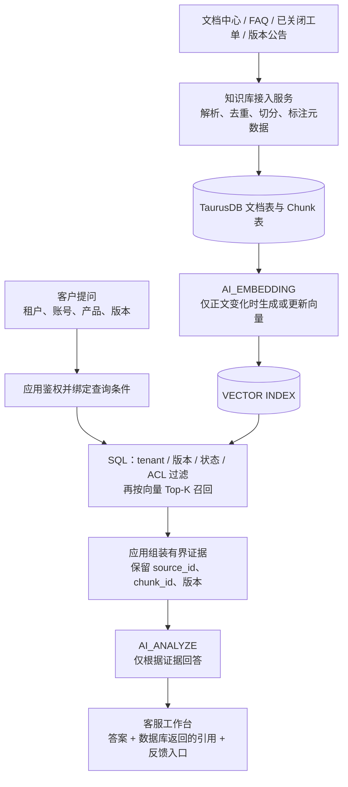
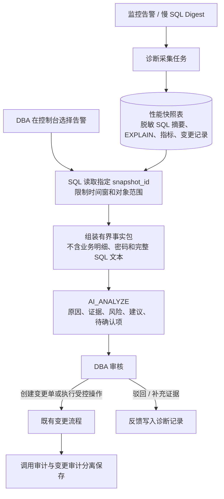
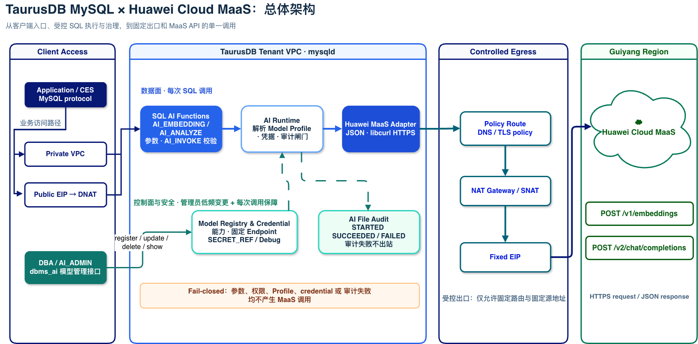
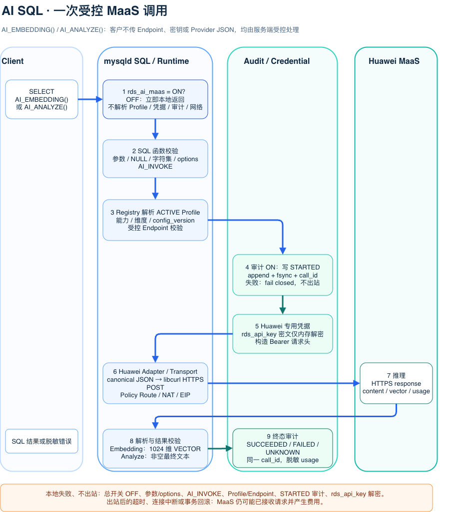
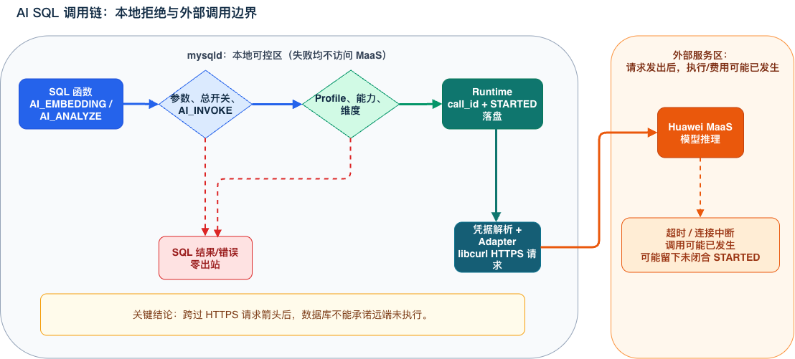
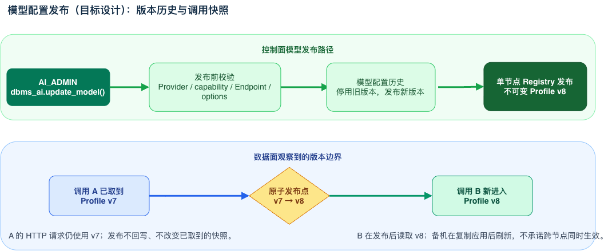
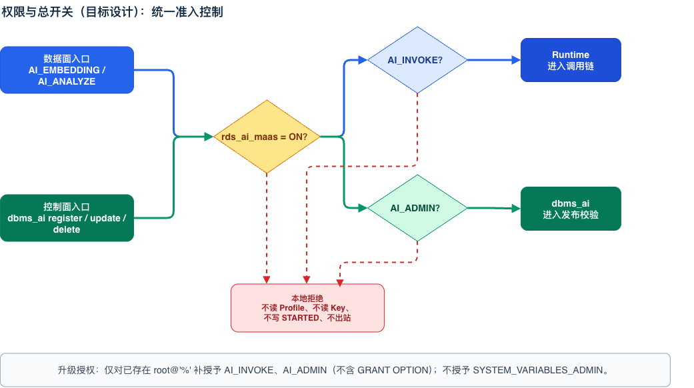
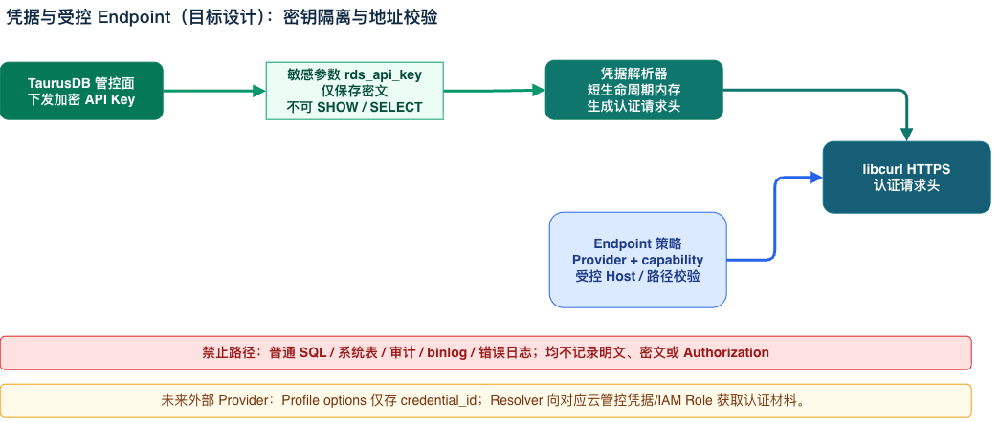
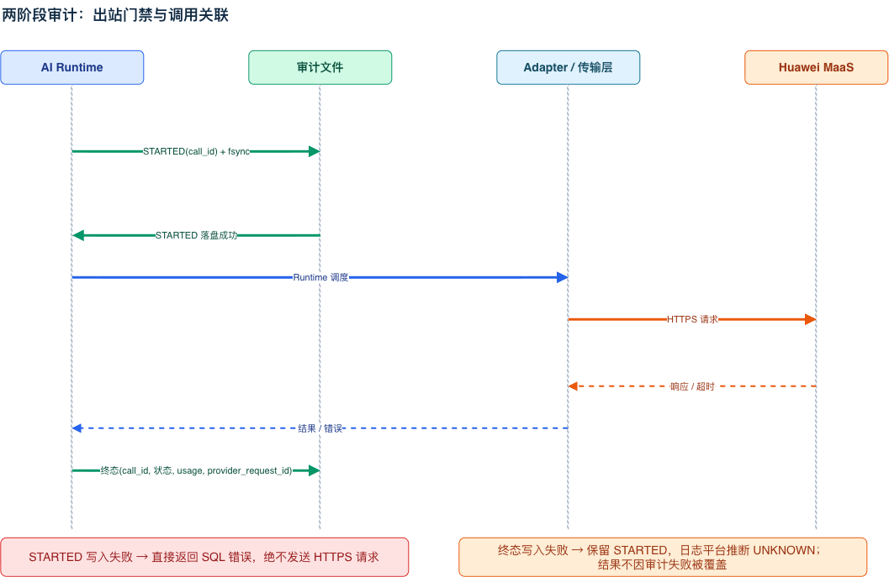
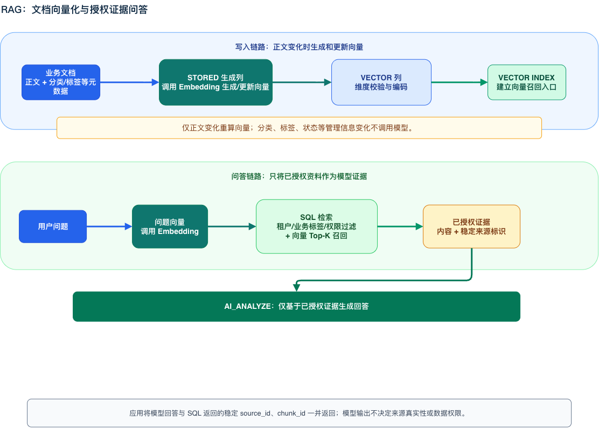

# TaurusDB MySQL 对接华为云 MaaS | Huawei Cloud MaaS Integration

**文档状态：** 评审稿

**目标版本：** 2026-09-30 P0 预览版本

**代码基线：** `ai_maas` 分支
**读者：** TaurusDB / AliSQL Committer、架构师、测试、运维、安全与管控负责人

本文按数据库产品部特性设计模板组织。当前实现事实以 `ai_maas` 分支源码和已通过的 MTR
为准；早期 LLD 中的原型描述不能单独作为当前行为的权威依据。本设计供评审接口稳定性、内核
侵入范围、升级风险、外部依赖和上线门禁；评审后可在本文件中继续收敛。

# 1 需求分析 | Requirement Analysis

## 1.1 背景及上下文 | Background and Context

TaurusDB MySQL 需要让客户在数据库内完成文本向量化、向量检索后的 RAG 问答、SQL 结果解读和
DBA 辅助诊断，而不是由应用分别管理模型 Endpoint、API Key、网络访问和审计。该特性使
mysqld 通过受控的华为云 MaaS 接口调用文本向量和文本生成模型：数据库负责 Profile、权限、
凭据隔离、审计、向量数据契约和错误收敛，MaaS 只负责推理。

首期接入华为云 MaaS；公共 SQL 契约不暴露 Endpoint、API Key、Provider 原始 JSON 或
OpenAI-compatible `messages`，从而为后续接入阿里云百炼、字节方舟、AWS Bedrock 等外部模型
服务保留 Adapter 扩展空间，而不破坏客户 SQL。

### 1.1.1 交付目标

1. 让应用通过 SQL 安全调用已配置的华为 MaaS 文本模型，并为后续外部模型服务保留接口扩展能力。
2. 支持“向量化 -> 向量索引和业务过滤 -> 已授权资料回答”的 RAG 闭环。
3. 支持 SQL 结果摘要、经营分析和 DBA 只读诊断，不执行自动修复 SQL。
4. 让模型变更、权限、凭据和外部出站可审计、可定位、可演进。
5. 使新模型主要通过 Model Profile + Provider Adapter 接入，不改变客户 SQL 契约。

### 1.1.2 非目标

- 不将 MaaS HTTP API、Endpoint、API Key 或 Provider 原始 JSON 直接暴露为 SQL 接口。
- 不提供异步/批量推理、流式/多模态、工具调用、预算配额或按模型细粒度授权。
- 不在用户 OLTP 事务中提供无界批量文档导入、自动重试或异步队列。
- 不由模型决定租户、行级数据、RAG 来源或 DBA 修复操作。
- 不通过普通 SQL 读取审计文件，也不在审计中记录 API Key、完整 prompt、完整响应或原始向量。
- 不承诺模型调用的时延、吞吐或可用性 SLA；这些受 MaaS、网络路径、Region、模型规格和配额影响。

### 1.1.3 术语

| 术语 | 说明 |
| --- | --- |
| Model Profile | 逻辑模型名到 Provider、Provider 模型、Endpoint、能力、维度、凭据引用和配置版本的受控映射。 |
| 控制面 | `dbms_ai` 管理模型配置、权限和凭据引用的低频路径。 |
| 数据面 | 一次 `AI_EMBEDDING()` / `AI_ANALYZE()` 从 SQL 到 MaaS 再返回结果的路径。 |
| Embedding space | 由模型、版本、维度和编码约束确定的向量兼容域；不同域的向量不得混用。 |
| 真实 smoke | 显式授权、会访问 MaaS 并可能计费的人工验证；不进入默认 MTR/CI。 |
| STARTED / terminal | 同一 `call_id` 的两阶段审计：外呼前的起始事件，以及 `SUCCEEDED` 或 `FAILED` 终态；未闭合 STARTED 由日志平台推断为 `UNKNOWN`。 |

### 1.1.4 P0 基线与关键评审结论

为避免将当前原型与 P0 目标混为一谈，本节统一按以下状态阅读：

| 状态 | 范围 |
| --- | --- |
| 当前已实现并有离线回归 | 华为 MaaS Adapter、`AI_EMBEDDING(model_name, text [, options_json])`、`AI_ANALYZE(model_name, prompt [, options_json])`、离线 fixture MTR、真实 smoke 脚本、动态权限、两阶段追加式审计、受控 Profile 与 `rds_ai_maas`。 |
| 后续管控面/Provider 演进 | 管控后台对 `rds_api_key` 的真实加解密/轮换接入、进程级 Registry 缓存与多 Provider Adapter；这些不属于当前开发验证交付。 |
| 上线阻断 | 主备真实 MaaS 验证、完整 ROW image/故障切换矩阵、目标 Region 网络和日志平台闭环。 |

当前已实现并经过离线回归覆盖的功能包括：

- `AI_EMBEDDING()`：华为 `bge-m3` 文本向量化，固定输出 1024 维，可写入 `VECTOR` 列和
  `VECTOR INDEX`；`STORED` 生成列在 MIXED 主从下强制 ROW，并由从库保留主库向量行镜像而不重复外呼。
- `AI_ANALYZE(model_name, prompt [, options_json])`：文本生成、RAG 上下文回答、SQL 结果分析和
  只读 DBA 诊断。
- `dbms_ai`：当前模型注册、更新、删除、展示；目标 Endpoint/Provider/版本管理接口待收敛。
- 动态权限 `AI_INVOKE`、`AI_ADMIN`，以及脱敏本地审计文件；目标两阶段终态故障语义见 2.1.3.5。
- Huawei MaaS HTTP/HTTPS Adapter、离线 fixture MTR 和显式授权的真实 MaaS SQL smoke。

接口冻结如下：`AI_ANALYZE(model_name, prompt [, options_json])` 与
`AI_EMBEDDING(model_name, text [, options_json])` 均采用“模型名、输入、可选 JSON”的一致形式。
旧 Embedding 参数顺序不再兼容，也不会猜测两个字符串参数的含义；错误调用在本地失败。

## 1.2 竞争力分析 | Competitive Analysis

调研日期为 **2026-08-05**。调研结论仅用于接口和产品取舍，不表示 TaurusDB 与友商功能等价。

### 1.2.1 Databricks

Databricks 将内置 AI Functions 区分为任务型函数（如 `ai_extract`、`ai_classify`）和
`ai_query(endpoint, request, ...)` 通用入口；`ai_gen(prompt)` 是简单文本生成入口。
`ai_query` 使用命名 `modelParameters`、`responseFormat` 和 `failOnError` 表达模型参数、
结构化输出和错误行为，且建议优先使用任务型函数。

TaurusDB 借鉴“模型/请求 + 可选对象参数”的稳定形态，但不采用 Endpoint/request 透传：数据库
场景必须由服务端控制 Endpoint 选择、`AI_INVOKE`、凭据隔离、审计和 Provider Adapter。

- 易用性：`AI_ANALYZE(model_name, prompt [, options_json])` 仅保留稳定主参数，客户不需要理解
  Provider 消息格式。
- 差异化：在 SQL 数据面内完成权限校验、受控模型解析、向量契约和两阶段审计。
- 取舍：首期没有 Databricks 级别的丰富任务函数、异步任务或结构化输出，后续应通过专用 SQL
  接口扩展，不能向通用接口回灌 Provider 私有参数。

参考：

- https://docs.databricks.com/aws/en/large-language-models/ai-functions
- https://docs.databricks.com/aws/en/sql/language-manual/functions/ai_query
- https://docs.databricks.com/aws/en/sql/language-manual/functions/ai_extract

### 1.2.2 Snowflake

Snowflake 的通用文本入口为：

```sql
AI_COMPLETE(model, prompt [, model_parameters, response_format, show_details])
```

它把模型和 prompt 作为主参数，将 `temperature`、`top_p`、`max_tokens` 等放入对象参数，
将结构化输出 Schema 和调用详情作为独立语义。这证明“主参数少、扩展参数对象化”适合长期 SQL
契约。

TaurusDB 借鉴其参数层次，但采用 `AI_ANALYZE` 名称，匹配数据库的数据分析、RAG 和只读诊断
场景；客户无需理解 LLM completion 术语。首期 options 只开放超时和输出长度，避免把模型行为、
Provider 协议和业务语义混到同一 JSON 中。

参考：https://docs.snowflake.com/en/sql-reference/functions/ai_complete-single-string

### 1.2.3 Aurora、PolarDB 与其他 Provider

Aurora MySQL 的 Bedrock 路径以每个模型一个 UDF、调用方传入原始 JSON 请求体实现；Aurora
PostgreSQL 也公开 `model_id`、`content_type`、`json_key` 等 Provider 细节。这便于快速透传，
但模型、协议或字段变化会进入客户 SQL 契约。

PolarDB 的 `EMBEDDING`、生成列和向量检索示例验证了“向量化 + 索引 + 应用侧上下文拼装”的
知识库范式。TaurusDB 借鉴该范式，并强调业务 SQL 必须先完成授权过滤，模型不能直接读取表。

TaurusDB 不采用 Provider 透传模式。百炼、火山方舟、Bedrock 等后续 Provider 通过新的 Adapter
和 Model Profile 接入，客户函数不增加 Endpoint、API Key、Provider 模型 ID 或原始 messages。
优势是 SQL 契约稳定、凭据和审计可控；代价是每个 Provider 协议需实现并验证 Adapter。

参考：

- https://docs.aws.amazon.com/AmazonRDS/latest/AuroraUserGuide/mysql-ml.html
- https://docs.aws.amazon.com/AmazonRDS/latest/AuroraUserGuide/postgresql-ml.html
- https://help.aliyun.com/en/polardb/polardb-for-mysql/use-the-embedding-function

## 1.3 场景和功能 | Scenarios and Functions

### 1.3.1 场景约束 | Scenario Constraints

**支持场景：**

1. 应用使用 `AI_EMBEDDING()` 调用 `bge-m3` 生成 1024 维文本向量，将结果写入 `VECTOR` 列，
   并结合向量索引和标量过滤检索。
2. 应用以 `STORED + AI_EMBEDDING()` 建立知识库。文本正文写入或修改时同步生成向量；分类、标签、
   状态等非正文管理字段更新不应触发额外调用，相关复制/row-image 矩阵仍需专项验证。
3. 应用先在 SQL 中完成 tenant、业务标签、数据权限和来源过滤，再把有界资料与问题组合成 prompt，
   调用 `AI_ANALYZE()` 做 RAG 问答。
4. 运营或 DBA 先以 SQL 聚合和脱敏形成有界事实包，再调用 `AI_ANALYZE()` 生成摘要、解释和只读
   建议；模型输出不得自动执行为 SQL 或运维命令。
5. 主节点和只读节点均可调用模型并在本地写审计文件；主节点负责模型配置管理。

**不支持或不作承诺的场景：**

- 高并发 OLTP 热路径、无界大表扫描、长事务、触发器和在线批量处理中的同步模型调用。
- 服务端数据库级 RAG ACL、租户隔离、来源真实性校验、模型预算、配额和限流。
- 多 Provider 的生产 Adapter、新协议、多模态、流式输出、工具调用、异步任务和自动修复 SQL。
- 在事务回滚、客户端断开或调用超时时撤销已由 MaaS 接收的请求或费用；P0 默认不自动重试。

### 1.3.2 外部依赖 | External Dependency

| 依赖对象 | 用途与依赖条件 | 局点不具备时的影响与替代 |
| --- | --- | --- |
| 华为云 MaaS | 提供 `/v1/embeddings`、`/v2/chat/completions` 推理服务、模型准入和配额。 | 没有模型准入、API Key 或服务时不可进行真实调用；离线 MTR fixture 可验证内核路径但不能替代真实服务。 |
| 租户 VPC、Policy Route、NAT Gateway、EIP、安全组、DNS/TLS | 为 tenant VPC 到 MaaS Endpoint 提供受控 HTTPS 出站和回流。 | 每个 Region 必须验证；缺失时真实调用失败。不能由 mysqld 或 SQL 自动创建，替代是完成云网络部署。 |
| 开发验证私有配置文件 | 当前通过不可由 SQL 读写的 `rds_api_key` 向 mysqld 注入 Huawei 明文开发 Key；生产所需的密文解密、轮换和外部 Provider 凭据引用是后续后台集成。 | 参数为空时本地失败且不出站；模型表不保存 Key。 |
| TaurusDB 日志平台 | 采集、轮转、保留、访问控制和告警本地 JSON Lines 审计文件。 | 仍可写本地文件但不具备集中追溯能力；上线前须完成日志采集和磁盘满告警闭环。 |
| `libcurl`、TLS/CA、DNS | mysqld 内进程 HTTPS Transport。 | TLS、DNS 或证书异常导致调用失败并记录脱敏终态；不调用 shell `curl`、Python 或 OpenAI SDK。 |

### 1.3.3 功能清单 | Function List

| 功能 | P0 交付内容 | 验收要点 |
| --- | --- | --- |
| 文本向量化 | `AI_EMBEDDING()` 调用 `bge-m3`，输出 1024 维向量。 | 正确维度返回；无权限、模型不可用、维度/凭据错误本地或受控失败。 |
| 向量写入和检索 | 向量列、向量索引、标量过滤、`STORED` 生成列和 RAG 资料准备范式。 | 检索结果经业务 SQL 授权过滤；应用返回可靠来源标识。 |
| 文本分析 | `AI_ANALYZE()` 支持摘要、分类、抽取、RAG 回答和只读诊断。 | 已配置文本生成模型返回非空文本；不生成自动执行路径。 |
| 模型治理 | `dbms_ai` 注册、更新、删除和展示 Profile。 | 仅 `AI_ADMIN` 可管理；停用/删除后后续调用失败。 |
| 权限 | `AI_INVOKE`、`AI_ADMIN` 动态权限。 | 无 `AI_INVOKE` 的调用在出站前失败。 |
| 审计与 DFX | 两阶段脱敏审计、`call_id`、错误分类和本地日志。 | 开启审计时 STARTED 不可安全写入即 fail closed；日志无密钥和完整内容。 |
| 主备支持 | 主/只读节点调用与审计；主节点模型管理。 | 不依赖只读节点写系统表。 |

### 1.3.4 典型应用场景

本节不把“向量化两行数据再提问”当作 RAG。参考 Dify / LangChain 的检索链路，生产系统至少需要
**资料接入与版本管理 → 内容解析与切分 → 元数据/权限过滤 → 语义召回 → 有界上下文组装 → 生成
答案与引用 → 人工反馈和质量运营**。TaurusDB 的职责是保存业务事实、生成向量、在 SQL 中执行过滤和
召回，并通过受控模型调用生成文本；文件解析、OCR、切分策略、工作流编排、对话状态和 UI 仍由应用或
知识库服务负责。

为使本节案例能够直接对应当前代码、MTR 和真实 MaaS smoke，下文使用已实现接口
`AI_EMBEDDING(model_name, text [, options_json])`。旧的
`AI_EMBEDDING(text, model_name [, dimension])` 已在本次迁移中删除；两种字符串参数顺序不再并存。

#### 场景一：多租户产品支持知识库与客服 RAG

**业务背景。** 某 SaaS 厂商同时维护 API Gateway、数据库和运维平台。客服在处理“升级后只读副本
延迟升高”“某版本是否支持跨 AZ 恢复”等问题时，必须回答客户所属产品、已购买版本和服务等级对应的
内容，不能把内部 Runbook、其他租户工单或已经废弃的版本说明暴露给客户。该场景不是让模型“搜索
数据库”，而是让应用把已经授权、可追溯的资料交给模型组织语言。



**资料与数据模型。** 知识库接入服务从文档中心、FAQ、已关闭且可复用的工单、版本公告获取资料。
它解析 HTML、Markdown、PDF 或工单富文本，删除导航栏和重复页脚，按标题层级和段落切分为约
300–800 中文字的 Chunk；每个 Chunk 保留标题路径和少量上下文，避免把“前置条件”和“操作步骤”
拆开。切分服务写入如下业务元数据，而不是只保存 `content + vector`：

- `tenant_id`、`knowledge_base_id`、`source_id`、`chunk_id`：确定资料归属和稳定引用；
- `product_line`、`product_version`、`service_tier`：保证回答与客户已购买产品和版本匹配；
- `access_label`、`allowed_group_id`：由应用鉴权结果参与 SQL 过滤，区分客户可见、支持工程师可见和内部运维资料；
- `document_status`、`effective_from/to`、`content_hash`、`source_updated_at`：只检索已发布且当前有效的资料；
  内容未变时不重新向量化，源文档撤回时及时从候选集排除；
- `heading_path`、`chunk_ordinal`、`language`：用于 UI 引用、相邻片段展开和多语言检索。

首次导入数万篇历史资料、批量重切分或模型整体迁移不应在在线客服请求中完成。P0 只有同步调用，
因此接入服务必须在业务低峰以可恢复的小批次写入，并以 `source_id + content_hash` 做幂等控制；
单次失败只重试该 Chunk，不能对整库无界重跑或在用户事务中批量外呼。

**一次真实问答。** 客户 `tenant_id=42`、账号组为 `enterprise_support`，正在使用 `gateway` 的
`8.0` 版本，提问“升级后如何通过只读副本分担读取压力？”。应用先完成登录态与产品订阅校验，再在
同一个请求内执行下面的受控 SQL。`source_id/chunk_id` 来自数据库结果，是 UI 唯一可信的引用；
模型输出中的链接或编号不能替代它们。

```sql
SET @question = '升级后如何通过只读副本分担读取压力？';
SET @qvec = AI_EMBEDDING(
  'huawei/bge-m3', @question, JSON_OBJECT('dimension', 1024));

CREATE TEMPORARY TABLE rag_selected_sources AS
SELECT source_id, chunk_id, document_version, heading_path, content
  FROM product_manual_chunk
 WHERE tenant_id = 42
   AND knowledge_base_id = 17
   AND product_line = 'gateway'
   AND product_version = '8.0'
   AND document_status = 'PUBLISHED'
   AND access_label IN ('customer', 'support')
   AND (allowed_group_id IS NULL OR allowed_group_id = 'enterprise_support')
   AND CURRENT_TIMESTAMP BETWEEN effective_from AND effective_to
 ORDER BY VEC_DISTANCE_COSINE(embedding, @qvec), source_id, chunk_id
 LIMIT 6;

SELECT JSON_ARRAYAGG(JSON_OBJECT(
         'source_id', source_id, 'chunk_id', chunk_id,
         'document_version', document_version, 'heading', heading_path,
         'content', content)) INTO @evidence
  FROM rag_selected_sources;

SELECT AI_ANALYZE(
  'huawei/glm-5.2',
  CONCAT('你是客户支持助手。仅根据给定资料回答；资料不足时明确回答“资料不足，建议转人工”。',
         '不要编造版本、配置项或引用。\n问题：', @question,
         '\n已授权资料(JSON)：', JSON_PRETTY(@evidence)),
  JSON_OBJECT('max_output_tokens', 400, 'timeout_ms', 60000)) AS draft_answer;

SELECT source_id, chunk_id, document_version, heading_path
  FROM rag_selected_sources
 ORDER BY source_id, chunk_id;
DROP TEMPORARY TABLE rag_selected_sources;
```

**面向客服的交付内容。** 工作台展示模型的自然语言答复、数据库返回的资料标题和版本、每条引用的
`source_id/chunk_id`，以及“有帮助/无帮助/资料已过期/疑似越权”的反馈按钮。客服可以编辑后发送；
首期不要求模型自动回复客户。若没有任何经过权限过滤的 Chunk，应用直接显示“未找到可授权资料”而
不调用模型；若召回资料互相矛盾，提示人工确认；若 MaaS 超时或失败，保留 SQL 检索结果并转人工，
不把失败伪装成“没有答案”。

**当前实现与测试对应关系。** 当前内核已经覆盖“文本向量化 → VECTOR 索引 → SQL 过滤 → 有界证据
→ `AI_ANALYZE()`”这条最小 RAG 链路：`mysql-test/suite/rds/t/ai_maas_rag.test` 使用离线 fixture 验证
tenant/标签过滤、来源标识、`STORED` 向量生成、正文/非正文更新和 RAG 证据组装；
`scripts/db4ai_maas_real_embedding_rag_smoke.sql` 对真实 MaaS 验证 `bge-m3`、向量索引、`STORED`、
资料过滤与生成回答。它们验证的是数据库能力和调用链，不等价于验证文档解析、OCR、切分质量、客服
工作台或企业 ACL 系统。

**运营与验收。** 业务方应持续观察资料新鲜度（源文档更新到可检索的时间）、Chunk 向量化失败率、
有资料召回率、转人工率、人工纠正率、用户反馈率和按产品版本的“无答案”问题。上述指标由应用日志
和业务表维护；TaurusDB 审计只记录脱敏的模型调用事实，不能替代问答质量平台。Dify / LangChain
常见的 rerank、多路召回、会话记忆、工作流节点和 Agent 工具调用均不属于 P0；它们可由应用在 SQL
召回结果之外演进，但不得绕开 SQL 的 ACL 与来源筛选。

#### 场景二：DBA 性能诊断与变更审核助手

**业务背景。** 值班 DBA 收到“订单查询 P95 从 180 ms 升至 4.2 s”的告警。排障通常需要在慢 SQL
摘要、`EXPLAIN`、索引定义、扫描行数、锁等待、表容量、CPU/IO 时间序列和近期变更记录之间反复切换。
助手的价值是把这些已核实的事实组织成初步诊断，减少人工阅读时间；它不能拥有生产执行权限，也不能
把“建议加索引”直接转成 DDL。



**事实采集与脱敏。** 诊断采集任务可以由监控系统、DAS 或 DBA 工具周期性写入
`dba_diagnosis_snapshot`。一条快照对应一个明确的 `snapshot_id`、实例、时间窗和告警对象，而不是
让模型临时扫描 Performance Schema。事实包至少包括 SQL digest（参数化并脱敏）、计划摘要、索引
候选信息、`rows_examined`、`rows_sent`、平均/P95 时延、锁等待、临时表/排序指标、相关表行数和容量、
CPU/IO 峰值，以及最近一次 schema、参数或应用发布变更。客户订单、手机号、身份证、完整绑定变量、
账号密码和访问 Token 不能进入快照或 prompt。

**一次真实诊断。** DBA 选择 `snapshot_id=202608060421` 后，控制台只读取这一条已授权快照，并在
模型调用前限制 JSON 大小和时间窗。下面 SQL 的结果是“候选意见”，而非自动化操作指令。

```sql
SELECT JSON_OBJECT(
         'incident_id', incident_id,
         'time_window', DATE_FORMAT(window_start, '%Y-%m-%dT%H:%i:%sZ'),
         'sql_digest', sql_digest_masked,
         'plan_summary', plan_summary,
         'elapsed_ms_p95', elapsed_ms_p95,
         'rows_examined_p95', rows_examined_p95,
         'lock_wait_ms_p95', lock_wait_ms_p95,
         'table_rows', table_rows,
         'cpu_peak_pct', cpu_peak_pct,
         'io_util_pct', io_util_pct,
         'recent_change', recent_change_summary)
  INTO @diagnostic
  FROM dba_diagnosis_snapshot
 WHERE snapshot_id = 202608060421
   AND instance_id = 'orders-prod-a'
   AND visibility_scope = 'dba'
   AND captured_at >= CURRENT_TIMESTAMP - INTERVAL 24 HOUR;

SELECT AI_ANALYZE(
  'huawei/glm-5.2',
  CONCAT('你是只读数据库诊断助手。仅根据下列事实，以“现象、可能原因、证据、风险、建议、待确认项”',
         '六部分作答。区分事实与推测；不得生成可直接执行的 SQL、DDL、参数修改或自动修复步骤。',
         '\n诊断事实(JSON)：', JSON_PRETTY(@diagnostic)),
  JSON_OBJECT('max_output_tokens', 600, 'timeout_ms', 60000)) AS diagnosis_draft;
```

**人工审核与闭环。** 控制台将模型答案与 `snapshot_id`、模型名、Profile 版本和调用审计 `call_id`
并排展示。DBA 必须选择“采纳、部分采纳、驳回、证据不足”之一，并将最终操作放入现有变更单、审批和
回滚流程；任何 SQL、参数调整、扩容或索引变更仍由既有权限体系执行。诊断反馈可写入业务工单，用于
统计模型建议的采纳率、误报率和平均排障耗时，但 P0 不使用反馈自动训练、自动更新模型或自动执行操作。

`AI_ANALYZE()` 的返回值是不可信的自然语言文本。当前 mysqld 不具备让模型执行 SQL、调用运维工具或
修改数据库状态的能力，但模型仍可能在回答中输出类似 SQL 的文本。因此控制台不得解析、拼接或自动执行
模型输出；只有 DBA 按既有审批流程手工确认后的操作才可信。

**异常与边界。** 快照不存在、过期、超出大小上限或包含未脱敏字段时，控制台应在出站前拒绝并提示
补采证据；MaaS 超时、连接中断或返回不可解析内容时，保留原始快照和人工排障入口。模型可能不知道
实例拓扑、业务 SLO 或近期人为操作，因此“建议”必须被视为待验证假设。P0 不支持连续自治诊断、
跨实例自动关联、访问业务明细、调用运维工具、自动建索引或自动执行修复。

**运营与验收。** 对每类告警建立固定评审样本，衡量事实引用准确率、建议可执行性（由 DBA 评审）、
错误建议率、证据不足拒答率、人工处理时长变化和模型调用失败率。质量结论应按模型、Region、版本、
网络和输入事实包分别记录；一次真实 smoke 只能证明连通与基本正确性，不能替代生产性能或诊断质量
承诺。

**当前实现与测试对应关系。** `mysql-test/suite/rds/t/ai_maas_analysis.test` 覆盖
`AI_ANALYZE(model_name, prompt [, options_json])` 的参数、选项边界、权限和离线返回；
`scripts/db4ai_maas_smoke.sql` 对真实 MaaS 验证文本生成模型返回非空内容。当前尚没有以
`dba_diagnosis_snapshot` 为输入的专用 MTR 或真实 smoke，因此上述“快照采集、脱敏校验、控制台审批”
是应用集成设计，不应表述为已经由 mysqld 自动交付。

这两个场景之外的订单经营摘要、分类抽取和多模型对比可复用同一“SQL 先形成有界、脱敏事实 →
`AI_ANALYZE()` 生成文本 → 人工或应用消费结果”的模式，但不扩大 P0 的异步、Agent 工具调用、自动
执行或服务端行级 ACL 范围。

## 1.4 内核功能交叉分析 | Cross Analysis of Kernel Functions

| 模块 | 检查项 | 是否相互影响 | 备注 |
| ---- | ------ | ------------ | ---- |
| 基本开关 | `rds_ai_maas` 总开关 | 是 | 已实现，默认 OFF；开启后才允许数据面和管理写操作。主/只读一致下发与运行中调用的运维验证仍属于上线验证。 |
| 基本开关 | binlog | 是 | `dbms_ai` 控制面写入需写 binlog 并被复制 applier 应用；AI 外呼和审计文件不写 binlog。 |
| 基本开关 | 事务隔离级别 | 是 | 外部调用不参与用户事务原子性；回滚或连接断开后 MaaS 仍可能已计费。 |
| 基本开关 | 全量 SQL | 是 | 全量 SQL、错误日志和审计不得输出 API Key、Authorization、完整 prompt/response 或原始向量。 |
| 基本开关 | 查询缓存 | 否 | 不依赖查询缓存；AI 函数结果不应被设计为跨语句缓存。 |
| proxy代理 | 代理一致性级别 | 待验证 | Proxy 仅转发 SQL；需在主/只读路由和超时传播场景验证。 |
| proxy代理 | 代理路由模式 | 是 | 主、只读均可调用和写本地审计；模型管理仅在主节点。 |
| proxy代理 | 代理事务拆分 | 是 | 不建议在事务拆分、长事务和高频 OLTP 路径发起同步外呼。 |
| proxy代理 | 代理重启/关闭 | 待验证 | 客户端中断不代表上游请求未发生；审计终态可能为 `UNKNOWN`。 |
| 协议 | prepare 二进制协议/文本协议 | 待验证 | SQL 函数须覆盖文本和 prepared statement 参数、NULL、字符集和错误映射。 |
| 基本功能 | 实例重启 | 是 | 审计文件为追加式；重启后的路径、权限、日志采集和未终态 STARTED 处置需验证。 |
| 基本功能 | 规格变更 | 待验证 | CPU/内存和网络资源变化会影响并发外呼容量；无规格专项优化承诺。 |
| 基本功能 | 只读升主 | 是 | 升主后模型配置从复制状态接续；审计继续在执行节点本地记录。 |
| 基本功能 | 添加/删除只读节点 | 是 | 新只读节点需具备控制表复制数据、日志目录权限、网络和 Secret 可读能力。 |
| 基本功能 | 版本升级/降级 | 是 | 新系统表、动态权限、管理包和 SQL 契约须走升级回退门禁，详见 2.5 和 5.4。 |
| 基本功能 | 数据恢复、迁移、备份 | 是 | 旧原型的明文 Key 可能进入物理数据、binlog 和备份，迁移时必须轮换/吊销；目标模型表不保存凭据。 |
| 基本功能 | 数据同步 | 是 | 当前验证 row-based replication；statement/跨版本复制及全部 native procedure 回归仍为门禁。 |
| 新特性 | 应用无损 ALT | 待验证 | 与 AI 函数无直接耦合，但系统表保护、生成列和并发 DDL 需覆盖。 |
| 新特性 | serverless / HTAP / PQ / 算子下推 | 待评审 | P0 不依赖这些能力；禁止把外部调用下推或在并行 worker 中无界放大。 |
| 新特性 | 多租实例 / 多主 / RegionlessDB | 不支持 | P0 是实例级 `AI_INVOKE`，无服务端 tenant 绑定和多主一致性设计。 |
| 新特性 | 只读节点支持 Binlog 拉取 | 待验证 | 不影响 AI 外呼；须确认控制面配置复制和审计文件不被误认为 binlog 数据面。 |
| 新特性 | 字段压缩 | 否 | 不改变业务表的存储格式；向量列兼容性由已有 VECTOR 能力保证。 |

## 1.5 对外依赖及影响 | External Dependency and Impact

| 对象 | 依赖 or 影响（Y or N） | 外部需求编号 | 需求名称 / 影响说明 |
| ---- | ----------------------- | ------------ | -------------------- |
| 管控/Agent | Y | 待分配 | 生产模型 Profile、Provider 加密凭据、动态参数权限、日志路径和升级任务需管控适配。 |
| DRS | Y | 待分配 | 控制面写 binlog；需验证 NEW->OLD / OLD->NEW 兼容策略，未完成前不得承诺跨版本复制。 |
| binlog 复制 | Y | 待分配 | 受控模型管理变更复制；AI 调用、prompt、响应和审计文件不进入 binlog。 |
| DAS | Y | 待分配 | 新 SQL 函数、错误文本和动态权限可能需要控制台识别；不得展示敏感信息。 |
| DDM | 待评审 | 待分配 | DDM 路由、分片 SQL 和分布式事务不属于 P0 交付；接入前需评估外呼位置和数据汇聚。 |
| 备份恢复 | Y | 待分配 | 需确认系统表恢复、旧 Profile 迁移、明文开发 Key 风险和审计文件不作为备份恢复数据。 |
| 开源工具 | N | 不涉及 | 不修改 mysqlbinlog、mysqlcheck、perror 等接口；新增 SQL/权限需在兼容测试中确认。 |
| CDE(DFV) | N | 不涉及 | Runtime 不依赖 CDE/DFV 或 `getAllSliceReplicaInfo`。 |
| 局点部署形态 | Y | 待分配 | 仅网络、MaaS 模型可用、日志采集与凭据服务均满足的 Region 可上线；公有云/HCS/HCSO 需逐一确认。 |
| 内核界面 | Y | 待分配 | 新增 AI SQL 函数、动态权限、模型控制表、`dbms_ai` 过程和审计参数；错误码仍需收敛为兼容 SQLSTATE 方案。 |

# 2 特性设计 | Feature Design

## 2.1 实现方案描述 | Description Of Implementation

### 2.1.1 总体架构



可编辑源：[`taurusdb-maas-committer-diagrams.drawio`，页“01 Architecture”](assets/taurusdb-maas-committer-diagrams.drawio)。

架构分为控制面与数据面。控制面由管理员通过 `dbms_ai` 发布受控 Profile；数据面由 SQL 函数、
Runtime、Registry、Adapter、Transport 和 Audit 组成。客户端只调用 SQL；Endpoint、凭据和
Provider JSON 始终由服务端构造和持有。tenant VPC 到 MaaS 的网络连通是部署前提，不能替代
服务端权限、Profile 受控 Endpoint 或审计控制。

### 2.1.2 AI 调用流程与时序



可编辑源：[`taurusdb-maas-committer-diagrams.drawio`，页“02 Invocation Flow”](assets/taurusdb-maas-committer-diagrams.drawio)。

**调用步骤：**

1. SQL 函数先检查实例级总开关 `rds_ai_maas`。开关为 `OFF` 时立即返回
   `AI feature is disabled`，不解析 Profile、凭据、审计或网络，也不访问 MaaS。
2. 客户端执行 `AI_EMBEDDING()` 或 `AI_ANALYZE()`；SQL 函数校验参数、NULL、字符集和 JSON options。
3. 授权层在解析 Profile、凭据和网络前检查 `AI_INVOKE`；无权限本地失败且不得出站。
4. Registry 按逻辑模型名解析 ACTIVE Profile，校验能力、Provider 模型标识、配置版本、维度，以及由控制面发布的
   Endpoint 是否符合该 Provider/能力的安全策略。
5. Runtime 创建 canonical request，并在 `ai_invoke_audit=ON` 时先落盘 `STARTED`；安全落盘失败则
   fail closed，不发送 MaaS 请求。
6. Huawei Adapter 仅在调用 Huawei Profile 时读取管控面经受控启动路径注入的 `rds_api_key` 内存值，
   并在内存中构造认证 Header；P0 不支持其他 Provider。该值不写入表、日志或审计；密文解密和轮换
   由后续管控面集成负责。
7. Huawei Adapter 将 canonical request 序列化为 MaaS JSON；HTTP Transport 以 libcurl 发起 HTTPS POST。
8. Adapter 解析 Provider 响应、usage、request id 和结果；Embedding 校验 1024 维并编码为 `VECTOR`，
   Analyze 提取非空最终文本。
9. Runtime 用相同 `call_id` 写 `SUCCEEDED` 或 `FAILED` 终态；若终态无法落盘，
   保留 STARTED 并由日志平台推断 `UNKNOWN`，但不覆盖已获得的 Provider 结果或原始 Provider 失败。
   客户端保留 Provider 成功结果或原始 Provider 的脱敏错误，终态审计故障仅作为服务端 DFX 信号。

实线是 mysqld 代码路径；网络图中的虚线表示必须由云网络/运维完成并验收的部署前提。HTTPS 响应
使用同一 TCP/TLS 连接的反向流量，经 NAT 状态映射返回 tenant VPC，不需要为响应单独配置 DNAT。

管理员关闭 `ai_invoke_audit` 时，Runtime 不创建 audit sink：调用仍可出站，但不写 STARTED/终态。
这属于管理员级无审计外呼风险事件；“STARTED 不可写则 fail closed”仅在审计开关为 ON 时成立。
`rds_ai_maas=OFF` 与关闭审计不同：它阻止新的模型调用，因此不会产生新的 AI 调用审计；开关变更
本身必须由管控/管理审计记录。关闭总开关不强制取消已经发出的 libcurl 请求；已开始的调用仍按原有
审计策略尽力写终态。

### 2.1.3 Server 子模块与职责

可编辑源：[`taurusdb-maas-committer-diagrams.drawio`，页“03 Server Modules”](assets/taurusdb-maas-committer-diagrams.drawio)。

本节按模块说明责任、关键接口、内存状态和交互边界；“03 Server Modules”只表达静态依赖关系，
不表达一次调用的先后顺序。页“06–11”分别展开关键机制的状态、分支和时序；端到端时序见 2.1.2，
具体 SQL 与过程签名见 2.3。

#### 2.1.3.1 数据面：SQL 函数、Runtime、Adapter 与 Transport

机制图见 [`页“06 数据面调用边界”`](assets/taurusdb-maas-committer-diagrams.drawio)：它明确区分可证明
零出站的本地拒绝点，与 HTTP 请求发出后可能已产生外部调用的失败边界。



数据面由每条 `AI_EMBEDDING()` 或 `AI_ANALYZE()` 语句触发。调用链的入口和外部协议隔离在不同模块，
避免 SQL 层直接理解 HTTP 或密钥。

| 模块 | 主要文件 | 关键接口/内存对象 | 责任与边界 |
| --- | --- | --- | --- |
| SQL 函数层 | `sql/ai/item_ai_func.*` | SQL 函数参数、`THD`、`Item` 返回类型 | 校验参数、NULL、JSON options、`AI_INVOKE` 和 SQL 错误映射；不构造 Provider JSON、不读取 Key。 |
| AI Runtime | `ai_runtime.*`、`ai_runtime_server.cc` | `Ai_request`、`Ai_response`、解析后的 Profile 快照、`call_id` | 编排 Registry、审计、凭据、Adapter；维护单次调用的短生命周期状态；不保存 RAG 业务数据。 |
| Provider Adapter | `ai_huawei_maas_adapter.*` | canonical request/response、Huawei 请求/响应 JSON | 将 canonical 请求转换为 MaaS 协议，解析内容、向量、usage、request id；不执行 SQL 权限或网络策略。 |
| HTTP Transport | `ai_http_transport.*` | libcurl easy handle、HTTPS 响应体、超时/大小限制 | 仅允许受控 HTTPS Endpoint，实施 TLS、连接/总超时和响应上限；不解释 prompt 语义。 |
| 向量编码 | `ai_vector_codec.*` | `std::vector<float>`、`MYSQL_TYPE_VECTOR` | 校验浮点数组与维度，编码/解码 VECTOR；不负责向量索引或 HNSW 检索。 |

数据面稳定边界是 canonical request/response：新增 Provider 时优先新增 Adapter 和受控配置策略，
不改变 SQL 函数签名。Runtime 不跨语句缓存模型回答或明文密钥；每次调用使用解析到的配置版本快照。

#### 2.1.3.2 模型管理：Profile 发布与内存 Registry

机制图见 [`页“07 模型配置发布”`](assets/taurusdb-maas-committer-diagrams.drawio)：展示 Profile 的受控
发布，以及运行中调用继续使用旧快照、后续调用使用新版本的原子边界。



模型管理是低频控制面。`dbms_ai` 是唯一写入口，`mysql.ai_model_config` 是内部控制表；客户端没有
直接 DML/DDL 管理模型的路径。

版本历史已由控制表的 `config_version` 与 ACTIVE/RETIRED 状态实现。当前实现每次调用读取控制表并形成单调用
快照，不承诺进程级缓存、跨节点同时切换或已发布版本的历史回退。

| 项目 | 设计 |
| --- | --- |
| 管理接口 | `dbms_ai.register_model()`、`update_model()`、`delete_model()`、`show_models()`；写操作要求 `AI_ADMIN`。 |
| 持久对象 | Profile 保存逻辑模型名、Provider、能力、Provider 模型、受控 Endpoint、维度、非敏感 `provider_options`、状态和 `config_version`。 |
| 内存对象 | Registry 将 ACTIVE Profile 解析为不可变快照；数据面只读快照，不持锁执行网络调用。 |
| 发布流程 | 校验 Provider/能力/Endpoint/选项/凭据可用性 → 写入新版本 → binlog/复制 → 原子替换可见快照。 |
| 回退与删除 | 从前一已验证历史配置重新发布新版本；删除逻辑上置为 `RETIRED`，保留历史 Profile 与审计关联。 |

关键流程：`AI_ADMIN` → `dbms_ai` 校验 → `ai_model_config` 新版本 → Registry 刷新 → 后续数据面使用新快照。
运行中的调用继续使用已解析快照，因此配置发布不会改变已发出的 HTTP 请求。

#### 2.1.3.3 权限与实例总开关

机制图见 [`页“08 权限与总开关”`](assets/taurusdb-maas-committer-diagrams.drawio)：数据面和控制面都先经过
实例总开关与对应动态权限；任一拒绝都发生在读取 Profile、凭据、审计和网络之前。



权限控制不在 Profile 表中维护用户列表，而复用 MySQL 动态权限和实例参数，保持授权模型简单、可升级。

`rds_ai_maas` 与 root 升级补授权已实现；主备下发和存量升级路径仍以 TaurusDB 升级编排验证为准。

| 控制点 | 接口/对象 | 关键流程 |
| --- | --- | --- |
| 总开关 | `rds_ai_maas` | 最先检查；OFF 时数据面与管理写操作本地失败，不解析 Profile、凭据、审计或网络。 |
| 调用权限 | `AI_INVOKE`、`mysql.global_grants` | SQL 函数在 Registry 前检查；无权限不会形成 canonical request 或外部请求。 |
| 管理权限 | `AI_ADMIN`、`mysql.global_grants` | `dbms_ai` 写操作前检查；不等同于普通系统表 DML/DDL 权限。 |
| 升级授权 | mysql 系统升级/bootstrap | 动态权限注册后，对存量 `root@'%'` 幂等补授予 `AI_INVOKE`、`AI_ADMIN`，不带动态转授权。 |

当前是实例级权限：有 `AI_INVOKE` 的账号可调用所有 ACTIVE Profile。按用户/模型/预算/配额授权不是隐含
能力，后续必须以新的授权模型与系统表单独设计。

#### 2.1.3.4 凭据与 Endpoint 受控路由

机制图见 [`页“09 凭据与 Endpoint”`](assets/taurusdb-maas-committer-diagrams.drawio)：展示密钥从
管控面到短生命周期内存 Header 的唯一可信路径，以及 SQL、日志和审计的禁止路径。



| 模块 | 关键对象 | 责任与失败边界 |
| --- | --- | --- |
| Model Registry | Profile 的 `endpoint_url`、`config_version` | 校验 Provider、HTTPS Host/路径策略、能力和 Endpoint；普通 SQL 不可覆盖 URL。 |
| Credential Resolver | Huawei `rds_api_key` | 当前仅消费私有启动配置注入的内存值并构造 Bearer Header；密文解密、轮换和外部 Provider 凭据解析由管控面后续接入。缺失时出站前失败。 |
| HTTP Transport | libcurl、TLS/CA、DNS、超时和 1 MiB 响应限制 | 接受已验证的 Endpoint 快照，不接受客户端 URL/Header/Authorization。 |

`rds_api_key` 敏感参数和 Huawei Endpoint 策略已实现。当前内核不实现管控后台密文的解密或轮换；
它只消费由受控启动路径注入的内存值，因此该后台集成仍是生产上线前置条件，也不能据此开放生产 Endpoint 修改。

明文 Key、密文、Authorization、完整 HTTP 请求/响应都不得进入系统表、SQL 结果、binlog 或审计日志。
Endpoint 变更必须经 `dbms_ai` 版本化发布；仅修改 URL 不能绕过 Adapter 协议兼容性验证。

#### 2.1.3.5 两阶段审计与 DFX

机制图见 [`页“10 两阶段审计与 DFX”`](assets/taurusdb-maas-committer-diagrams.drawio)：以四条生命线表示
STARTED 落盘、HTTPS 出站、终态写入与 UNKNOWN 分支的准确时序。



审计模块由 `ai_file_audit.*`、`ai_audit_service.cc` 实现，写入本地 JSON Lines，再由 TaurusDB 日志平台采集。
它不提供普通 SQL 查询接口，也不依赖只读节点写系统表。

1. Runtime 在审计开启时先写 `STARTED`，生成 `call_id`；安全落盘失败则 fail closed，禁止 MaaS 出站。
2. Adapter/Transport 返回后，Runtime 以相同 `call_id` 写 `SUCCEEDED` 或 `FAILED` 终态。
3. 记录时间、用户、客户端 IP、模型、配置版本、耗时、脱敏 usage、Provider request id 和错误分类；不记录 Key、Authorization、完整 prompt/response 或原始向量。
4. DFX 以 `call_id` 为主线关联 SQL 错误、审计事件、脱敏错误日志与 Provider request id。`UNKNOWN` 是日志
   平台在观察窗口内发现 `STARTED` 未闭合后的推断状态，不是写入文件的 terminal 枚举。
5. 终态写入失败不改变已获得的 Provider 成功结果或原始 Provider 失败；保留
   `STARTED`、写入脱敏 server warning/指标，由日志平台按 `UNKNOWN` 告警；MTR 通过故障注入覆盖该语义。

#### 2.1.3.6 向量结果与 RAG 边界

机制图见 [`页“11 向量与 RAG”`](assets/taurusdb-maas-committer-diagrams.drawio)：并列展示知识写入链路和
检索/问答链路，强调先在 SQL 完成数据过滤，再组织已授权片段给模型。
该图对应可复跑用例 `mysql-test/suite/rds/t/ai_maas_rag.test` 中的 `knowledge_base`（STORED 向量）和
`rag_manual_chunk`（受限证据组织）两个场景。



Embedding Adapter 只负责把模型返回的 float 数组交给向量编码模块；对 `huawei/bge-m3` 强制校验 1024 维。
数据库的 VECTOR 列、VECTOR INDEX、标量过滤和结果来源由 SQL/RAG 表设计负责。模型不参与行级权限、tenant
过滤或引用真实性判断：调用方必须先在 SQL 中筛选已授权资料，再将资料组织为 `AI_ANALYZE()` prompt。

**配套验证用例。** 完整 MTR 实现为 [`ai_maas_rag.test`](../../mysql-test/suite/rds/t/ai_maas_rag.test)，使用
离线 `mtr/fixture-*` Profile，不读取真实 Key、不访问 MaaS。图 11 只说明机制；下面的 SQL 说明如何建立和
验证该机制。

场景 A：写入文档时自动生成向量。

```sql
CREATE TABLE knowledge_base (
  id INT AUTO_INCREMENT PRIMARY KEY,
  doc TEXT NOT NULL,
  category VARCHAR(32) NOT NULL DEFAULT 'general',
  vec VECTOR(1024)
    AS (AI_EMBEDDING('mtr/fixture-embedding', doc,
                     JSON_OBJECT('dimension', 1024))) STORED,
  VECTOR INDEX ix_knowledge_vec (vec) M=3 DISTANCE=COSINE
);

INSERT INTO knowledge_base (doc) VALUES
  ('Read replicas offload pressure from the primary node.');
SELECT id, VECTOR_DIM(vec) FROM knowledge_base;

UPDATE knowledge_base
   SET doc = 'Read replicas offload pressure from the primary database node.'
 WHERE id = 1;
UPDATE knowledge_base SET category = 'operations' WHERE id = 1;
```

预期：插入后 `VECTOR_DIM(vec)` 为 1024；更新 `doc` 时重新生成 `vec`；仅更新 `category` 时不生成新向量。

场景 B：仅把已授权资料作为 RAG 证据。

```sql
SELECT JSON_ARRAYAGG(JSON_OBJECT(
         'source_id', source_id, 'chunk_id', chunk_id, 'content', content))
  INTO @rag_input
  FROM (
    SELECT source_id, chunk_id, content
      FROM rag_manual_chunk
     WHERE tenant_id = 42
       AND product_line = 'gateway'
       AND access_label = 'support'
     ORDER BY source_id, chunk_id
     LIMIT 8
  ) AS permitted_rag_sources;

SELECT AI_ANALYZE(
  'mtr/fixture-chat',
  CONCAT('Answer only from the following application-selected evidence. ',
         'Question and sources JSON:\n', @rag_input)
);
```

预期：数据库先按 `tenant_id`、产品线和访问标签筛选资料，再组织 JSON 证据并调用文本生成模型；结果可关联
`source_id` 和 `chunk_id`。未通过 SQL 过滤的资料不会进入 prompt，模型不能越过数据库的数据范围。

**复制与外呼放大约束。** 包含 AI 函数的写入在
`binlog_format=STATEMENT` 下必须在出站前拒绝；`MIXED` 在 binlog 决策前标记为不安全并生成 ROW event。对
`STORED + AI_EMBEDDING()`，从库在 after image 带有向量值时保留主库的值并跳过生成列表达式重算，因此不会
重新调用 MaaS。离线 MTR 已覆盖该 MIXED/FULL 写入链路；MINIMAL/NOBLOB、正文/非正文更新和主备切换仍需上线
专项验证，并须断言备机 MaaS 请求数为零。

同步外呼在出站前限制单次输入为 1 MiB、单条语句最多 32 次、实例最多 32 个并发调用；超限本地失败且
零出站。预算和租户配额可后续扩展，但不能替代上述第一版熔断边界。

### 2.1.4 子模块交互与关键失败边界

| 位置 | 可本地拒绝的条件 | 是否允许 MaaS 出站 |
| --- | --- | --- |
| SQL 函数 | 参数个数/类型、模型名为空、options 非法；`NULL` 按函数契约返回 `NULL` 或本地报错 | 否 |
| 权限 | 无 `AI_INVOKE` / `AI_ADMIN` | 否 |
| Registry | 无 Profile、禁用模型、能力/维度不匹配 | 否 |
| Audit STARTED | 文件不可写、权限/同步失败 | 否 |
| Credential | Secret 不可读、Release 使用 Debug 明文 | 否 |
| Transport | 非 HTTPS、非 Profile Endpoint、Host/路径策略不匹配、连接/总超时、TLS/响应超限 | 请求前或请求中失败 |
| Adapter/Renderer | HTTP 非 2xx、JSON 错误、无最终内容、维度错误 | 请求可能已发生 |
| Audit terminal | 终态不可写 | 请求已可能发生；不产生 terminal，日志平台由未闭合 STARTED 推断 `UNKNOWN` |
| 输入成本保护 | 单次输入超过 1 MiB、单条语句超过 32 次、实例并发超过 32 | 否；本地拒绝且不写 STARTED/不出站 |

### 2.1.5 mysqld 与 MaaS 的关键调用协议

mysqld 内部使用 libcurl 发起 HTTPS POST，不调用 shell `curl` 命令、不启动 Python、也不依赖
OpenAI Python SDK。Endpoint 是 Model Profile 的受控配置：普通 `AI_INVOKE` 客户只能传
`model_name`，不能在 SQL 或 `options_json` 中传 URL；`AI_ADMIN` 通过 `dbms_ai` 或管控面发布新的
Endpoint 配置版本。这样既允许 MaaS Host、Region 或 V1/V2 路径演进时无需重新编译 mysqld，又避免
普通调用方把 MaaS API Key 和业务数据发送到任意地址。

Transport 仅允许 `https://`，拒绝 userinfo、query/fragment、非 443 端口和不符合 Provider Endpoint
策略的 Host/路径。Huawei P0 仅允许经 Adapter 验证的 MaaS 域名和 capability 对应路径；例如
Embedding 使用已支持的 embeddings 路径，文本生成使用已支持的 V1/V2 Chat 路径。若新 URL 的
请求/响应协议不兼容，必须新增或升级 Adapter，不能只修改 URL。连接超时默认 5 秒、总超时默认
30 秒，SQL options 最多可设 60 秒；最大响应体为 1 MiB。

**当前实现：**Registry 和 Transport 使用已发布 Profile 的 `endpoint_url`，并通过
`ProviderEndpointPolicy` 校验 Huawei 的 HTTPS Host、端口和 capability 对应路径。管理员可通过
`dbms_ai.update_model()` 发布新的兼容 Endpoint；普通 SQL 与 `options_json` 不能覆盖 URL。新的 API
协议仍须先实现并验证对应 Adapter，Endpoint 更新不是绕过协议兼容性的通道。

**Embedding 请求与响应处理：**

```http
POST /v1/embeddings HTTP/1.1
Content-Type: application/json
Authorization: Bearer <in-memory API key>

{"model":"bge-m3","input":"待向量化文本","encoding_format":"float"}
```

Adapter 读取 `data[].embedding` 浮点数组与 `usage`，对 `huawei/bge-m3` 强制检查 1024 维，再转换为
TaurusDB `VECTOR`；不向 SQL 返回 MaaS 原始 JSON。

**文本生成请求与响应处理：**

```http
POST /v2/chat/completions HTTP/1.1
Content-Type: application/json
Authorization: Bearer <in-memory API key>

{
  "model":"glm-5.2",
  "messages":[
    {"role":"system","content":"TaurusDB 服务端受控策略"},
    {"role":"user","content":"客户请求及调用方提供的上下文"}
  ],
  "max_tokens":256
}
```

Adapter 只读取首个 choice 的非空最终 `message.content`、`finish_reason`、`usage` 和
`x-request-id`。只有 `reasoning_content`、响应截断或没有最终 content 均失败；reasoning 不返回
给客户。system prompt 只提供行为约束，不是防提示注入、越权检索或数据可信性的安全边界；模型
输出永远是不可信文本，不得被服务端自动执行为 SQL/运维命令。

## 2.2 元数据设计 | Metadata Design

P0 仅保留一张低频内部控制表，描述“模型是什么、如何调用”：`mysql.ai_model_config`。旧
`mysql.alisql_ai_model_config` 和 `mysql.taurusdb_ai_model_config` 只作为升级迁移来源，Runtime、
`dbms_ai`、MTR 和运维脚本均不再读取它们。调用权限复用 MySQL 既有 `mysql.global_grants` 中的动态权限；
审计写入本地追加式日志文件，不建立审计系统表，因此主机和只读节点都可记录调用事实。

| 元数据对象 | 核心信息 | 设计 |
| --- | --- | --- |
| `mysql.ai_model_config` | 逻辑模型名、Provider、能力、Provider 模型、Endpoint、维度、非敏感 Provider 选项、版本、内部状态 | 仅 `dbms_ai` 管理包、升级和复制 applier 可写。 |
| `mysql.global_grants` | `AI_INVOKE`、`AI_ADMIN` | 扩展现有权限；不新增 AI 用户-模型或 tenant 绑定表。 |
| `<datadir>/ai_invoke_audit.jsonl` | 调用起始/终态、用户、IP、模型、耗时、usage、脱敏错误 | 追加式写本地日志；不提供 SQL 接口查询。 |

### 2.2.1 模型控制表结构

模型控制表只保存“调用哪个模型、走哪个受控地址”的 Profile 信息，不承担凭据存储、认证协议或
Provider 私有请求参数。表中不保存 tenant 或用户到模型的绑定：谁能调用模型由 `AI_INVOKE`
决定；谁能管理 Profile 由 `AI_ADMIN` 决定。

下面是当前物理表结构。历史原型中的 `auth_type`、`credential_mode`、`credential_ref`、
`api_key_plaintext`、`allowed_dimensions`、`model_revision`、`generation_defaults`、
`generation_limits`、`is_builtin` 和 `is_default` 均为已删除的历史/原型字段；本次一次性
数据字典收敛后，后续新增 Provider 不再需要为凭据或 Provider 私有配置修改该表。

```sql
CREATE TABLE mysql.ai_model_config (
  Id                  BIGINT UNSIGNED NOT NULL AUTO_INCREMENT,
  model_name          VARCHAR(255) CHARACTER SET utf8mb4 COLLATE utf8mb4_bin NOT NULL,
  provider            VARCHAR(64)  CHARACTER SET utf8mb4 COLLATE utf8mb4_bin NOT NULL,
  capability          ENUM('TEXT_EMBEDDING','TEXT_GENERATION') NOT NULL,
  provider_model_name VARCHAR(255) CHARACTER SET utf8mb4 COLLATE utf8mb4_bin NOT NULL,
  endpoint_url        VARCHAR(512) CHARACTER SET utf8mb4 COLLATE utf8mb4_bin NOT NULL,
  dimension           INT UNSIGNED DEFAULT NULL,
  provider_options    JSON NOT NULL,
  status              ENUM('ACTIVE','DISABLED','RETIRED') NOT NULL DEFAULT 'ACTIVE',
  config_version      BIGINT UNSIGNED NOT NULL DEFAULT 1,
  created_at          TIMESTAMP NOT NULL DEFAULT CURRENT_TIMESTAMP,
  updated_at          TIMESTAMP NOT NULL DEFAULT CURRENT_TIMESTAMP ON UPDATE CURRENT_TIMESTAMP,
  PRIMARY KEY (Id),
  UNIQUE KEY uq_ai_model_config_version (model_name, capability, config_version),
  KEY ix_ai_model_active (model_name, capability, status)
) ENGINE=InnoDB;
```

| 字段 | 含义与使用边界 |
| --- | --- |
| `Id` | 内部 Profile 行标识；审计记录已解析的配置 ID 与版本。 |
| `model_name` | 面向 SQL 的稳定逻辑模型名，例如 `huawei/bge-m3`；客户传模型名，不传 Endpoint。 |
| `provider` | Provider 标识，例如 `huawei`、`bailian`、`volcengine`、`aws_bedrock`；用于选择 Adapter 和 Provider 凭据解析器。 |
| `capability` | `TEXT_EMBEDDING` 或 `TEXT_GENERATION`；调用接口与能力必须匹配。 |
| `provider_model_name` | 发给 Provider 的实际模型 ID，例如 `bge-m3`、`glm-5.2` 或 Bedrock 模型 ID。 |
| `endpoint_url` | `AI_ADMIN` 经控制面配置的 HTTPS Endpoint；普通客户 SQL 不能指定。 |
| `dimension` | Embedding Profile 的确定输出维度；文本生成模型为 `NULL`。一个 Profile 只对应一个维度；多维模型通过多个逻辑 Profile 表达。 |
| `provider_options` | 受控、非敏感的 Provider 专属选项；由 `dbms_ai` 与 Adapter 严格校验，不能作为原始 HTTP 参数透传。 |
| `status` | 内部生命周期状态：`ACTIVE` 可调用；`DISABLED` 保留为可回退历史但不可调用；`RETIRED` 为已删除 Profile 的长期审计保留状态。`show_models()` 不展示该内部字段。 |
| `config_version` | 同一逻辑模型/能力的单调递增版本；审计、并发调用快照和回退定位使用，客户无需感知。 |
| `created_at`、`updated_at` | 受控运维追踪字段。 |

`provider_options` 预留的目的是避免每新增一个 Provider 就修改数据字典，但它不是自由扩展字段。
它只允许存放非敏感、Provider 专属且已被 Adapter 支持的配置，例如：

```json
{}
```

华为 MaaS：P0 凭据不进入模型表，`provider_options` 因此必须为空对象。

```json
{"credential_id":"bailian-prod"}
```

阿里百炼或字节方舟：这是后续 Adapter 的设计示意；`credential_id` 将是管控后台凭据的逻辑引用，不是 API Key。

```json
{"credential_id":"aws-bedrock-role-prod","api_family":"converse"}
```

AWS Bedrock：引用受控 IAM Role/临时凭据配置；`api_family` 仅在 AWS Adapter 已实现并验证对应协议时
允许出现。禁止出现 `api_key`、`secret`、`access_key`、`token`、`Authorization`、`headers`、
原始请求 JSON、Endpoint 覆盖或任何可绕过 Adapter 的字段。未知 key、错误值、过大 JSON 或不可解析的
`credential_id` 必须在 Profile 发布前失败。

**版本发布约束。** `dbms_ai` 是该表唯一的业务写入口。它在单个事务中锁定同一
`(model_name, capability)` 的版本集合：停用原 `ACTIVE` 行、插入递增 `config_version` 的新 `ACTIVE` 行，
再发布 Registry。该过程保证每个逻辑模型/能力在单节点最多一个 `ACTIVE` 版本。回退不重新激活旧行，
而是复制指定的 `DISABLED` 历史配置形成一个新的 `ACTIVE` 版本；因此审计记录始终能定位到实际调用的
配置行和版本。该版本历史与唯一键已在 P0 控制表中实现。

### 2.2.2 Endpoint 受控配置与切换

Endpoint 变化是正常的 Provider 演进场景：华为 MaaS 已存在 V1、V2 和 Region 化 Host，例如官方
[V1 Chat](https://support.huaweicloud.com/model-call-maas/model-call-020.html) 与
[V2 Chat](https://support.huaweicloud.com/model-call-maas/model-call-019.html) 使用不同路径。设计目标是
让管理员修改 Profile 即可切换已兼容的 URL，不需要重新编译或重启 mysqld；但 Endpoint 不能成为
普通 SQL 参数，否则 `AI_INVOKE` 用户可借数据库持有的 MaaS Key 向任意地址发请求，造成密钥泄露、
SSRF 和业务数据外传。

受控发布流程如下：

1. `AI_ADMIN` 通过 `dbms_ai.register_model()` 或 `dbms_ai.update_model()` 提交逻辑模型、能力、
   Provider 模型、`endpoint_url` 和经校验的 `provider_options`；普通 DML 继续拒绝。
2. 管理包和 Transport 都使用独立的 `ProviderEndpointPolicy` 校验 URL：必须为 HTTPS、无
   userinfo/query/fragment、端口为 443，并精确匹配 `provider + capability` 对应的 Host 与路径集合；
   不得把 Profile 自己的 URL 当作 allowlist。拒绝重定向、子域名替换、路径前缀混淆、IP 字面量与 DNS
   重绑定；如 `provider_options` 包含 `credential_id`，Provider 凭据解析器必须确认该逻辑引用存在、
   可用且与 Provider 匹配。
3. 校验通过后以新的 `config_version` 原子发布。新调用使用新 Endpoint；运行中的调用继续使用其已解析
   的配置快照。审计只写 Endpoint fingerprint、config id/version，不写 URL 明文或密钥。
4. 管理员在目标 Region 完成 DNS、TLS、Policy Route/NAT/EIP、安全组、回流、模型准入和真实 smoke
   验证后扩大使用范围。失败时停用新版本；回退时从前一已验证历史配置重新发布一个新版本。
5. 若新 URL 的 API 协议与现有 Adapter 不兼容，先实现新 Adapter/协议版本和 MTR，再允许发布；
   `endpoint_url` 不是绕过协议兼容性和安全校验的通道。

目标表结构已具备 `endpoint_url`、`provider_options` 和 `config_version`，后续新增 Provider 不再需要
为凭据或 Provider 专属选项修改表结构。P0 已实现独立的 `ProviderEndpointPolicy`、管理接口和绕过
测试；当前仅允许 Huawei 的精确 Endpoint 与空 `provider_options`，非 Huawei Provider 必须随对应
Adapter、凭据解析器和选项 Schema 一并交付。

### 2.2.3 当前验证实例的模型 Profile 快照

以下为 3344 Debug 验证实例的非敏感路由/模型信息，按目标表结构转换后的快照。实例当前使用的
`PLAINTEXT_DEV` 是已移除的旧原型调试方式，华为凭据由
`rds_api_key` 通过受控启动路径注入，故 `provider_options` 为 `{}`。所有 Profile 均为 `ACTIVE`、
`config_version=1`。

| 逻辑模型名 | 能力 | Provider 模型 | Endpoint | 维度 | `provider_options` |
| --- | --- | --- | --- | --- | --- |
| `huawei/bge-m3` | `TEXT_EMBEDDING` | `bge-m3` | `https://api.modelarts-maas.com/v1/embeddings` | `1024` | `{}` |
| `huawei/glm-5.2` | `TEXT_GENERATION` | `glm-5.2` | `https://api.modelarts-maas.com/v2/chat/completions` | 不适用 | `{}` |
| `huawei/kimi-k2.6` | `TEXT_GENERATION` | `kimi-k2.6` | `https://api.modelarts-maas.com/v2/chat/completions` | 不适用 | `{}` |
| `huawei/deepseek-v4-pro` | `TEXT_GENERATION` | `deepseek-v4-pro` | `https://api.modelarts-maas.com/v2/chat/completions` | 不适用 | `{}` |
| `huawei/deepseek-v4-flash` | `TEXT_GENERATION` | `deepseek-v4-flash` | `https://api.modelarts-maas.com/v2/chat/completions` | 不适用 | `{}` |
| `huawei/openpangu-2.0-pro` | `TEXT_GENERATION` | `openpangu-2.0-pro` | `https://api.modelarts-maas.com/v2/chat/completions` | 不适用 | `{}` |
| `huawei/openpangu-2.0-flash` | `TEXT_GENERATION` | `openpangu-2.0-flash` | `https://api.modelarts-maas.com/v2/chat/completions` | 不适用 | `{}` |

模型变更通过递增 `config_version` 发布：`register_model` 仅创建不存在逻辑模型；`update_model`
停用当前 `ACTIVE` 行并插入新版本，后续调用解析新配置快照；`delete_model` 将当前版本标记为
`RETIRED`，不物理删除与审计关联的配置。Embedding 模型升级必须使用新 Profile 版本、新向量、新索引和新
corpus/index version，再切换读取路径；不得把不同模型、版本或维度的向量混入同一检索空间。

P0 不以 `distance_metric` 定义模型契约。余弦或欧氏距离是检索计算策略；模型 Profile 需要关心
模型、版本、维度和编码兼容性。早期 `.../cosine` embedding-space 标识属于历史遗留，后续表结构
优化需同步处理升级脚本、`AI_MODEL_INFO()`、RAG 约束、样例和 MTR，不能静默混用旧空间。

## 2.3 接口描述 | Interfaces

### 2.3.1 客户 SQL 接口

```sql
AI_EMBEDDING(model_name, text [, options_json])
AI_ANALYZE(model_name, prompt [, options_json])
AI_MODEL_INFO(model_name)
```

| 接口 | 输入与返回 | 兼容性和约束 |
| --- | --- | --- |
| `AI_EMBEDDING` | 显式模型、文本、可选 JSON；返回 `VECTOR`。 | `NULL` 文本返回 `NULL`；当前 `bge-m3` 仅允许 1024 维，其他维度在出站前失败。 |
| `AI_ANALYZE` | 模型、自然语言 prompt、可选 JSON；返回 `utf8mb4` 文本。 | 主参数顺序冻结；旧 `task/input/options` 形态、第三参数 `model_name`、`mode` 和 Provider 私有字段本地拒绝。 |
| `AI_MODEL_INFO` | 显式逻辑模型名；返回一个安全 Profile 元数据对象。 | P0 要求同一逻辑模型名只注册一种能力；不返回 status、Endpoint、credential ref 或 API Key。列举模型使用 `CALL dbms_ai.show_models()`。 |

`AI_ANALYZE` 的 `model_name` 和 `prompt` 必填。客户只写自然语言请求；数据库内部将固定
system policy 与客户 prompt 构造成 Provider 所需的 `system` / `user` messages。`options_json`
首版只允许：

```json
{
  "max_output_tokens": 256,
  "timeout_ms": 60000
}
```

未知 option、Endpoint、API Key、原始 messages、工具调用、异步/批量参数和 Provider 私有字段均在
出站前拒绝。`rag`、`dba`、`diagnose`、`summarize` 不是 options；它们属于 prompt、数据库数据
准备，或未来专用接口语义。未来 JSON Schema、类型验证、引用或置信度应以
`AI_EXTRACT(model_name, content, json_schema [, options_json])` 等专用接口扩展，而不改变
`AI_ANALYZE` 的 SQL 返回类型或加入 Provider 透传字段。

`AI_EMBEDDING` 的 `model_name` 和 `text` 必填；`options_json` 必须是对象。首期目标仅允许：

```json
{
  "dimension": 1024
}
```

未传 `dimension` 时使用 Model Profile 的 `dimension`；对当前 `huawei/bge-m3`，显式传入时也只能
是 `1024`。未来支持多维输出的模型时，由对应 Adapter 定义并校验允许的维度；不恢复
`allowed_dimensions` 系统表字段。Endpoint、API Key、凭据引用、Header、Provider 原始 JSON 和未知
options 均必须在出站前拒绝。

**迁移结果：**旧签名与新签名的前两个参数均为字符串，无法安全自动识别顺序。因此已在一次接口迁移中
同步修改 SQL 函数、Runtime 调用、所有 MTR/result、真实 smoke、RAG 示例和用户文档；旧签名本地失败，
不会被保留为兼容别名。

### 2.3.2 模型管理接口

```sql
CALL dbms_ai.register_model(
  'huawei/bge-m3', 'TEXT_EMBEDDING', 'huawei', 'bge-m3',
  'https://api.modelarts-maas.com/v1/embeddings',
  1024, '{}');
CALL dbms_ai.update_model(
  'huawei/glm-5.2', 'TEXT_GENERATION', 'huawei', 'glm-5.2',
  'https://api.modelarts-maas.com/v2/chat/completions',
  0, JSON_OBJECT());
CALL dbms_ai.delete_model('huawei/glm-5.2', 'TEXT_GENERATION');
CALL dbms_ai.show_models();
```

未来外部 Provider Adapter 落地后，管理接口仍沿用相同顺序；以下仅为设计示意，当前 P0 会在发布前拒绝：

```sql
CALL dbms_ai.register_model(
  'bailian/text-embedding-v4', 'TEXT_EMBEDDING', 'bailian', 'text-embedding-v4',
  'https://<approved-bailian-endpoint>/v1/embeddings',
  1024, '{"credential_id":"bailian-prod"}');
```

`register_model` / `update_model` 已接收 `provider`、Endpoint、维度和 `provider_options` 参数；P0 仅允许
Huawei 的精确 Endpoint 与空 `provider_options`，以确保模型表不成为凭据或 Provider 私有 Header 的存储通道。
`provider` 不得由模型名前缀隐式猜测；后续 Adapter 必须连同严格的 options Schema 和独立凭据解析器一起启用。

**总开关语义：**`rds_ai_maas=OFF` 时，`register_model`、`update_model`、`delete_model`
必须在写系统表/binlog 前失败；只读 `show_models()` 保持可用，只返回脱敏 Profile 元数据，便于
管理员在关闭状态下检查或准备配置。设置 `rds_ai_maas` 本身不受该开关阻断。

`AI_ADMIN` 是上述过程的前置权限。即使账号同时具备 `AI_ADMIN` 和控制表 DML/DDL 权限，直接
`INSERT`、`UPDATE`、`DELETE`、`ALTER`、`DROP` 仍由授权层拒绝；管理包经受控系统表访问发布
版本。当前保护不拒绝 `SELECT`，因此控制表 SELECT 只能授予受信任 server admin；收敛后的表
不保存明文 Key；`endpoint_url` 是受控运维元数据，P0 的 `provider_options` 固定为空对象。

### 2.3.3 权限接口

| 权限 | 作用 | 边界 |
| --- | --- | --- |
| `AI_INVOKE` | 调用 Embedding 和 Analyze。 | 在 Profile、凭据和网络解析前检查；持有者可调用全部 ACTIVE Profile。 |
| `AI_ADMIN` | 调用 `dbms_ai` 管理模型。 | 不等于直接修改控制表，不扩大普通表权限。 |

当前实现实例级授权。按 `user@host -> model/capability`、预算、配额和多租户授权需要明确业务诉求后
另行设计，不能在 `model_config` 中塞用户列表。

**开发者 root 账号升级授权：**TaurusDB 为开发者提供的 `root@'%'` 是受限 root，不能假定
其既有静态 `GRANT OPTION` 自动覆盖新增动态权限。升级必须在 AI 动态权限完成注册后，为已存在的
`root@'%'` 幂等补授予 `AI_INVOKE`、`AI_ADMIN`，且 `WITH_GRANT_OPTION='N'`；这允许开发者调用
模型和管理 Profile，但不能向其他账号扩散 AI 权限。

```sql
-- 仅在 mysql 系统升级/bootstrap 路径执行；普通 SQL 用户不得直接修改 global_grants。
INSERT IGNORE INTO mysql.global_grants (USER, HOST, PRIV, WITH_GRANT_OPTION)
SELECT User, Host, 'AI_INVOKE', 'N'
  FROM mysql.user
 WHERE User = 'root' AND Host = '%';

INSERT IGNORE INTO mysql.global_grants (USER, HOST, PRIV, WITH_GRANT_OPTION)
SELECT User, Host, 'AI_ADMIN', 'N'
  FROM mysql.user
 WHERE User = 'root' AND Host = '%';
```

若 `root@'%'` 在升级后才由实例初始化/管控流程创建，应在创建账号后执行标准授权：

```sql
GRANT AI_INVOKE, AI_ADMIN ON *.* TO 'root'@'%';
```

两条路径均不自动授予 `SYSTEM_VARIABLES_ADMIN` 或其他总开关管理权限；`rds_ai_maas` 仍由
TaurusDB 管控面/具备系统变量管理权限的管理员控制。总开关默认 OFF，因此授予上述权限本身不导致
外部模型调用。

## 2.4 参数描述 | Parameters

| 参数 | 含义 | 是否开放到 Console | 是否对接 OPS |
| --- | --- | --- | --- |
| `rds_ai_maas` | 已实现的实例级 AI MaaS 总开关，`GLOBAL` 动态参数，默认 `OFF`。`OFF` 时阻断新的 Embedding/Analyze 调用和模型管理写操作；保留 `show_models()` 只读 DFX。 | 是，管理员级；开启/关闭需变更审计。 | 是；管控必须向主机和所有只读节点一致下发并确认生效。 |
| `rds_api_key` | 已实现的华为 MaaS 敏感启动参数。当前为开发验证明文模式：mysqld 仅在内存中将其用作 Bearer Token；后台密文加解密、轮换与多节点下发仍需 TaurusDB 管控面接入。它不适用于阿里百炼、字节方舟或 AWS 等外部 Provider。 | 否。客户、DBA 和普通 SQL 均不能设置、读取或通过 `SHOW VARIABLES` 获取该值；从权限为 0600 的私有启动配置文件注入，不得提交真实 Key。 | 当前主机开发验证；后续节点下发使用同一受控密文版本。 |
| `ai_invoke_audit` | 全局动态开关，默认 `ON`。控制后续新调用是否写两阶段 AI 审计；仅管理员可修改，不支持 `SET SESSION`。 | 是，管理员级；关闭必须有变更记录和告警。 | 是；需鉴权、审计和告警联动。 |
| `ai_invoke_audit_log_file` | 只读启动参数，默认 `<datadir>/ai_invoke_audit.jsonl`，指定追加式审计文件。 | 否；避免租户任意指定文件路径。 | 是；通过启动配置、日志采集和目录权限管理。 |

开发验证通过权限为 0600 的私有启动配置文件传入 `rds_api_key`，mysqld 仅在内存中用它为 Huawei
Adapter 构造 `Authorization: Bearer` 请求头；参数为空时调用必须在 MaaS 出站前失败。当前内核不执行
密文解密或版本校验，生产环境必须由管控后台在启动前完成解密、轮换和节点一致下发。该参数值不得出现
在 `SHOW VARIABLES`、Performance Schema、general/slow/error log、binlog、AI 审计文件或 SQL 错误消息中。

`timeout_ms`、`max_output_tokens` 和 Embedding 的 `dimension` 属于 SQL 函数的 `options_json`，
见 2.3 接口描述，不属于本节实例参数。服务端固定输入和调用上限为 1 MiB、每语句 32 次、实例并发 32；
预算、Token 限制与配额类参数仍由后续版本决定是否开放为 Console/OPS 参数。

## 2.5 升级回退 | Upgrade and Rollback

系统表升级由 `scripts/mysql_system_tables_fix.sql` 创建 `ai_model_config`。动态权限和 `dbms_ai` 必须随内核版本
安装，受控管理变更写入 binlog 后由复制 applier 应用到只读节点。

升级期间新旧节点共存时，必须满足以下要求：

1. 升级脚本可幂等执行，模型配置迁移失败可重试，不产生重复 ACTIVE Profile。
2. 当前开发验证的华为 Key 仅通过 `rds_api_key` 私有启动配置文件注入，不参与升级数据迁移或复制；
   外部 Provider 凭据由后续后台加密配置和 `credential_id` 引用。旧明文 Key 必须单独迁移、轮换或吊销。
3. AI 动态权限注册完成后，升级脚本必须仅对已存在的 `root@'%'` 幂等写入 `AI_INVOKE`、`AI_ADMIN`，
   且两项 `WITH_GRANT_OPTION` 均为 `N`。账号不存在时升级继续成功；升级后新建的开发者 root 由
   初始化/管控流程执行标准 `GRANT`。不得用普通 SQL 会话直接写 `mysql.global_grants`。
4. 旧表、旧 `distance_metric`、旧 embedding-space 标识和旧 `task/input/options` 接口需有受控的
   兼容读取或迁移策略；新 SQL 契约不应静默回退到旧行为。
5. 降级前必须确认目标旧版本不读取新系统表、不依赖新动态权限和新 `dbms_ai` 元数据；无法兼容时
   禁止直接降级并给出数据导出/清理指导。
6. 备份恢复应恢复模型配置版本和权限元数据；审计文件仅作日志追溯，不作为事务数据恢复依据。

当前 `dbms_ai` 复用共享 `SQLCOM_ADMIN_PROC`，并在 `sql/sql_parse.cc` 为该 command 设置事务、
binlog 与 row-event flags。这些 flags 会影响所有使用该 command 的既有 native procedure，而非仅
`dbms_ai`。最低门禁是既有 native procedure 的语义/事务/binlog 回归、row/statement 复制回归和
只读节点行为验证；更稳妥的后续实现是专用 SQL command 或按过程设置 flag。该项未闭环前不视为
低风险升级改动。

## 2.6 故障与亚健康 | Fault and Subhealth

### 2.6.1 可靠性设计 | Reliability Design

- **本地 fail-fast：** 参数、权限、Profile、能力、维度、凭据、Endpoint、审计 STARTED 等可
  本地判断的失败必须在出站前结束。
- **特性总开关：**`rds_ai_maas=OFF` 先于 SQL 权限、Profile、凭据和审计检查生效；
  不出站、不产生新的调用审计，也不写模型控制表。主机和只读节点必须保持同一开关状态。
- **审计 fail closed / fail open：** `ai_invoke_audit=ON` 时 STARTED 写入并安全落盘失败，
  调用失败且不得出站；终态写失败时不覆盖已获得的 Provider 结果，保留 STARTED 并由日志平台按 `UNKNOWN` 处置。
- **无伪原子性承诺：** MaaS 外呼不能加入 MySQL 用户事务。事务回滚、网络中断和客户端断开后，
  远端可能已经接收请求并产生费用；P0 默认不自动重试，以避免重复收费/重复推理。
- **版本化配置：** 调用解析配置快照；模型更新以递增版本发布，Embedding 升级不覆盖旧空间。
- **敏感信息最小化：** API Key 仅在当前调用内存中构造 Bearer header；不写 SQL 结果、审计、
  错误日志、MTR result 或 Git。Debug 明文 Key 仅用于可撤销联调。

### 2.6.2 故障场景及管理 | Fault Scenarios and Management

| 故障场景 | 检测与隔离 | 用户可见行为 | 告警/恢复 |
| --- | --- | --- | --- |
| 参数、权限、模型或维度错误 | SQL/Registry 本地校验，不创建请求。 | SQL 立即失败。 | 记录脱敏错误分类；修复授权或 Profile 后重试。 |
| 总开关关闭 | SQL/管理包在入口检查 `rds_ai_maas=OFF`。 | AI 调用和模型管理写操作返回明确“特性已关闭”错误。 | 不出站、不新增 AI 调用审计；通过管控审计追踪开关变更。 |
| STARTED 文件不可写、权限错误或安全落盘失败 | Audit sink 失败并阻断 Runtime。 | SQL 失败且不出站。 | 采集 `AUDIT_UNAVAILABLE`，修复目录/磁盘/权限后自动恢复；按 `call_id` 去重告警。 |
| DNS、TLS、网络、连接或总超时 | Transport 截断调用，记录失败终态。 | SQL 失败；远端是否接收不确定。 | 关联 `call_id`、Endpoint fingerprint、Provider request id；恢复网络后调用方显式重试。 |
| 401/403、429、404、5xx 或协议错误 | Adapter 分类并拒绝解析不可信响应。 | SQL 失败。 | 按错误分类聚合告警，避免每次调用风暴；账号/模型/配额恢复后清理告警。 |
| 响应过大、无最终 content、向量维度不符 | 1 MiB 限制与 Adapter 校验。 | SQL 失败，不返回部分结果。 | 记录 `RESPONSE_TOO_LARGE`、`INCOMPLETE_OUTPUT` 或 `PROTOCOL_MISMATCH`。 |
| 终态审计写失败 | 请求已发生，日志保留 STARTED。 | 返回已获得的 Provider 成功结果或原始 Provider 失败；审计状态不完整。 | 日志平台将缺失终态视为 `UNKNOWN`，按窗口聚合告警并人工关联 Provider request id。 |

审计内部分类包括 `ACCESS_DENIED`、`RATE_LIMITED`、`MODEL_NOT_FOUND`、`TIMEOUT`、
`PROTOCOL_MISMATCH`、`RESPONSE_TOO_LARGE`、`INCOMPLETE_OUTPUT`、`AUDIT_UNAVAILABLE` 等。
这些尚不是稳定的客户 SQL error-code 契约；多数 Provider/Transport 失败当前仍向 SQL 收敛为
通用 `ER_NOT_SUPPORTED_YET` 文本，后续需设计兼容的错误码/SQLSTATE 映射。

### 2.6.3 亚健康场景及管理 | Subhealth Scenarios and Management

| 亚健康场景 | 风险 | 检测、隔离与处置 |
| --- | --- | --- |
| MaaS 慢响应、配额趋近或 429 增多 | SQL worker 被同步等待，业务延迟和费用不可控。 | 按模型/Endpoint 的耗时、失败率和 429 聚合告警；应用限流、限长，必要时管理员暂时停用 Profile。 |
| 大 prompt、大 Embedding 文本、RAG sources 或批量 DML | 输入费用、mysqld 内存放大、worker 阻塞和单语句外呼风暴。 | 上线前增加输入字节/Token、单语句外呼次数和实例并发外呼上限；超限本地拒绝且零出站，应用侧先做有界聚合。 |
| 审计文件增长、磁盘水位升高或采集延迟 | 审计不可写会阻断开启审计的 AI 调用。 | 日志轮转、保留、磁盘水位和采集延迟纳入日志平台；告警恢复后自动清理。 |
| Debug 明文凭据残留 | Key 进入系统表、binlog、备份的泄露风险。 | 仅隔离开发实例允许；真实联调后删除 Profile 并在 MaaS 侧轮换/吊销 Key。 |
| 模型配置已 ACTIVE 但上游不可用 | 调用错误集中发生。 | 区分配置 ACTIVE 与最近推理成功；以真实 smoke/健康探测验证，不把可见模型等同于可调用模型。 |

# 3 非功能性设计 | Non-functional Design

## 3.1 性能分析及验收基线 | Performance Analysis and Baseline

P0 是功能验证版本，不提供 P50/P95/P99、QPS、并发或吞吐承诺。模型时延和吞吐受 MaaS 服务、
网络路径、模型规格、Region 和服务配额影响，不能用一次 smoke 的结果推导生产 SLA。

资源和性能边界如下：

- **CPU/内存：** 每个同步调用占用连接对应的执行资源；prompt、Provider 响应和向量编码均在
  mysqld 内存中处理。输入和响应上限均为 1 MiB；单语句与实例并发上限均为 32。
- **网络：** 每次调用为 tenant VPC 经受控出口到 MaaS 的 HTTPS 请求；网络抖动、DNS/TLS 和
  NAT/EIP 容量影响端到端时延。
- **存储：** 模型配置低频写入系统表；审计为追加式 JSONL，容量受调用量、日志轮转和保留策略影响。
- **性能优势场景：** 有界文本、低频业务分析、知识库增量写入、离线或人工 DBA 诊断。
- **性能劣势场景：** 大文本、无界 RAG 上下文、高并发同步调用、OLTP 热路径、长事务和批量更新。

2026-09-30 前的最低功能验收基线为：Release 构建成功；DB4AI 离线基本功能测试通过；
`AI_EMBEDDING()` 返回有效 1024 维向量；`AI_ANALYZE()` 对已配置文本生成模型返回非空内容；
本地可判断的错误不得访问 MaaS；开启审计后每次外部调用均记录起始和终态或可识别的 `UNKNOWN`。
生产目标网络、模型规格和配额明确后，另立性能方案定义负载模型、并发、输入长度、P50/P95/P99、
CPU、内存、网络和告警阈值。

## 3.2 上线策略设计 | Rollout Policy Design

1. **用户选择与使用。**特性随内核版本交付，但 `rds_ai_maas` 默认 OFF。管理员开启总开关、配置
   Profile、授予 `AI_INVOKE` 后才可使用；客户显式调用 AI SQL，不对存量 SQL 自动生效。审计默认
   ON，只有管理员可全局关闭。
2. **灰度策略。** 先在具备 MaaS、受控出口、Secret、日志采集能力的测试 Region 使用单一
   `bge-m3` 和冻结的 V2 Chat Profile 验证；随后按 Region、实例白名单、管理员权限和受控模型
   Profile 扩大。每个阶段完成离线 MTR、真实 smoke、审计脱敏、主/只读节点和网络回流检查后再扩大。
3. **局点约束。** 每个上线 Region 必须独立完成 MaaS Endpoint、DNS、TLS、Policy Route/NAT/EIP、
   安全组、回流、模型准入、服务配额、Secret 可读和日志采集验证。外网连通不等于 MaaS 可用。
4. **回退策略。** 出现严重安全、费用、稳定性或上游故障时，管理员停用相关 Profile 或关闭调用
   权限；不能通过用户关闭审计规避问题。已发出的请求不回滚，审计按终态或 UNKNOWN 追溯。

本章上线范围、Region 清单、灰度比例、日志平台接入和模型准入必须由产品经理、SL、管控 SE、
SRE 和安全 SE 共同确认后定稿。

# 4 检查清单 | CheckList

## 4.1 特性设计 CheckList | Feature Design Checklist

| 检查项 | 是/否满足 | 说明 |
| --- | --- | --- |
| 有特性开关且动态生效 | 部分满足 | `rds_ai_maas` 已实现为默认 OFF 的全局动态总开关，统一阻断数据面与管理写操作；主/只读一致下发和正在执行调用的终态行为仍需目标环境验证。 |
| 不影响兼容性 | 部分满足 | 新增函数、权限、系统表和过程；不修改既有客户 SQL。旧 AI 原型三参数接口不兼容，需明确迁移。 |
| 不影响版本升级/回退 | 待验证 | 新表、权限、`dbms_ai` 和共享 `SQLCOM_ADMIN_PROC` flags 需完成升级/回退及既有过程回归。 |
| 不影响故障快速恢复（5 分钟内） | 待验证 | Runtime 无持久调用队列；日志、Secret、网络和 Profile 恢复时间需在目标环境演练。 |
| DFV 副本故障无影响 | 是 | 不依赖 DFV 或 Slice 强一致状态。 |
| 不依赖 `getAllSliceReplicaInfo` | 是 | 没有该接口依赖。 |
| 各种场景均不会性能劣化 | 否 | 同步外呼在大输入、高并发和 OLTP 热路径会增加时延；以场景约束、上限、灰度和告警规避。 |
| 特性对规格无依赖 | 部分满足 | 代码无固定规格限制，但并发能力受 CPU、内存、网络和 MaaS 配额影响，需容量评估。 |
| 新增保留或非保留关键字 | 是 | 不新增 SQL 关键字；新增函数名、动态权限和 `dbms_ai` 包。 |

## 4.2 安全性 CheckList | Security Checklist

| 自检项 | 是否涉及 | 备注 |
| --- | --- | --- |
| 通信矩阵变化 | 是 | 新增 tenant VPC 到 MaaS 的 HTTPS 出站、DNS、TLS、Policy Route/NAT/EIP、安全组和回流验证。 |
| 新增/减少安全凭据 | 是 | 当前开发验证使用不可由 SQL 读取的 `rds_api_key` 向 mysqld 注入华为 Key；管控后台密文解密/轮换和外部 Provider 的 `credential_id` 解析仍是生产上线前置集成。 |
| 安全凭据新用途或新权限 | 是 | 凭据仅供对应 Provider Adapter 的出站认证使用；模型控制表 SELECT 仅授予受信任管理员。 |
| 权限变化 | 是 | 新增 `AI_INVOKE`、`AI_ADMIN`；审计开关仅管理员可改。 |
| 新加解密场景 | 否 | P0 复用 HTTPS/TLS 与既有 Secret 机制，不新增自定义加密算法。 |
| 新增进程 | 否 | 在 mysqld 内通过 libcurl 调用，不启动 shell、Python 或独立 agent。 |
| 租户数据操作 | 是 | prompt、Embedding 文本和 RAG 资料可能含业务数据；应用须先授权过滤、最小化与脱敏。 |
| 敏感数据存储/传输/打印 | 是 | Key、prompt、response、向量均为敏感边界；审计和日志只记录脱敏元数据。 |
| 新 OBS 桶或数据 | 否 | 不使用 OBS。 |
| 侵入认证、鉴权、加解密、哈希 | 是 | 使用 MySQL 动态权限和系统表保护；需安全 SE 审核 Debug 明文、日志、备份/binlog 与控制表 SELECT 风险。 |
| 其他安全合规 | 是 | 远端 MaaS 调用可能产生费用；超时/回滚不等于远端未调用，需产品与安全确认告知和审计策略。 |

# 5 开发自测试设计 | Develop Test Design

## 5.1 功能覆盖测试设计 | Function Coverage Test

默认 MTR 使用 `mtr/fixture-*`，不读取真实密钥、不访问公网，覆盖 SQL -> Runtime -> Adapter ->
Audit -> VECTOR 编码路径：

```bash
cd build-debug/mysql-test
./mtr --suite=rds \
  ai_maas_contract ai_maas_embedding ai_maas_analysis ai_maas_governance \
  ai_maas_rag ai_maas_model_admin ai_maas_model_admin_rpl
```

| 序号 | 用例场景 | 前置条件 | 测试步骤 | 预期结果 |
| --- | --- | --- | --- | --- |
| 1 | SQL 契约与本地失败 | fixture Profile、测试账号 | 调用 NULL、空模型、非法 arity、旧 Analyze/Embedding 签名、禁用模型和错误 options。 | SQL 失败或按契约返回 NULL；本地失败不访问 fixture/真实 MaaS。 |
| 2 | Embedding 与 VECTOR | `mtr/fixture-embedding`、VECTOR 能力 | 使用新签名生成 1024 维向量；覆盖省略/显式 `dimension`、未知 option、向量转换、余弦/欧氏距离和向量索引。 | 向量可写入/检索；错误维度或 options 本地失败；旧签名本地失败且零出站。 |
| 3 | Analyze 新接口 | `mtr/fixture-generation` | 覆盖 2/3 参数、`max_output_tokens`、`timeout_ms`、未知/旧/Provider 私有字段和无最终内容。 | 新签名返回 fixture 内容；非法参数或无最终 content 失败且无不受控出站。 |
| 4 | 模型控制面与 Endpoint 切换 | `AI_ADMIN` 账号、内部控制表、Provider URL fixture | `dbms_ai` 注册/更新/删除/展示；更新已验证 V1/V2 URL；尝试直接 DML/DDL、普通 SQL options 传 URL、非法 Host/端口/路径。 | 管理包以新 `config_version` 发布已验证 URL；直接写表和普通 SQL URL 均拒绝；非法 URL 本地失败且不出站。 |
| 5 | 权限与审计 | `AI_INVOKE`、审计开关、临时日志文件 | 无权限调用、尝试 Session 关闭审计、STARTED/终态写失败与敏感字段检查。 | 无权限不出站；无 Session 开关；STARTED 失败 fail closed；日志无 Key/prompt/response/vector。 |
| 6 | RAG 与 STORED 生成列 | 产品手册表、可计数 fixture Embedding、双节点复制环境 | 先 SQL 授权过滤，再检索并构造 prompt；插入/更新正文和非正文管理字段；覆盖 ROW FULL/MINIMAL/NOBLOB 与主备切换。 | RAG 资料来自已授权 SQL；正文更新的 Adapter/STARTED 计数加一，非正文更新计数为零；备机 MaaS 调用计数为零。 |
| 7 | 复制与主备 | row-based replication 测试环境 | 在主节点执行受控模型管理变更，观察只读节点；主/只读分别调用并检查审计。 | Profile 配置复制；执行节点均写本地审计；不要求只读写系统表。 |
| 8 | 总开关 | 主机和只读节点均启动，分别授予 `AI_INVOKE`、`AI_ADMIN`。 | 默认 OFF 下调用 AI 函数和管理写过程；开启后验证调用/写入；关闭后验证 `show_models()`、STORED DML 和已开始调用。 | OFF 时数据面与管理写均在本地失败、无 MaaS 请求/新调用审计；`show_models()` 可读；触发 STORED 向量生成的 DML 失败；主/只读一致生效。 |
| 9 | 开发者 root 升级授权 | 创建含/不含 `root@'%'` 的存量实例，完成 AI 动态权限注册。 | 执行升级脚本；检查 `mysql.global_grants` 和 `SHOW GRANTS`；升级后创建 `root@'%'` 并走初始化授权。 | 存量 root 获得 `AI_INVOKE`、`AI_ADMIN` 且无动态权限转授权；不存在 root 时升级成功；新建 root 获得相同权限；不自动获得总开关管理权限。 |
| 10 | 华为 API Key 参数 | 配置有效、为空的 `rds_api_key` 开发 Key。 | 分别调用 Huawei Embedding/Analyze；检查请求结果和各类日志/审计；验证主机不可通过 SQL 读取或设置。 | 有效 Key 可调用；为空在出站前失败；Key 不出现在可查询变量、日志或审计中。生产密文解密与轮换由管控面专项验证。 |

### 5.1.1 RAG 测试入口

图示、关键 SQL 和预期结果见 [2.1.3.6 向量结果与 RAG 边界](#2136-向量结果与-rag-边界)；可复跑实现为
[`ai_maas_rag.test`](../../mysql-test/suite/rds/t/ai_maas_rag.test)。本节不重复 SQL，避免设计说明与用例分叉。

当前基线已验证 8 个 RDS MTR 用例及 shutdown report 通过。`ai_maas_model_admin_release.test`
不再依赖 Debug fixture 或 keyring，覆盖生产控制表无凭据字段与受控 Endpoint 发布；TaurusDB 后台密文
解密、轮换和失效仍必须在目标环境以真实管控面集成验证。

**真实 MaaS smoke（管理员显式授权、专用 schema、可撤销凭据）：**

| 脚本 | 测试范围 | 预期结果 |
| --- | --- | --- |
| `scripts/db4ai_maas_smoke.sql` | `bge-m3` Embedding 维度与 `glm-5.2` 文本生成。 | 返回 1024 维和非空文本，审计可关联。 |
| `scripts/db4ai_maas_real_embedding_rag_smoke.sql` | 直接向量化、VECTOR INDEX、STORED 自动向量化、文档更新和 RAG 召回。 | 按脚本得到可检索向量及业务过滤后的资料。 |
| `scripts/db4ai_maas_generation_model_comparison.sql` | 六个文本生成模型、两个固定业务用例、逐项耗时与脱敏错误。 | 保留当次输出/耗时供人工比较，不输出 Key，不作为性能 SLA。 |

真实验证完成后清理测试表和临时 Profile；若使用开发 Key，必须轮换或吊销。

## 5.2 故障场景测试 | Fault Scenario Test

| 序号 | 场景 | 测试步骤 | 预期结果 |
| --- | --- | --- | --- |
| 1 | STARTED 审计不可写 | 令审计目录不可写后调用 AI 函数。 | SQL 失败、MaaS 请求数为零、产生 `AUDIT_UNAVAILABLE` 定位信息。 |
| 2 | 终态审计不可写 | STARTED 成功后注入终态写失败。 | 请求结果按实际成功/失败返回；STARTED 保留，日志平台按 `UNKNOWN` 处置。 |
| 3 | 后台凭据不可解析/Key 无效 | 使用不存在的 `credential_id` 或使后台凭据失效。 | 解析失败本地失败；上游 401/403 脱敏记录，不泄漏 Key。 |
| 4 | DNS/TLS/网络/超时 | 注入不可达 Endpoint、证书失败或超时。 | SQL 失败；审计含 call_id、超时/传输分类；不自动重试。 |
| 5 | Provider 限流与协议异常 | fixture 或真实受控环境返回 429、5xx、无 content、错误维度。 | 不返回部分结果；记录准确脱敏类别；聚合告警不形成告警风暴。 |
| 6 | Endpoint 变更和回退 | 将 Profile 切换到已验证的新 URL 后调用，再从前一历史配置重新发布新版本。 | 每次调用使用其解析的版本快照；审计记录不同 fingerprint/version；不兼容协议拒绝发布或调用。 |
| 7 | 运行中关闭总开关 | 在可控长请求写入 STARTED 后关闭 `rds_ai_maas`。 | 新调用被阻断；已开始请求不被强行取消，仍尝试写入终态；开关变更可由管理审计追溯。 |

## 5.3 边界场景测试 | Border Scenario Test

| 序号 | 场景 | 测试步骤 | 预期结果 |
| --- | --- | --- | --- |
| 1 | 输入/输出边界 | 覆盖空值、Unicode、多字节、最大 options、超过 1 MiB 响应。 | 字符集正确；非法 option 本地失败；超大响应拒绝。 |
| 2 | Embedding 维度和空间 | 使用 1024 维、错误维度、不同 Profile/version 向量混写。 | 正确向量可用；错误维度/不兼容空间受约束拒绝。 |
| 3 | 并发配置更新与调用 | 并发 `update_model`、调用、删除/停用。 | 调用解析一致配置快照；无崩溃、无泄漏、无未授权 Profile。 |
| 4 | RAG 数据权限 | 多 tenant、多标签、无权限来源和提示注入文本。 | SQL 层先过滤；模型仅看到筛选资料；来源由 SQL 返回。 |
| 5 | STORED 更新与复制 | 修改正文、仅修改分类/标签/状态，分别使用 ROW FULL/MINIMAL/NOBLOB，并在备机检查调用计数。 | 正文变更仅在主机生成一次向量；非正文更新主备均为零外呼；备机只应用行镜像、MaaS 调用数为零；SBR/MIXED 未满足强制 ROW 时本地拒绝。 |
| 6 | 关闭总开关的 STORED DML | `rds_ai_maas=OFF`，插入文档或更新正文。 | 因需要生成向量而失败；不得静默写入 NULL、旧向量或绕过总开关。 |

## 5.4 升降级测试 | Upgrade/Downgrade Test

1. 从不含 AI 表的存量实例升级，验证表创建、动态权限、`dbms_ai` 安装和默认审计参数。
2. 从旧 `alisql_ai_model_config` 迁移，验证幂等重试、旧表保留、显式模型调用和凭据轮换策略。
3. 验证存量 `root@'%'` 的 `AI_INVOKE`、`AI_ADMIN` 幂等补授予、不带动态 `WITH GRANT OPTION`，以及
   root 不存在时升级不失败；验证升级后新建 root 的初始化授权。
4. 新旧版本主备混部，分别验证 row/statement binlog、复制 applier、只读节点调用和审计。
5. 降级预检查，确认目标版本对新 Profile/权限/过程的识别能力；不兼容时阻断降级并验证导出/清理步骤。
6. 备份恢复后验证 Profile、权限和后台凭据引用；确认审计日志不被当作数据库数据恢复。

## 5.5 长稳测试 | Long-term Stability Test

1. 在目标网络和已确认模型配额下，以有界 prompt、固定并发和应用限流执行 24 小时调用，收集成功率、
   端到端时延、连接/总超时、429、内存、CPU、网络、审计文件增长和日志采集延迟。
2. 注入短时 MaaS 不可达、DNS/TLS 错误、审计目录不可写、磁盘水位高和节点切换，验证 fail closed、
   UNKNOWN、自动恢复、告警去重和告警恢复后自动清理。
3. 在主节点、只读节点和升主后分别执行成功、Provider 失败和审计失败调用，验证同一 `call_id`
   链路的可追溯性。

长稳压测必须在专用测试账号、预算和模型配额下执行；禁止以生产 API Key 或无上限的业务文本压测。

## 5.6 转测建议 | Suggestions for Testing

1. 转测前固化目标 Region、Endpoint、模型 Profile、凭据引用、网络路径和可用配额；真实调用须由
   管理员显式授权并采用可撤销 Key。
2. 先执行离线 MTR，再执行真实 smoke；真实失败需记录模型名、脱敏错误、call_id、Provider request id
   和耗时，不得提交 Key 或完整业务内容。
3. 必须覆盖主/只读节点、节点切换、总开关默认关闭/动态开关/运行中关闭、审计不可写、凭据不可解析、
   网络中断、模型限流、模型停用、控制面复制和升级回退。
4. 以下为上线前阻断项：输入字节/Token 上限及无出站测试、TaurusDB 后台加密凭据真实验证、
   `SQLCOM_ADMIN_PROC` 全量兼容回归、控制表 SELECT/Debug 明文/备份 binlog 安全回归、
   `endpoint_url` 的受控发布/Host-路径校验/版本回退回归、`rds_ai_maas` 主/只读一致性与 STORED
   生成列阻断回归，以及目标 Region 网络和日志平台闭环。

## 附：资料联动修改

| 资料名称 | 资料地址 |
| --- | --- |
| 用户指导与 SQL 示例 | `Docs/db4ai/alisql-maas-p0-operations-and-examples.md` |
| 总体设计与历史决策 | `Docs/db4ai/taurusdb-maas-p0-high-level-design.md` |
| 实现级低层设计 | `Docs/db4ai/alisql-maas-p0-low-level-design.md` |
| 验收标准 | `Docs/db4ai/taurusdb-maas-p0-acceptance-criteria.md` |
| 验证状态 | `Docs/db4ai/alisql-maas-p0-validation-status.md` |
| 代码移植入口 | `Docs/db4ai/README.md` |
| 离线测试 | `mysql-test/suite/rds/t/ai_maas_*.test` |
| 真实测试 | `scripts/db4ai_maas_*.sql` |
| 架构图源 | `Docs/db4ai/assets/taurusdb-maas-committer-diagrams.drawio` |
| 双平面网络图源 | `Docs/db4ai/assets/taurusdb-maas-dual-plane-flow.drawio` |
