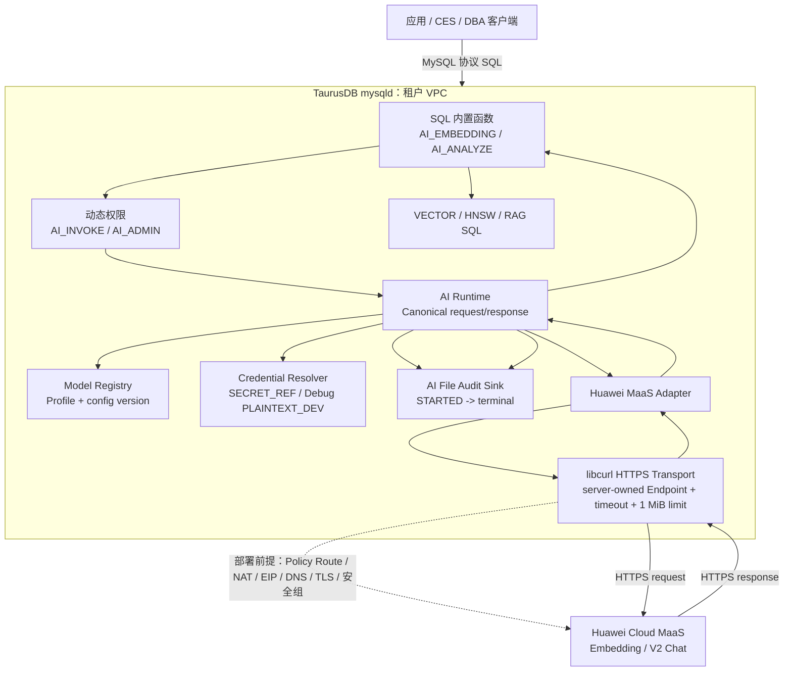
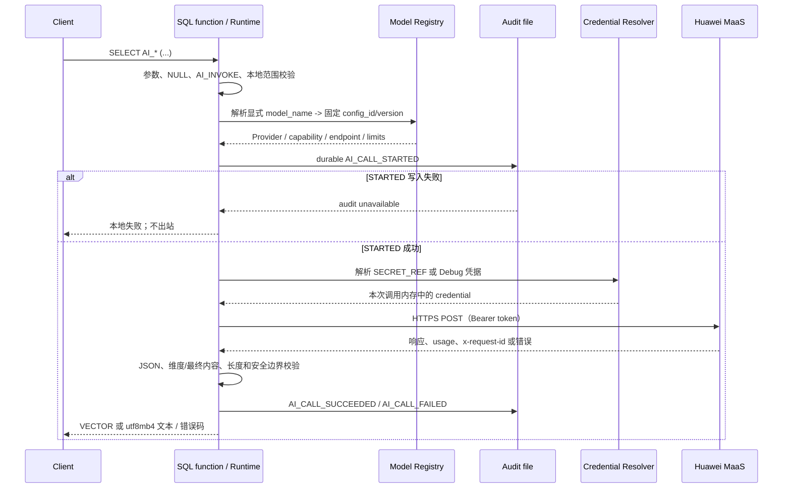
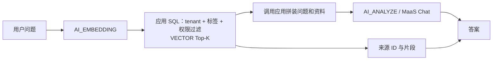
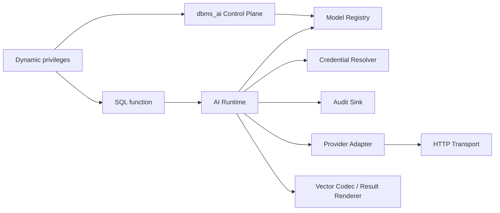
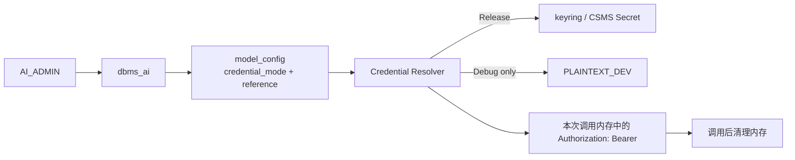
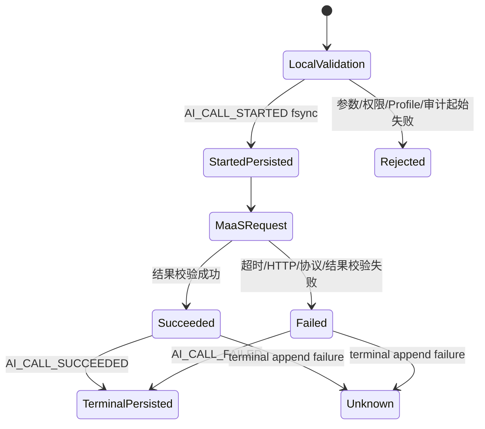

# TaurusDB MySQL 对接华为云 MaaS：P0 特性设计（Committer 评审稿）

**状态：** 评审稿

**目标版本：** 2026-09-30 P0 预览版本

**代码基线：** `ai_maas` 分支，`b66194ad06d`

**读者：** TaurusDB / AliSQL Committer、架构师、测试与运维负责人

**本文目的：** 说明该特性的产品边界、端到端数据流、内核模块、协议、安全和测试设计，供
Committer 判断接口稳定性、内核侵入范围、升级风险和上线门禁。当前实现事实以源码和已通过
MTR 为准；现有 LLD 含历史原型描述，正在按本设计收敛，不能单独作为当前行为的权威依据。

## 1. 摘要与评审结论

TaurusDB MySQL 在服务端内置调用华为云 MaaS 的文本向量和文本生成能力。数据库负责模型
Profile、权限、凭据隔离、审计、向量数据契约和错误收敛；MaaS 只负责推理。公共 AI SQL
接口不暴露 Endpoint、API Key 或 Provider 原始 JSON。

P0 已实现并通过离线回归的能力包括：

- `AI_EMBEDDING()`：华为 `bge-m3` 文本向量化，固定 1024 维；可写入 `VECTOR` 列、
  `VECTOR INDEX` 和 `STORED` 生成列。
- `AI_ANALYZE()` 原型：文本生成、RAG 上下文回答、SQL 结果分析和只读 DBA 诊断。
- `dbms_ai`：受控模型注册、更新、删除、展示；直接修改模型控制表被拒绝。
- 动态权限 `AI_INVOKE`、`AI_ADMIN`，以及出站前/结束后的两阶段、脱敏本地审计文件。
- Huawei MaaS HTTP/HTTPS Adapter、离线 fixture MTR、显式授权的真实 MaaS SQL smoke。

P0 不交付异步/批量推理、多 Provider 生产 Adapter、流式/多模态、工具调用、预算配额或
按模型细粒度授权。它也不承诺模型时延、吞吐或可用性 SLA；这些受 MaaS、网络路径、Region
和配额影响。

**接口冻结建议：** `AI_EMBEDDING(text, model_name [, dimension])` 保持；文本生成接口在
外部 GA 前从当前原型三段式签名收敛为
`AI_ANALYZE(model_name, prompt [, options_json])`。该目标签名尚未实现，不得在代码或验收中
写成已交付功能。

### 1.1 当前实现的关键限制与 Committer 决策

下列事项必须在 Committer 评审中明确接受、修复或列为 GA 阻断；它们不是可由文档掩盖的
产品承诺：

1. 当前 RAG 原型只校验调用方 `question/sources` JSON 的形状，并回显调用方给出的来源标签；
   Runtime 不验证该来源是否来自内部表、当前 tenant、账号 ACL 或实际向量检索结果。因此它只
   适用于应用已完成授权过滤的受控集成，不构成数据库级 RAG 行级授权或不可伪造引用。
2. `ai_invoke_audit=OFF` 时 Runtime 不创建 audit sink，允许正常出站但不写两阶段审计。
   “STARTED 不可写则 fail closed”仅在审计开关为 ON 时成立；关闭审计是管理员级、全实例的
   无审计外呼风险事件。
3. 控制表的写入由内核拒绝，但当前保护不拒绝 `SELECT`。具有该表 SELECT 权限的受信任管理
   账号可读取 Endpoint/credential reference；在 Debug `PLAINTEXT_DEV` 场景还可读取明文 Key。
   因此明文 Key 绝不能用于共享或生产实例，且控制表 SELECT 必须只授予受信任 server admin。
4. `dbms_ai` 当前复用共享 `SQLCOM_ADMIN_PROC`，并修改该 command 的事务/binlog/row-event
   flags；影响不局限于 `dbms_ai`，包括只读 `show_models` 和其他 native admin procedure。
   当前只验证了模型管理包的 row-based replication，尚未完成全部既有 native procedure 的
   兼容性回归。
5. P0 没有输入字节或输入 Token 上限、预算或配额；只有输出 Token 上限和 1 MiB 响应上限。
   大 prompt、Embedding 文本或 RAG sources 可能造成不可预期的 MaaS 输入费用、mysqld 内存
   放大和 worker 阻塞。输入上限及“超限无出站”测试是上线前必须补齐的门禁。

## 2. 目标、非目标与术语

### 2.1 目标

1. 让应用通过 SQL 安全调用已配置的华为 MaaS 文本模型。
2. 支持“向量化 -> 向量索引和业务过滤 -> 已授权资料回答”的 RAG 闭环。
3. 支持 SQL 结果摘要、经营分析和 DBA 只读诊断，不执行自动修复 SQL。
4. 让模型变更、权限、凭据和外部出站可审计、可定位、可演进。
5. 使新模型可主要通过 Model Profile + Adapter 接入，而不破坏客户 SQL 契约。

### 2.2 非目标

- 将 MaaS HTTP API 或 OpenAI-compatible JSON 直接暴露为 SQL 接口。
- 在用户 OLTP 事务中提供无界批量文档导入、自动重试或异步队列。
- 由模型决定租户、行级数据、RAG 来源或 DBA 修复操作。
- 通过普通 SQL 读取审计文件，或将 API Key/完整 prompt/响应写入审计。

### 2.3 术语

- **Model Profile：** 逻辑模型名到 Provider、Provider 模型、Endpoint、能力、维度、凭据
  引用和配置版本的受控映射。
- **Control Plane：** `dbms_ai` 管理模型配置、权限和凭据引用的低频路径。
- **Data Plane：** 一次 `AI_EMBEDDING` / `AI_ANALYZE` 调用从 SQL 到 MaaS 再返回结果的路径。
- **Embedding space：** 由模型/版本/维度/编码约束确定的向量兼容域；不同域的向量不能混用。
- **真实 smoke：** 显式授权、会访问 MaaS 并可能计费的人工验证，不进入默认 MTR/CI。

## 3. 友商调研与设计取舍

本节以各产品官方文档为准，调研日期为 **2026-08-05**。调研的结论只用于接口取舍，不表示
TaurusDB 与其功能等价：Databricks 的任务函数/通用函数分层支持“少量稳定主参数 + 专用函数”的
演进方式；Snowflake 的 `AI_COMPLETE` 支持把模型参数和结构化返回独立出来；Aurora 的较低层
Provider 透传则说明了将模型协议固化进客户 SQL 的长期兼容代价。

### 3.1 Databricks

Databricks 将内置 AI Functions 区分为任务型函数（如 `ai_extract`、`ai_classify`）和
`ai_query(endpoint, request, ...)` 通用入口；`ai_gen(prompt)` 是面向简单文本生成的便利
入口。`ai_query` 使用命名的 `modelParameters`、
`responseFormat` 和 `failOnError` 表达模型参数、结构化输出和错误行为；当任务型函数满足
需求时，官方建议优先使用任务型函数。

TaurusDB 借鉴“模型/请求 + 可选对象参数”的稳定形态，但不采用 Endpoint/request 透传：数据库
场景必须保证服务端拥有的 Endpoint 选择、`AI_INVOKE`、凭据隔离、审计和 Provider Adapter 仍由服务端
控制。Databricks 参考：

- https://docs.databricks.com/aws/en/large-language-models/ai-functions
- https://docs.databricks.com/aws/en/sql/language-manual/functions/ai_query
- https://docs.databricks.com/aws/en/sql/language-manual/functions/ai_extract

### 3.2 Snowflake

Snowflake 的通用文本入口为：

```sql
AI_COMPLETE(model, prompt [, model_parameters, response_format, show_details])
```

它把模型与 prompt 作为主参数，将 `temperature`、`top_p`、`max_tokens` 等放入对象参数，
将结构化输出 Schema 和调用详情作为独立语义。该设计证明“主参数少、扩展参数对象化”适合
长期 SQL 契约。

TaurusDB 借鉴其参数层次，但产品名称采用 `AI_ANALYZE`，以匹配数据库数据分析、RAG 和
只读诊断定位；不要求客户理解 LLM 的 completion 术语。Snowflake 参考：

- https://docs.snowflake.com/en/sql-reference/functions/ai_complete-single-string

### 3.3 Aurora 与其他 Provider 的反例

Aurora MySQL 的 Bedrock 路径以每个模型一个 UDF、调用方传入原始 JSON 请求体实现；Aurora
PostgreSQL 也公开 `model_id`、`content_type`、`json_key` 等 Provider 细节。这种形式便于
快速透传，但模型、协议或字段变化会进入客户 SQL 契约。

TaurusDB 不采用该模式。百炼、火山方舟、Bedrock 等后续 Provider 只通过新的 Adapter 和
Model Profile 接入；客户函数不增加 Endpoint、API Key、Provider 模型 ID 或原始 messages。

Aurora 官方参考（调研日期均为 2026-08-05）：

- https://docs.aws.amazon.com/AmazonRDS/latest/AuroraUserGuide/mysql-ml.html
- https://docs.aws.amazon.com/AmazonRDS/latest/AuroraUserGuide/postgresql-ml.html

## 4. 总体架构与端到端流程

### 4.1 架构图



### 4.2 一次调用的时序



**图例与返回路径说明：** 实线是 mysqld 代码路径；虚线是每个 Region 必须由云网络/运维完成
并验收的部署前提，不是 mysqld 自动创建的网络资源。HTTPS 响应与请求使用同一连接的反向流量，
经现有 NAT 状态映射返回租户 VPC；不需要为响应单独配置 DNAT。网络模块负责允许出站和回流，
不能替代服务端的 Endpoint 固定选择、权限或审计。

上面的时序图仅描述 `ai_invoke_audit=ON` 的强审计路径。管理员显式关闭该全局开关时，Runtime
不创建 audit sink：调用仍可出站且不会写 STARTED/终态记录。这是当前实现的例外，不能把“审计
起始失败 fail closed”误读为审计关闭时仍然生效。

## 5. 典型应用场景

### 5.1 文档向量化与语义检索

应用在写入知识库时调用 `AI_EMBEDDING()`，将文本转换为 `VECTOR(1024)`，配合向量索引和
业务过滤检索。华为 `bge-m3` 当前 Profile 固定为 1024 维。

```sql
CREATE TABLE product_manual_chunk (
  tenant_id BIGINT NOT NULL,
  source_id VARCHAR(64) NOT NULL,
  chunk_id INT NOT NULL,
  access_label VARCHAR(32) NOT NULL,
  content TEXT NOT NULL,
  embedding VECTOR(1024) NOT NULL,
  PRIMARY KEY (tenant_id, source_id, chunk_id),
  VECTOR INDEX ix_embedding (embedding) M=6 DISTANCE=COSINE
);

INSERT INTO product_manual_chunk
  (tenant_id, source_id, chunk_id, access_label, content, embedding)
VALUES
  (42, 'manual-001', 3, 'support',
   '一个 TaurusDB 实例最多可以添加 15 个只读副本。',
   AI_EMBEDDING('一个 TaurusDB 实例最多可以添加 15 个只读副本。',
                'huawei/bge-m3', 1024));
```

### 5.2 RAG 问答

RAG 不是一个 `options_json` 中的 `rag=true` 开关。推荐的应用模式是：应用先向量化问题，在 SQL
中完成 tenant、业务标签和访问控制过滤，再把选出的片段和来源标识交给文本生成模型。P0 当前
Runtime **不**持有检索语句、ACL 或不可伪造的来源句柄；它只校验调用者传入 `question/sources`
JSON 的形状，并把该内容发送给模型。因此“资料已授权”“来源可信”是调用应用的责任，而不是
当前服务端能够证明的安全属性。



P0 当前原型以 `AI_ANALYZE(task_text, input_value, options_json)` 接收 RAG 上下文；目标接口
收敛后，调用方将“问题 + 已过滤资料”构造成单个 `prompt`。模型不能自行访问数据库或选择文档；
但 P0 也不会验证来源是否确由数据库查询产生，来源标签仅是调用方提供的元数据。

### 5.3 SQL 结果与经营数据分析

将已经聚合的 SQL 结果作为证据交给模型，模型只解释数据，不访问表、不执行 SQL：

```sql
SELECT AI_ANALYZE(
  '根据证据说明订单量和营收变化、可能原因和下一步建议。',
  JSON_OBJECT('month', '2026-08', 'order_count', 1200,
              'previous_month_order_count', 980, 'revenue', 356000),
  JSON_OBJECT('model_name', 'huawei/glm-5.2',
              'max_output_tokens', 256, 'timeout_ms', 60000));
```

### 5.4 DBA 只读诊断

输入 SQL digest、执行计划、扫描行数和耗时，要求模型返回原因、证据、风险和建议。Runtime
拒绝包含 DDL/DML/修复 SQL 的诊断结果；模型仅辅助定位，执行者仍是 DBA。

### 5.5 真实 MaaS 多模型对比

`scripts/db4ai_maas_generation_model_comparison.sql` 对 `glm-5.2`、`kimi-k2.6`、
`deepseek-v4-pro`、`deepseek-v4-flash`、`openpangu-2.0-pro` 和 `openpangu-2.0-flash`
执行慢 SQL 诊断和订单经营分析两类真实调用。该脚本用于比较当次账号、Region、网络、配额和
模型输出，不构成性能、质量或可用性承诺。

## 6. Server 子模块设计

### 6.1 模块边界



| 子模块 | 主要文件 | 责任 | 不负责 |
|---|---|---|---|
| SQL 函数层 | `sql/ai/item_ai_func.*` | 参数、NULL、权限入口、SQL 类型和错误映射 | Provider JSON、密钥 |
| AI Runtime | `ai_runtime.*`、`ai_runtime_server.cc` | 编排、canonical request/response、审计和本地失败 | 持久 RAG 数据模型 |
| Model Registry | `ai_model_registry.*` | Profile 解析、能力/维度/Endpoint/版本约束 | 客户直接写表 |
| 模型管理包 | `ai_model_admin.*` | `dbms_ai` 过程、受控版本发布 | 普通 DML 管理 |
| Adapter | `ai_huawei_maas_adapter.*` | 华为协议序列化、响应解析、usage | SQL 权限、网络策略 |
| HTTP Transport | `ai_http_transport.*` | libcurl HTTPS、服务端固定 Endpoint、超时、响应限制 | Prompt 语义 |
| 审计 | `ai_file_audit.*`、`ai_audit_service.cc` | 两阶段事件、脱敏、文件权限 | 审计查询 SQL |
| 向量编码 | `ai_vector_codec.*` | float 向量校验、`MYSQL_TYPE_VECTOR` 编码 | HNSW 索引实现 |

### 6.2 SQL 接口设计

#### 当前已实现接口

```sql
AI_EMBEDDING(text, model_name [, dimension])
AI_ANALYZE(task_text, input_value, options_json)
AI_MODEL_INFO([model_name])
```

`AI_EMBEDDING` 必须显式指定模型；`NULL` 文本返回 `NULL`。`bge-m3` 的非 1024 维请求在
出站前失败。

当前 `AI_ANALYZE` 的三个参数均必填；第三个 JSON 内 `model_name` 必填。它支持
`model_name`、`mode`、`output_format`、`return_sources`、`max_output_tokens` 和 `timeout_ms`。
其中 `output_format='json'` 返回的是 TaurusDB 元数据封装 JSON，`content` 仍是未经 JSON Schema
验证的模型文本，并不等价于模型的结构化 JSON 输出；`return_sources` 回显调用者输入的来源元数据。
这是已实现原型，为现有 MTR 服务；它不应被误认为最终外部 SQL 契约。

#### 接口冻结前的目标契约

```sql
AI_EMBEDDING(text, model_name [, dimension])
AI_ANALYZE(model_name, prompt [, options_json])
```

`model_name` 和 `prompt` 必填。客户只写自然语言请求；数据库内部将固定 system policy 与
客户 prompt 构造成 Provider 所需的 `system` / `user` messages。`options_json` 首版只允许：

```json
{
  "max_output_tokens": 256,
  "timeout_ms": 60000
}
```

未知 option、Endpoint、API Key、原始 messages、工具调用、异步/批量参数和 Provider 私有
字段均在出站前拒绝。`rag`、`dba`、`diagnose`、`summarize` 等不是 options；它们是 prompt、
数据库数据准备，或未来专用接口的语义。

`AI_ANALYZE` 始终返回 `utf8mb4` 文本。未来的 JSON 输出先以合法 JSON 文本表达，不随 option
改变 SQL 返回类型；需要 JSON Schema、类型验证、引用或置信度时，新增
`AI_EXTRACT(model_name, content, json_schema [, options_json])` 等专用接口。

### 6.3 模型管理

控制面只保留内部表 `mysql.taurusdb_ai_model_config`。它保存逻辑模型名、能力、Provider 模型、
Endpoint、凭据模式/引用、维度、版本和内部状态。P0 不引入 AI 专用 tenant、用户-模型绑定或
默认模型。

```sql
CALL dbms_ai.register_model(
  'huawei/bge-m3', 'TEXT_EMBEDDING', 'bge-m3',
  'SECRET_REF', 'maas/bge-m3/key');
CALL dbms_ai.update_model(
  'huawei/glm-5.2', 'TEXT_GENERATION', 'glm-5.2',
  'SECRET_REF', 'maas/glm-5.2/key');
CALL dbms_ai.delete_model('huawei/glm-5.2', 'TEXT_GENERATION');
CALL dbms_ai.show_models();
```

`register_model` 只创建不存在的逻辑模型；`update_model` 创建递增 `config_version`，后续调用
解析到新的配置快照；并发 update 与调用的线性化、可见性和回滚语义须以专门并发测试确认。
`delete_model` 将全部版本标记为内部 `RETIRED`，不物理删除与审计关联的
历史版本。`show_models` 仅返回安全元数据，不显示 status、Endpoint、API Key 或 Secret 引用。

即使账号持有 `AI_ADMIN` 和控制表 DML/DDL 权限，直接 `INSERT`、`UPDATE`、`DELETE`、
`ALTER`、`DROP` 仍被授权层拒绝。管理包经受控系统表访问发布版本，变更写入 binlog 并由
复制 applier 应用到只读节点。当前授权层保护直接 DML/DDL，但没有禁止 `SELECT`；所以该表的
`SELECT` 权限必须仅授予受信任管理员。尤其 Debug `PLAINTEXT_DEV` 会使拥有该权限的账号读取
明文 Key，不能用于共享或生产环境。

#### 内核侵入、升级与回滚门禁

当前 `dbms_ai` 复用共享 `SQLCOM_ADMIN_PROC`，并在 `sql/sql_parse.cc` 为该 command 设置事务、
binlog 与 row-event 标志。这些标志会影响所有使用该 command 的既有 native procedure，而非仅
`dbms_ai`；例如只读的 `show_models` 也可能继承数据变更语义。这是必须在合入前处理或明确接受的
核心兼容风险。最低门禁是：覆盖既有 native procedure 的语义/事务/binlog 回归、row/statement
复制回归和只读节点行为验证。较稳妥的后续实现是引入专用 SQL command 或按过程设置 flag。

系统表升级由 `scripts/mysql_system_tables_fix.sql` 创建 `taurusdb_ai_model_config` 并从旧
`alisql_ai_model_config` 迁移兼容数据；旧表不会自动删除，历史 active 配置会写入兼容的
`is_default` 标记。Runtime 的正式调用仍应显式指定模型，不能依赖该标记。升级方案还必须明确：
旧明文 Key 的迁移/轮换、失败时的幂等重试、备份恢复、降级期间双表处理以及升级后旧表的清理策略；
上述项目当前不是已验证的完整回滚承诺。

### 6.4 权限管理

| 权限 | 作用 | 边界 |
|---|---|---|
| `AI_INVOKE` | 调用 Embedding 和 Analyze | 在 Profile、凭据和网络解析前检查；持有者可调用全部 ACTIVE Profile。 |
| `AI_ADMIN` | 调用 `dbms_ai` 管理模型 | 不等于直接修改控制表，不扩大普通表权限。 |
| `AI_AUDIT_VIEWER` | 预留兼容权限 | P0 不提供普通 SQL 读取审计文件；查看由日志平台授权。 |

P0 是实例级授权。按 `user@host -> model/capability`、预算、配额和多租户授权需要明确业务
诉求后再设计，不能在 `model_config` 中塞用户列表。

### 6.5 API Key 与凭据管理



- Release/生产只允许 `SECRET_REF`；注册/更新时验证引用可读且非空，运行时每次调用读取。
- Debug 开发可使用 `PLAINTEXT_DEV` 缩短联调路径；其值在本次调用的进程内存中构造 Bearer
  header，调用后按现有对象生命周期释放。它不是 OAuth 短生命周期令牌，且不应写入 SQL 结果、
  审计、错误、MTR 结果或 Git。
- `PLAINTEXT_DEV` 会进入系统表物理数据、binlog 和备份，必须使用可撤销的测试 Key；验证后
  删除临时 Profile，并在 MaaS 侧轮换/吊销 Key。
- `AI_MODEL_INFO()`、`show_models()` 和审计不得返回 Endpoint 明文、credential ref 或密钥。

### 6.6 AI 调用审计

审计文件默认位于 `<datadir>/ai_invoke_audit.jsonl`，可用只读启动变量
`--ai-invoke-audit-log-file` 指定路径。`ai_invoke_audit` 是默认 ON、仅 GLOBAL 的动态开关；
普通 `AI_INVOKE` 用户不能关闭，且不支持 `SET SESSION`。只有管理员可关闭；关闭表示允许无审计
外呼，必须纳入变更记录与告警，而不是常规降级手段。



起始事件安全落盘失败时，调用 fail closed、不得出站。终态事件写入失败时，云端请求可能已发生；
保留 `STARTED`，日志平台按缺失终态处置为 `UNKNOWN`。每行仅包含时间、`call_id`、实例、账号、
客户端 IP、能力、逻辑模型、Endpoint fingerprint、config id/version、状态、错误分类；终态附加
Provider request id、HTTP 状态、时延和 Provider 响应所带的 token usage。它不包含 API Key、
Authorization、完整 prompt、完整响应或向量。当前没有 `usage_present` 标志；usage 为零无法区分
“模型实际未消耗”与“Provider 未返回 usage”，因此不能将其作为精确计费依据。

### 6.7 子模块交互与关键失败边界

| 位置 | 可本地拒绝的条件 | 是否允许 MaaS 出站 |
|---|---|---|
| SQL 函数 | 参数个数/类型、NULL、模型名为空 | 否 |
| 权限 | 无 `AI_INVOKE` / `AI_ADMIN` | 否 |
| Registry | 无 Profile、禁用模型、能力/维度不匹配 | 否 |
| Audit STARTED | 文件不可写、权限/同步失败 | 否 |
| Credential | Secret 不可读、Debug 明文用于 Release | 否 |
| Transport | 非 HTTPS、非服务端固定 Endpoint、连接/总超时、TLS/响应超限 | 请求前或请求中失败 |
| 输入成本 | 无输入字节/Token 上限（当前缺口） | 当前可能出站；上线前须补充上限与本地拒绝测试 |
| Adapter/Renderer | HTTP 非 2xx、JSON 错误、无最终内容、维度错误、不安全 DBA 输出 | 请求可能已发生 |
| Audit terminal | 终态不可写 | 请求已可能发生，按 UNKNOWN 处置 |

### 6.8 mysqld 与 MaaS 的协议

P0 使用服务器内 libcurl 发起 HTTPS POST，不调用 shell `curl` 命令、不启动 Python、也不依赖
OpenAI Python SDK。当前 Huawei Profile 的 Endpoint 由服务端 Profile/Registry 固定选择，而非
客户 SQL 或管理员任意传入的 endpoint allowlist。Transport 仅允许 `https://`；连接超时默认 5 秒、
总超时默认 30 秒，SQL options 最多可设 60 秒；最大响应体为 1 MiB。TLS/DNS/证书错误作为传输
失败脱敏记录，当前 SQL 对多数 Provider 失败仍收敛为通用错误。

**Embedding：**

```http
POST /v1/embeddings HTTP/1.1
Content-Type: application/json
Authorization: Bearer <in-memory API key>

{"model":"bge-m3","input":"待向量化文本","encoding_format":"float"}
```

Adapter 读取 `data[].embedding` 浮点数组与 `usage`，对 `huawei/bge-m3` 强制检查 1024 维，再
转换为 TaurusDB `VECTOR`。不向 SQL 返回 MaaS 原始 JSON。

**文本生成：**

```http
POST /v2/chat/completions HTTP/1.1
Content-Type: application/json
Authorization: Bearer <in-memory API key>

{
  "model":"glm-5.2",
  "messages":[
    {"role":"system","content":"TaurusDB 服务端受控策略"},
    {"role":"user","content":"客户请求及调用方提供的上下文"}
  ],
  "max_tokens":256
}
```

Adapter 只读取首个 choice 的非空最终 `message.content`、`finish_reason`、`usage` 和
`x-request-id`。仅有 `reasoning_content`、响应截断或没有最终 content 均失败；reasoning 不返回
给客户。system prompt 只提供行为约束，不是防提示注入、越权检索或数据可信性的安全边界；模型
输出永远是不可信文本，不得被服务端自动执行为 SQL/运维命令。

## 7. DFX 与可观测性设计

### 7.1 定位入口

| 现象 | 首先检查 | 预期定位信息 |
|---|---|---|
| 调用立即失败 | SQL 错误码、`AI_MODEL_INFO()`、权限 | 参数、权限、Profile、维度或凭据本地失败。 |
| 调用超时 | 审计 `call_id`、时延、网络/出口日志 | 是否已写 STARTED、是否有 Provider request id、连接/总超时。 |
| Provider 失败 | 审计错误分类、HTTP 状态、MaaS 控制台 | 401/403、429、404、协议或服务端错误；不记录响应正文。 |
| 结果为空 | `INCOMPLETE_OUTPUT`、finish reason | reasoning-only、截断或不完整上游响应。 |
| 向量不可检索 | model metadata、维度、应用表的 embedding space、索引 | Profile/version/dimension 与索引空间是否一致。 |
| 只读节点无审计 | 本地 audit 文件、节点日志采集 | 不依赖写系统表；检查文件路径、权限、磁盘与采集规则。 |

### 7.2 DFX 原则

- 审计内部错误分类使用 `ACCESS_DENIED`、`RATE_LIMITED`、`MODEL_NOT_FOUND`、`TIMEOUT`、
  `PROTOCOL_MISMATCH`、`RESPONSE_TOO_LARGE`、`INCOMPLETE_OUTPUT`、`AUDIT_UNAVAILABLE` 等。
  这些分类当前不是稳定的客户 SQL error-code 契约：多数 Provider/Transport 失败仍向 SQL 收敛为
  通用 `ER_NOT_SUPPORTED_YET` 文本，后续需设计可兼容的错误码/SQLSTATE 映射。
- 用 `call_id`、Provider request id、HTTP 状态和 Endpoint fingerprint 做跨系统关联，不记录
  原始请求或 Secret。
- 审计和日志用于定位，不是客户 SQL 数据面；日志轮转、保留、采集、告警和访问控制复用
  TaurusDB 日志平台。
- 真实调用测试必须输出脱敏结果、模型名、耗时和错误分类，不保存 Key 或完整响应到仓库。

## 8. 测试设计

### 8.1 离线 MTR

默认 MTR 使用 `mtr/fixture-*`，不读取真实密钥、不访问公网，覆盖完整 SQL -> Runtime ->
Adapter -> Audit -> VECTOR 编码路径：

```bash
cd build-debug/mysql-test
./mtr --suite=rds \
  ai_maas_contract ai_maas_embedding ai_maas_analysis ai_maas_governance \
  ai_maas_rag ai_maas_model_admin ai_maas_model_admin_rpl
```

| 用例 | 核心测试点 |
|---|---|
| `ai_maas_contract` | NULL、显式 Profile、禁用 Profile、函数 arity、本地失败无出站。 |
| `ai_maas_embedding` | fixture 1024 维、VECTOR 转换、余弦/欧氏距离、向量索引、维度不匹配和清理。 |
| `ai_maas_analysis` | options 范围、RAG/诊断输入契约、私有参数拒绝、无最终内容、禁止修复 SQL。 |
| `ai_maas_governance` | 审计全局开关、无 Session 开关、终态审计写入失败与脱敏。起始写入失败由 `ai_file_audit` GUnit 覆盖。 |
| `ai_maas_rag` | 应用 SQL 的 tenant/业务过滤范式、应用表的 embedding-space 契约、STORED 生成列、调用方来源元数据。 |
| `ai_maas_model_admin` | `AI_ADMIN`、`dbms_ai`、直接 DML/DDL 拒绝、版本更新/停用。 |
| `ai_maas_model_admin_rpl` | 受控控制面变更的 row-based replication applier。 |

当前基线已验证上述 7 个 RDS 用例及 shutdown report 全部通过。
`ai_maas_model_admin_release.test` 另覆盖 Release 构建下的 fake keyring `SECRET_REF` 回归；它不在
上述 Debug 7 用例基线中，也不能替代目标环境 keyring/CSMS 的真实集成验证。

### 8.2 真实 MaaS smoke

真实验证必须由管理员明确授权，在专用 schema 和可撤销凭据下执行：

| 脚本 | 范围 |
|---|---|
| `scripts/db4ai_maas_smoke.sql` | `bge-m3` Embedding 维度与 `glm-5.2` 文本生成非空结果。 |
| `scripts/db4ai_maas_real_embedding_rag_smoke.sql` | 直接向量化、VECTOR INDEX、STORED 自动向量化、文档更新和 RAG 召回。 |
| `scripts/db4ai_maas_generation_model_comparison.sql` | 六个文本生成模型、两个固定业务用例、逐项耗时与脱敏错误。 |

真实验证完成后清理测试表和临时 Profile；若使用开发 Key，必须轮换或吊销。真实脚本不是
性能基准，不能用一次模型响应推导 P50/P95/QPS 或生产 SLA。

### 8.3 仍需补齐的测试门禁

- Release 构建 + keyring `SECRET_REF` 的真实可读、轮换和失效回归。
- 主节点、只读节点、节点切换、审计文件不可写四类场景的真实部署验证。
- 输入文本、RAG 上下文的字节/Token 上限和本地拒绝回归；当前实现没有这项成本保护。
- 控制表 `SELECT` 授权、Debug 明文 Key 备份/binlog 暴露与升级后 Key 轮换的安全回归。
- `SQLCOM_ADMIN_PROC` 对全部既有 native procedure 的事务、binlog、row event 和复制回归。
- 目标接口 `AI_ANALYZE(model_name, prompt [, options_json])` 完成实现后的 MTR、兼容迁移和
  真实 MaaS 回归。
- 百炼、火山方舟、Bedrock 等 Provider 在 Adapter 实现后各自的协议、维度和真实 smoke。
- 性能和容量测试在生产目标网络、模型规格和配额明确后单独定义验收指标。

## 9. 约束、风险与上线门禁

1. **同步与费用：** P0 仅同步调用。连接中断、超时或本地事务回滚时，MaaS 仍可能已收到请求并
   产生费用；P0 默认不自动重试。
2. **事务边界：** 外部模型调用不能与 MySQL 事务原子回滚。避免在长事务、触发器、无界扫描或
   高并发 OLTP 热路径中调用。
3. **STORED 生成列：** 文本正文插入/更新会同步调用模型并重建向量。现有测试覆盖
   `binlog_row_image=MINIMAL` 的范式；尚未以调用计数证明所有 row image、复制和生成列路径下
   “只改分类/标签/状态不产生额外调用”。在完成该矩阵前，不得将该行为作为通用产品承诺。
4. **网络：** 每个上线 Region 必须完成 MaaS Endpoint、DNS、TLS、Policy Route/NAT/EIP、
   安全组和回流验证。外网连通不等于账号、模型或 Region 准入可用。
5. **模型范围：** 当前生产实现仅有 Huawei Embedding/V2 Chat Adapter；模型可见不等于可调用。
   当前 Endpoint 是服务端固定选择，不是面向多 Provider 的可配置 allowlist。Profile 应区分配置
   ACTIVE 与最近推理成功。
6. **RAG 安全：** 业务/调用应用必须负责 tenant、权限、标签、来源过滤和提示注入防护；仅按向量
   距离 Top-K 不可作为安全边界。P0 不校验调用者来源的真实性。若对外宣称数据库级 RAG 隔离，
   必须先增加服务端绑定的检索/上下文句柄与 ACL 校验。
7. **审计：** `ai_invoke_audit=ON` 时，STARTED 写入失败 fail closed；终态写入失败只能证明请求
   可能已发出，必须由日志平台按 UNKNOWN 告警/处置。管理员关闭审计后，这套记录和 fail-closed
   保障均不存在。
8. **凭据与成本：** Debug 明文 Key 会进入系统表物理数据、binlog 和备份；控制表 `SELECT` 不能
   授予非受信任账号。当前无输入字节/Token 上限，调用方必须在应用侧限流、限长、限预算；上线前
   应补齐服务端限制。
9. **内核兼容：** `SQLCOM_ADMIN_PROC` 共享 flags 的影响范围尚未闭合；未完成回归前不得视为低风险
   控制面改动。
10. **接口演进：** 当前 `AI_ANALYZE` 原型和目标接口不同。外部 GA 前必须完成目标接口实现或
   经 Committer 明确决定冻结旧接口，不能让文档、测试和客户示例处于两种契约之间。

## 10. Committer 审核清单

- [ ] SQL 客户契约是否明确区分当前实现与冻结目标，且不存在默认模型或 Provider 透传。
- [ ] `dbms_ai` 是否是唯一模型写路径，系统表保护是否覆盖 DML/DDL、复制和升级路径；控制表
  `SELECT`、Debug 明文与备份/binlog 暴露是否已被运维权限收敛。
- [ ] `AI_INVOKE` 是否位于 Profile/凭据/网络解析之前，所有本地失败是否确保无 MaaS 出站。
- [ ] `SECRET_REF`、Debug 明文、日志和备份边界是否符合目标分支的 keyring/运维规范。
- [ ] 两阶段审计是否在主/只读节点都可写，且在开关 ON 时 STARTED 不可写完全 fail closed；审计
  关闭是否有管理员变更审计和告警。
- [ ] Adapter、libcurl、服务端固定 Endpoint、TLS、响应/输入限制、错误脱敏和内存清理是否符合
  mysqld 规范。
- [ ] RAG 的调用方 ACL/来源责任、embedding-space/version 和 STORED 生成列是否与 VECTOR/复制/
  事务语义一致；是否避免对 P0 原型作数据库级隔离承诺。
- [ ] `SQLCOM_ADMIN_PROC` 共享 flags 是否已消除或已有全量兼容回归与明确接受结论。
- [ ] 离线 MTR、Release keyring、真实 MaaS smoke 和目标网络验收是否满足发布门禁。

## 11. 代码与文档索引

- 总体演进设计：`Docs/db4ai/taurusdb-maas-p0-high-level-design.md`
- 当前实现级设计：`Docs/db4ai/alisql-maas-p0-low-level-design.md`
- 移植入口：`Docs/db4ai/README.md`
- 运维与 SQL 示例：`Docs/db4ai/alisql-maas-p0-operations-and-examples.md`
- 验收标准：`Docs/db4ai/taurusdb-maas-p0-acceptance-criteria.md`
- 验证状态：`Docs/db4ai/alisql-maas-p0-validation-status.md`
- 关键实现：`sql/ai/`、`sql/auth/sql_authorization.cc`、`sql/package/package_cache.cc`、
  `sql/sql_parse.cc`
- 离线测试：`mysql-test/suite/rds/t/ai_maas_*.test`
- 真实测试：`scripts/db4ai_maas_*.sql`
