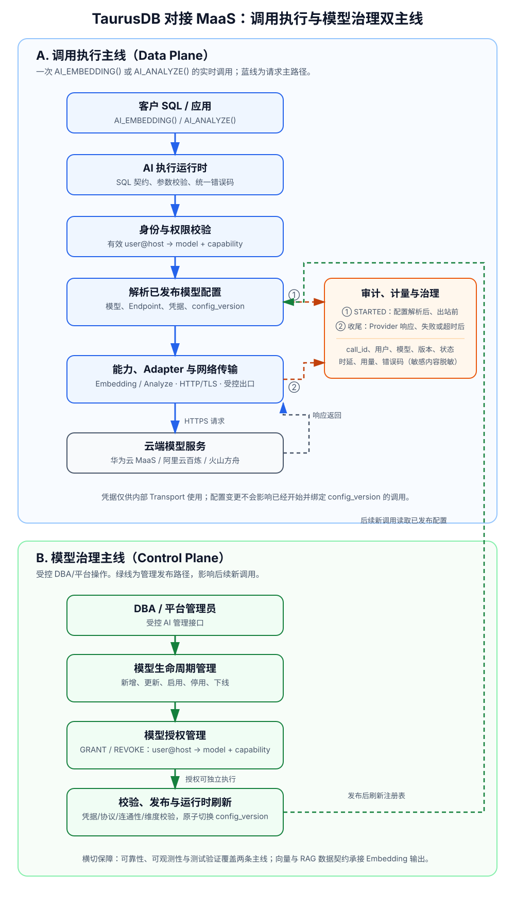

# TaurusDB 对接华为云 MaaS P0 High Level Design

日期：2026-07-08

目标版本：2026-09-30 P0 预览版本

最近更新：2026-08-04（合入 `dbms_ai` 受控模型管理、两阶段文件审计、离线回归和真实 MaaS 验证说明）

关联主计划：

- `Docs/db4ai_tasks/taurusdb-maas-phase1-main-plan-and-analysis.md`
- `Docs/db4ai_tasks/taurusdb-maas-engineering-and-validation.md`
- `CLAUDE.md`

文档职责：本文件是接口、运行时治理和扩展架构的唯一设计依据；不再维护独立的“关键决策”补充文档。

## 1. 设计结论

P0 版本不是 MaaS Chat demo，而是 TaurusDB MySQL 内的 AI 数据闭环：

```text
TaurusDB 数据
  -> MaaS Embedding
  -> TaurusDB 向量列 / HNSW 索引
  -> tenant/security/scalar filter + top-k 召回
  -> MaaS Chat / Analyze
  -> 带来源引用的答案、分析或诊断建议
  -> 审计、token 计量、错误治理
```

P0 发布承诺：

- 客户面主入口：`AI_EMBEDDING()`、`AI_ANALYZE()` 或等价 wrapper。
- 内部执行入口：TaurusDB 内置 AI Runtime Service，不向 SQL 暴露 MaaS primitive。
- 支持带租户/权限/标量过滤的 HNSW RAG 闭环。
- 支持 SQL 结果智能分析和至少一个 DBA 只读诊断样例。
- 支持 fail closed、endpoint allowlist、timeout、max response、错误脱敏、审计和 token usage 解析。
- provider/model/capability/options 抽象从 P0 写入内核代码结构，不把具体模型名和 endpoint 散落在函数实现中。
- 客户 SQL 不绑定 OpenAI、Anthropic、Bedrock 或任一厂商的原始 HTTP JSON；协议差异由内部 adapter 隔离。

P0 不承诺：

- `CREATE AI MODEL` / `CREATE AI CREDENTIAL` parser 语法。
- PolarDB 风格 `PREDICT` parser 语法。
- 完整批量 embedding 异步调度系统。
- 完整全文 + 向量 + 标量 hybrid search 产品化。
- Agent memory、ContextSearch、KooSearch、AgentArts 深度集成。
- 多 provider 生产级切换。

## 2. 设计原则

1. **数据库负责数据与治理，MaaS 负责模型能力**
   - TaurusDB 负责 SQL、权限、租户过滤、向量/HNSW、审计、token 计量和结果 provenance。
   - 华为云 MaaS 负责 Chat、Embedding，后续可扩展 Rerank、Classify、Extract 等 capability。

2. **客户面接口收敛**
   - 客户不直接面向 endpoint、API Key、OpenAI-compatible JSON。
   - 客户面稳定入口先收敛为 `AI_EMBEDDING()` 和 `AI_ANALYZE()`。
   - 不提供 `maas_*`、原始 HTTP 调用或 provider JSON 透传 SQL 接口。

3. **RAG 必须带过滤和来源**
   - P0 RAG 不是单纯 `ORDER BY vector_distance(...) LIMIT k`。
   - RAG 召回 SQL 必须显式包含 `tenant_id`、权限或业务标量过滤。
   - 输出答案必须能返回 `chunk_id`、`source_id` 或等价来源引用。

4. **模型运行时解耦**
   - 内核通过 model profile 识别 provider、protocol family、model alias、capability、endpoint、credential ref 和受控 options。
   - P0 要求客户 SQL 显式选择模型，不提供默认模型或 alias 静默切换。
   - 逻辑模型名解析到可审计、不可变的具体模型配置。
   - Embedding 模型必须绑定 corpus/index、embedding space 和 profile version。
   - 客户 SQL 不传 provider model ID、endpoint、API Key 或原始 `messages` 请求体。

5. **模型不应是黑盒**
   - 应用开发者和 DBA 必须能够查询 alias 实际解析到的 provider、模型 ID、上游版本、
     TaurusDB profile version、能力、限制、生命周期和向量空间信息。
   - 新模型如复用已支持的 protocol family 和 capability，可仅通过新增 model profile 启用；
     新协议或新 capability 必须通过新的 adapter 发布，不能静默降级或透传未知 JSON 字段。
   - 上游仅提供 `latest` 等非固定标识时，profile 必须标记为 `UPSTREAM_REVISION_UNRESOLVED`；
     该 profile 不得用于持久化 RAG corpus 或 HNSW 索引。

6. **同步调用有限制**
   - P0 允许同步调用支撑小规模 demo、SQL 分析和 smoke test。
   - 大表批量 embedding、文档导入、chunk、重试和索引重建不应在用户 OLTP 事务中同步完成。
   - P1/P2 再引入异步 embedding 队列、状态表、重试和调度。

7. **默认测试不依赖真实云端**
   - 默认 MTR 使用 mock 和 fail-closed 路径。
   - 真实 MaaS 调用只做显式 opt-in smoke test。

## 友商实测调研与 P0 设计输入

本章只收录 2026-07 已完成的官方资料核对和实机验证结论；“调用失败”仅表示指定账号、
区域和实例下未完成验证，不能外推为产品能力不存在。完整 SQL、脚本、脱敏输出和环境
清理记录见 `Docs/db4ai_tasks/taurusdb-maas-engineering-and-validation.md`。

### Databricks AI Functions 与 Snowflake Cortex

**接口事实：**

- Databricks 将 SQL AI Functions 分为两类：`ai_gen(prompt)` 等任务型简易函数，以及
  `ai_query(endpoint, request, ...)` 通用调用入口。后者通过命名的 `modelParameters`、
  `responseFormat` 和 `failOnError` 扩展模型参数、结构化输出和错误返回；其文档明确建议当
  任务型函数满足需求时优先使用任务型函数。`ai_query` 的 Endpoint 与 request 面向
  Databricks 管理的、外部或自定义模型服务，因此调用方需要理解 Endpoint 类型和请求形态。
  官方依据：
  https://docs.databricks.com/aws/en/large-language-models/ai-functions ，
  https://docs.databricks.com/aws/en/sql/language-manual/functions/ai_query 。
- Snowflake 的通用文本入口为
  `AI_COMPLETE(model, prompt [, model_parameters, response_format, show_details])`。
  `model_parameters` 是 SQL 对象，用于 `temperature`、`top_p`、`max_tokens` 和
  guardrails；`response_format` 单独表达 JSON Schema 或 SQL 类型形式的结构化输出，
  `show_details` 单独控制 usage 等调用详情。官方依据：
  https://docs.snowflake.com/en/sql-reference/functions/ai_complete-single-string 。
- 两者的共同点是：客户首先提供稳定的模型/Endpoint 标识和自然语言 prompt；可选行为通过
  对象或命名参数扩展，而不是把“RAG”“DBA 诊断”等业务场景编码为模式枚举。结构化抽取在
  Databricks 中有 `ai_extract(content, schema [, options])` 这类具有明确输入和输出契约的
  专用函数，而不是无限扩张一个通用函数。

**P0 设计输入：**

1. TaurusDB 采用 Snowflake 类似的“逻辑模型名 + prompt + 受控 options”形态，但逻辑模型名
   解析为 TaurusDB Model Profile，而不是暴露云厂商 Endpoint 或原始 Provider JSON。
2. 不照搬 Databricks `ai_query` 的 Endpoint/request 透传能力。TaurusDB 必须保留
   `AI_INVOKE`、Endpoint allowlist、凭据隔离、审计和 Provider Adapter 边界。
3. `options_json` 只容纳跨 Provider、调用级且可验证的配置；未知字段必须在 MaaS 出站前
   失败。Endpoint、API Key、原始 messages、工具调用、异步/批量控制和厂商私有 JSON 不进入
   客户 SQL 契约。
4. RAG、SQL 诊断、经营分析是 prompt 和数据库数据准备方式，不是 `options_json` 的
   `mode`。RAG 的召回、tenant/权限/标量过滤和来源保留必须在数据库 SQL 中完成。
5. 若后续需要字段抽取和类型保证，新增 `AI_EXTRACT(model_name, content, json_schema
   [, options_json])` 等专用接口；不要以 `AI_ANALYZE` 的 mode 或任意 JSON 透传替代输出
   Schema 校验。

### AWS Aurora 与 Amazon Bedrock

**接口与实测事实：**

- Aurora MySQL 以每个模型一个 `CREATE FUNCTION ... ALIAS AWS_BEDROCK_INVOKE_MODEL`
  的方式调用 Bedrock，函数返回 `TEXT`；Aurora PostgreSQL `aws_ml 2.0` 提供
  `aws_bedrock.invoke_model(...)` 和从原始 JSON 提取数组的
  `invoke_model_get_embeddings(...)`。两者都把模型 ID 或模型原生请求结构暴露给 SQL
  调用方，且 Aurora ML 不提供向量类型、HNSW 和 embedding space 治理。
- 在同一 AWS 账号和 `us-east-1`，应用通过 Bedrock Mantle OpenAI-compatible 入口调用
  `openai.gpt-oss-120b` 成功；直接 Bedrock Runtime、Aurora MySQL UDF 和 Aurora
  PostgreSQL `aws_bedrock` 调用均被 Bedrock corporate-customer allowlisting 拒绝。
  当时 Aurora 的 IAM role、`AWS_BEDROCK_ACCESS` 数据库角色和 `aws_ml` 扩展均已就绪，
  因此该失败发生在模型推理前的账号准入层，而非 SQL 权限、角色或请求 JSON。
- 本次没有得到 Aurora SQL 的模型响应、embedding 向量或 Token usage；不得将 Aurora
  Bedrock SQL 调用写为本账号已验证成功。AWS 放行后需要重新创建已删除的验证实例，先做
  Bedrock Runtime 准入预检，再重跑数据库调用。

**P0 设计输入：**

1. 不采用 Aurora MySQL 的“每模型一个 SQL UDF”，也不将 Aurora PostgreSQL 的
   `model_id + 原始 JSON + json_key` 暴露为客户契约；客户面保持
   `AI_ANALYZE()`、`AI_EMBEDDING()`，由内部 Adapter 处理模型协议。
2. Provider 状态必须区分 `ACCOUNT_ENTITLEMENT_DENIED`、`CREDENTIAL_DENIED`、
   `MODEL_UNAVAILABLE`、`PROTOCOL_MISMATCH` 和数据库权限错误。模型在目录或控制台可见，
   不等价于可推理。
3. AWS 后续以 `AWS_BEDROCK` Provider Profile 和 IAM Role/SigV4 Adapter 扩展；它不等于
   可直接调用华为 MaaS、百炼或其他公网 MaaS 服务。

### 阿里云 PolarDB MySQL 与百炼

**接口与实测事实：**

- PolarDB for AI 的早期形态是 `/*polar4ai*/` 下的模型生命周期和传统 ML；LLM 阶段以
  `PREDICT (MODEL ..., SELECT ...)` 调用内置任务模型；当前另有
  `EMBEDDING(text, model, dimension)`、向量/HNSW、PolarSearch 和托管 RAG 能力。
- 已购买 AI 节点先报 `polar4ai switch is not trun on`；路由配置后还需要连接集群地址、
  使用客户端 `-c` 并选择默认数据库。完成前置条件后，内置 Qwen 聊天、情感、摘要、翻译和
  评价任务模型均返回成功。`SHOW MODELS` 返回空集，证明内置模型不在用户模型目录内。
- 三行文本的异步 `PREDICT` 成功完成，但结果为有时效的 OSS 签名文件而不是数据库行集；
  NL2SQL schema 建索引和自定义传统模型训练在该环境均失败，且服务端错误不足以定位。
- PolarDB 内核 `EMBEDDING('...', 'text-embedding-v4', 64)` 被识别，但因
  `polar_embedding_oss_access_key_id/secret` 为空而失败。该结果证明 AI 节点 Qwen 调用与
  百炼 Embedding 是两条独立凭据/配置链路，不能把前者成功推断为后者可用。
- 使用百炼 OpenAI-compatible `/embeddings` 实测 `text-embedding-v4`：复数
  `dimensions` 参数的 64、512、1024 均返回相同维度；省略时默认 1024。DashScope 原生
  协议使用单数 `dimension`，因此参数名称不能跨协议透传。

**P0 设计输入：**

1. 采用 PolarDB 的高层 SQL 易用性，但不采用 `PREDICT` parser 语法或任务模型枚举；
   `AI_ANALYZE()` 根据可查询的 Model Profile 选择实际 provider/model/version。
   当前 `_polar4ai_tongyi_*` 路径是 PolarDB AI 节点上的内置 Qwen 能力，不要求用户提供
   外部 MaaS Endpoint 或 API Key；它只可作为“任务型 SQL 体验、同步/异步边界”的参考，
   不能作为 TaurusDB 对接华为 MaaS 的协议、凭据、模型版本或 Token 治理实现参考。
2. 模型发现接口必须列出内置模型、实际模型版本、能力、生命周期、准入和维度，不能像
   `SHOW MODELS` 一样只显示用户创建对象。
3. P0 同步调用严格限制输入规模；P1 再提供可查询、可保留、可重试的异步批量任务，不能
   只返回短期 OSS URL。Embedding 模型、维度、版本和度量必须绑定 embedding space。
4. 百炼 Profile 对 `text-embedding-v4` 应使用 `dimension_parameter='dimensions'`；
   DashScope 原生和其他 Adapter 由内部转换，客户 SQL 不感知参数命名差异。

### 火山引擎方舟

**接口与实测事实：**

- 已验证 Ark 图文 Embedding `doubao-embedding-vision-251215` 的
  `/api/v3/embeddings/multimodal`：纯文本输入成功返回一个 2048 维 float 向量；响应
  `data` 为对象，`embedding` 为二维数组，不是 OpenAI 文本 Embedding 常见的
  `data[0].embedding` 结构。
- 该模型不传维度时返回 2048；复数 `dimensions=1024` 和 `dimensions=2048` 分别返回
  1024 和 2048；`dimensions=64`、256、512 返回 HTTP 400 `InvalidParameter`；单数
  `dimension=1024` 被静默忽略并返回 2048。
- 方舟文本 Embedding `/api/v3/embeddings` 使用字符串数组和数组型 `data`；图文接口使用
  `type=text|image_url` 对象数组。二者的 endpoint、输入结构和响应结构均不同。

**P0 设计输入：**

1. P0 不把该图文模型作为默认 `TEXT_EMBEDDING` Profile；后续使用
   `VOLCENGINE_ARK_MULTIMODAL_EMBEDDING` Adapter 与 `MULTIMODAL_EMBEDDING`
   capability，并将输入模态、模型版本、维度共同绑定 embedding space。
2. 图文模型 Profile 的已验证配置为 `default_dimension=2048`、
   `allowed_dimensions=[1024,2048]`、`dimension_parameter='dimensions'`。Adapter 必须
   拒绝单数 `dimension` 和 allowlist 之外的维度，禁止静默回退。

**统一结论：**友商接口都不能直接成为 TaurusDB SQL 契约。模型/endpoint/凭据/协议/维度
差异必须由 Model Profile、Provider Adapter 和 Runtime 统一治理；所有 Profile 都必须记录
真实可调用状态和验证时间，所有持久化向量必须绑定不可变的 embedding space。

## 3. 目标架构

P0 采用两条相互衔接但职责分离的主线：**调用执行主线（Data Plane）**负责一次
`AI_EMBEDDING()` 或 `AI_ANALYZE()` 的实时调用；**模型治理主线（Control Plane）**
负责模型生命周期、凭据、用户授权和发布。模型治理的变更只影响发布后的新调用，不能
改变已开始调用所绑定的配置版本。



### 3.1 调用执行主线（Data Plane）

```text
客户 SQL
  -> AI 内置函数与执行运行时
  -> user@host 的模型/能力权限校验
  -> 解析已发布模型配置、Endpoint、凭据和 config_version
  -> Embedding 或 Analyze 能力实现
  -> Provider Adapter 与 HTTP/TLS/受控网络出口
  -> 云端模型服务
  -> 响应、维度/结果校验与 SQL 结果
```

当全局审计开关 `ai_invoke_audit=ON` 时，审计是该主线的同步治理步骤，而不是可选的
异步旁路：在出站前向 AI 审计日志文件写入最小、脱敏的 `STARTED` 事件；返回、失败或
超时后以相同 `call_id` 追加 `SUCCESS`、`FAILED` 或 `UNKNOWN` 终态、时延、用量和错误
分类。起始事件不可写或不可安全落盘时 fail closed；终态写入失败不得否认已经发出的
云端请求，保留 `STARTED` 事件并作为待处置的 `UNKNOWN` 调用处理。

### 3.2 模型治理主线（Control Plane）

模型治理必须通过受控的 DBA/平台管理接口完成，不向普通业务 SQL 用户暴露 API Key 或
任意 Endpoint。其生命周期为：

```text
新增/更新模型或凭据
  -> 协议、Adapter、Endpoint allowlist、凭据、连通性和维度校验
  -> 发布新的 config_version（或停用/下线旧版本）
  -> 刷新运行时模型注册表
  -> 后续新调用按新版本解析
```

授权是与模型配置独立的治理操作：`GRANT`/`REVOKE AI_INVOKE` 决定有效 MySQL 账号
`user@host` 是否可调用 P0 AI 能力。P0 不建立账号到 `model_name + capability` 的映射；
持有该权限的账号可以调用全部 `ACTIVE` Profile。模型集合、Endpoint 和凭据由 DBA 通过
受控 Profile 管理路径控制。

### 3.3 模块边界与主线归属

| # | 模块 | 主线/定位 | 边界 |
|---|---|---|---|
| 1 | SQL 接口与 AI 执行运行时 | 调用执行 | 统一 SQL 契约、参数校验、执行编排、错误码；不含厂商协议细节。 |
| 2 | 身份与权限控制 | 调用执行 + 模型治理 | 校验 `user@host -> model + capability`；不保存 API Key。 |
| 3 | 模型、Endpoint 与凭据管理 | 模型治理 | 模型生命周期、版本、端点和凭据引用；不决定普通用户是否获授权。 |
| 4 | Embedding 能力 | 调用执行 | 文本向量化、维度和结果校验；不负责索引和 RAG 检索。 |
| 5 | Analyze 能力 | 调用执行 | 文本生成请求/响应语义；不负责 Provider 网络细节。 |
| 6 | Provider 与网络传输 | 调用执行底座 | Adapter、HTTP/TLS、超时、受控 EIP/NAT 出口；不承载 SQL 语义。 |
| 7 | 审计、计量与治理 | 调用执行横切 | 调用事实、脱敏、用量和恢复；不保存业务明文输入/输出。 |
| 8 | 向量与 RAG 数据契约 | Embedding 下游 | 向量空间、距离、索引和模型迁移；不发起远程模型调用。 |
| 9 | 可靠性、可观测性与测试验证 | 全局横切 | 超时、限流、熔断、指标、Mock 与真实云端验证，覆盖两个主线。 |

P0 不引入新的 SQL 关键字、不修改 optimizer/InnoDB 热路径，也不引入 Parallel Query 相关代码。
`AI_EMBEDDING` 和 `AI_ANALYZE` 作为 TaurusDB 内置函数实现，直接调用 AI Runtime
Service，负责稳定 SQL 契约、模型配置解析、向量转换和治理；不依赖 MySQL Component/UDF。

## 4. SQL 接口设计

### 4.1 客户面接口

#### `AI_EMBEDDING(text, model_name [, dimension])`

用途：生成 embedding，返回可直接写入 TaurusDB 向量列和参与距离计算的
TaurusDB 向量值。

函数签名：

```sql
AI_EMBEDDING(input_text, model_name)
AI_EMBEDDING(input_text, model_name, dimension)
```

语义：

- `input_text IS NULL` 返回 `NULL`。
- `model_name` 使用 `provider/model`，例如 `huawei/bge-m3`，必须显式提供。客户 SQL
  不传 Endpoint、API Key、原始 provider JSON 或 Adapter 名称。
- `dimension` 省略时使用模型默认维度；显式指定时是结果维度断言，必须属于该模型的
  允许维度。Adapter 仅在云服务实际支持时才发送相应字段。
- 模型配置必须已启用且具有 `TEXT_EMBEDDING` capability；持久化 embedding 必须记录
  实际使用的配置 `Id/config_version`。
- 返回结果必须经过维度校验和 vector codec 转换；不得把 MaaS 原始 JSON 作为
  客户接口结果。
- 写入 chunk 表时必须同时记录 embedding space、实际 provider model、dimension、
  配置 `Id/config_version` 和 corpus/index version。

当前华为 `huawei/bge-m3` 固定返回 1024 维；`dimension=1024` 合法，其他维度必须在
网络调用前返回 `INVALID_EMBEDDING_DIMENSION`。

返回值形态：

- P0 产品契约是 vector-compatible 值，必须满足文档向量写入和
  `vector_distance(embedding, AI_EMBEDDING(question), ...)` 两个路径。
- 若当前 TaurusDB 不支持此转换，P0 不得宣称 `AI_EMBEDDING()` 已具备直接 RAG
  能力，必须先由向量子系统提供确定的转换接口。

#### `AI_ANALYZE(task, input [, options])`

用途：统一自然语言任务入口，覆盖 SQL 结果分析、RAG 问答和 DBA 只读诊断。

建议签名：

```sql
AI_ANALYZE(task_text, input_value, options_json)
```

`options_json` P0 支持字段：

```json
{
  "mode": "analyze | rag | diagnose | summarize | classify | extract",
  "model_name": "huawei/glm-5.2",
  "output_format": "text | json",
  "return_sources": true,
  "max_output_tokens": 2048,
  "timeout_ms": 30000
}
```

语义：

- 默认返回 `utf8mb4` 的 `content` 文本。
- `model_name` 是 `INFORMATION_SCHEMA.TAURUSDB_AI_MODELS` 中可见且获授权的逻辑模型名，
  例如 `huawei/glm-5.2`；必须显式提供，不存在默认模型。它解析到固定的配置
  `Id/config_version`、实际 provider model ID 和 revision，并写入审计。客户不传
  `model_profile`、provider model ID、Endpoint、API Key 或原始请求 body。
- `output_format='json'` 时返回 TaurusDB 规范 JSON 文本，至少可包含 `content`、
  `sources`、`request_id`、已解析模型信息和 `usage`；不直接返回 provider 原始响应、
  `reasoning_content` 或 provider 私有字段。
- `mode='rag'` 必须使用 `output_format='json'` 和 `return_sources=true`；任一缺失、false
  或 text 值均在权限、审计、凭据读取和 MaaS 出站前失败。RAG 来源由 TaurusDB 的 SQL
  召回结果填充，不能依赖模型自行生成或声称来源。
- `mode='rag'` 时，`input_value` 必须包含 `question` 和 `sources` 数组；每个 source 必须有
  `source_id`、`chunk_id` 和 `content`。
- `mode='diagnose'` 时，输入必须是证据集合，不允许模型自行假设缺失事实。
- `max_output_tokens` 和 `timeout_ms` 省略时保持 Adapter 既有默认值；显式值的固定 P0
  范围分别为 `1..32768` 和 `1..60000`，不增加客户可见的模型参数字段。`temperature`、
  思考开关、厂商原生 JSON 参数不在 P0 客户 SQL 契约中，由 Adapter 控制。
- HTTP 2xx 但缺少非空最终 `content`、或因输出长度耗尽而未形成最终答案时，调用失败并返回
  `AI_ANALYZE_INCOMPLETE_OUTPUT`；不得把 reasoning 当作客户结果。
- `AI_ANALYZE()` 不自动执行 SQL、不自动执行修复操作。
- `input_value` 是文本或 TaurusDB canonical JSON；服务层负责转换为 provider 所需
  的 `messages`、`contents` 或其他请求结构。

**后续优化：调用方任务与受控 system prompt 分离。** 保持
`AI_ANALYZE(task_text, input_value [, options_json])` 三参数形态，但将 `task_text`
定义为调用方的任务指令，而不是调用方可控的 provider `system` message；例如“用中文总结
订单变化，并说明原因和风险”。`input_value` 是待处理的业务数据。模型 Profile 或服务端维护
不可由普通调用方覆盖的 system prompt，用于固定安全边界、输出规范和产品角色。Runtime 将
受控 system prompt 与调用方任务、业务数据组合为 provider 请求。这样既保留通用分析能力，
又避免客户自行覆盖诊断边界或把第一个参数误解为角色设定。当前 AliSQL 原型将
`task_text` 映射为 provider `system` message；该行为是后续需要收敛的接口语义差异。

**接口冻结前的演进结论（未实现）。** 当前代码的三段式
`AI_ANALYZE(task_text, input_value [, options_json])` 仅作为 P0 原型兼容接口，不能直接冻结为
长期客户契约。结合 Databricks 与 Snowflake 调研，目标客户接口收敛为：

```sql
AI_ANALYZE(model_name, prompt [, options_json])
```

其中 `model_name` 和 `prompt` 必填；客户只提供自然语言问题及其已授权上下文，TaurusDB Runtime
在内部追加不可由调用方覆盖的 system policy。目标接口首版的 `options_json` 仅支持
`max_output_tokens` 和 `timeout_ms`；未来可在兼容基础上增加经过 Profile allowlist 校验的
`temperature` 或 `response_format`。未知字段必须失败。`rag`、`dba`、`diagnose`、`summarize`
等业务模式不再进入 options：它们通过 prompt、数据库侧数据准备或后续具有专用返回契约的函数
表达。

该函数始终返回 `utf8mb4` 文本；未来即使要求 JSON 输出，也先以有效 JSON 文本返回，由 SQL
JSON 函数消费，不能根据 options 改变函数的 SQL 返回类型。需要可验证 JSON Schema、类型、
引用或置信度时，应新增专用结构化接口，而不是继续扩张 `AI_ANALYZE`。在该接口完成实现、MTR
和真实 MaaS 回归前，文档中的“当前实现”仍以本节前述旧签名和现有测试为准。

### 4.2 内部 AI Runtime 接口

内置函数调用 provider-neutral 的内部 AI Runtime 接口。该接口接收 canonical request，
返回 canonical response；只对内核代码可见，不注册为 SQL UDF，不接受普通 SQL 用户的
原始 provider JSON。调试、健康检查和 mock 通过受控的内部测试接口完成。

### 4.3 模型信息与可观测性

P0 必须提供 `INFORMATION_SCHEMA.TAURUSDB_AI_MODELS` 或语义等价的
`AI_MODEL_INFO([model_name])`。客户可查询模型名、provider、能力、实际 provider
模型名、模型版本、默认/允许维度、状态、是否内置和配置版本；不得读取 API Key、
`credential_ref` 的敏感细节或完整私有 Endpoint。

内部保留由配置行派生的模型 Profile/Embedding Space 用于审计和向量兼容性，但它不是
普通客户 SQL 的必填参数。云厂商未提供固定 revision 时，必须标记 `UNRESOLVED`，不得
伪造模型版本。

对于文本模型，该查询面还必须显示 canonical generation defaults/limits 的可见摘要、最近
验证时间和最近结果分类（例如 `INVOKE_OK`、`ACCOUNT_ENTITLEMENT_DENIED`、
`REGION_RESTRICTED`、`TIMEOUT`、`INCOMPLETE_OUTPUT`）。配置 `status='ACTIVE'` 与
最近一次实际推理成功是两个不同维度，不能合并为一个布尔状态。

## 5. 内部模块设计

### 5.1 AI 内置函数层

`AI_EMBEDDING` 和 `AI_ANALYZE` 实现在 TaurusDB 内核函数层。该层负责参数个数、类型、
NULL、字符集、模型配置、权限、向量类型转换和数据库错误码；不得拼接具体 provider
请求，也不得写死模型名、Endpoint 或 API Key。

内置函数仅调用 AI Runtime Service。历史 `components/db4ai_maas` Component/UDF 代码是
工程验证原型，其现状和迁移工作记录在工程验证文档中，不属于 P0 目标架构。

### 5.2 AI Runtime Service

P0 建议拆分或抽象的逻辑模块：

```text
AI_runtime
  - Execute(request)
  - mock-first execution
  - HTTP transport

Model_registry / Model_resolver
  - resolve default model / model_name -> model configuration
  - validate capability
  - expose controlled endpoint and credential ref to internal callers

Protocol_adapter
  - translate canonical request -> provider request
  - parse provider response -> canonical response
  - own provider-specific schema and lifecycle differences

Request_builder
  - build chat request
  - build embedding request
  - apply timeout/max_tokens/options

Response_parser
  - parse content
  - parse embedding float array
  - parse usage
  - parse provider request id

Vector_codec
  - validate dimension
  - convert float array to TaurusDB vector-compatible representation

Audit_metering
  - record model call summary
  - redact sensitive fields
```

P0 可以先把这些作为 C++ 结构和函数边界，不要求全部拆成独立源文件。

### 5.3 模型配置、凭据与 Provider 路由

P0 模型治理控制面仅使用一张低频配置表 `mysql.taurusdb_ai_model_config`，描述“模型是
什么、如何调用”。调用权限不再通过 tenant、账号或模型绑定表表达，而由 MySQL 动态权限
`AI_INVOKE` 表达；调用审计写入受控的追加式日志文件，见第 8 章。这样模型配置、账号
授权和审计日志保持清晰边界，且不依赖系统表写入，因此可在只读节点执行。

`Id` 是内部自增主键；客户 SQL 使用可读且稳定的 `model_name`，不依赖该数值 ID。P0
不在 AI 控制面引入独立 `tenant_id`：若业务表需要多租户隔离，仍由业务 schema、行级
条件或可信会话上下文实现，不能以 AI 模型授权替代数据访问控制。

```sql
CREATE TABLE mysql.taurusdb_ai_model_config (
  Id BIGINT NOT NULL AUTO_INCREMENT,
  model_name VARCHAR(255) NOT NULL,
  provider VARCHAR(64) NOT NULL,
  capability VARCHAR(64) NOT NULL,
  provider_model_name VARCHAR(255) NOT NULL,
  endpoint_url TEXT NOT NULL,
  auth_type VARCHAR(64) NOT NULL,
  credential_mode VARCHAR(32) NOT NULL DEFAULT 'SECRET_REF',
  credential_ref VARCHAR(512) NULL,
  api_key_plaintext TEXT NULL,
  default_dimension INT NULL,
  allowed_dimensions JSON NULL,
  model_revision VARCHAR(128) NULL,
  generation_defaults JSON NULL,
  generation_limits JSON NULL,
  is_builtin BOOLEAN NOT NULL DEFAULT TRUE,
  is_default BOOLEAN NOT NULL DEFAULT FALSE, -- compatibility field; P0 always FALSE
  status VARCHAR(32) NOT NULL DEFAULT 'ACTIVE',
  config_version BIGINT NOT NULL DEFAULT 1,
  created_at TIMESTAMP NOT NULL DEFAULT CURRENT_TIMESTAMP,
  updated_at TIMESTAMP NOT NULL DEFAULT CURRENT_TIMESTAMP
    ON UPDATE CURRENT_TIMESTAMP,
  PRIMARY KEY (Id),
  UNIQUE KEY uq_ai_model_config (model_name, capability, config_version)
);
```

字段规则：

- `model_name` 使用 `provider/model` 命名，例如 `huawei/bge-m3`。
- `provider` 为受控枚举，如 `HUAWEI_MAAS`、`BAILIAN`、`AWS_BEDROCK`；
  `capability` 当前使用 `TEXT_EMBEDDING`、`TEXT_GENERATION`，后续可扩展
  `RERANK`、`MULTIMODAL_EMBEDDING` 等。一个配置行只描述一种调用 capability。
- `provider_model_name` 是实际发给云服务的模型参数；`model_revision` 有上游版本时
  必须记录，无固定版本时标记为 `UNRESOLVED`。
- `endpoint_url` 是受控路由配置而非 SQL 入参。同一 Endpoint 被多个模型复用时允许
  在多行中重复保存，P0 以反规范化换取单表简单性。
- `credential_mode` 决定凭据来源：`PLAINTEXT_DEV` 仅用于显式开发验证；`SECRET_REF`
  是生产默认，引用 CSMS/KMS/keyring 中的 Secret；`AWS_IAM_ROLE` 用于 AWS IAM Role
  或临时凭据。各模式的字段互斥规则由 AI 管理接口和 Runtime 校验，不能由普通 SQL
  会话绕过。
- `api_key_plaintext` 只在 `credential_mode='PLAINTEXT_DEV'` 时保存 API Key 明文，
  仅允许开发/测试实例的受控 AI 管理接口写入。它不是客户 SQL 参数，也不得通过
  `INFORMATION_SCHEMA`、`AI_MODEL_INFO()` 或普通配置查询面读取。
- 系统表的直接 `SELECT`/DML 不授予普通业务账号；开发验证由具备 `AI_ADMIN` 权限的
  管理路径写入和删除明文配置，避免为验证再引入额外的凭据服务依赖。
- `credential_ref` 在 `SECRET_REF` 和 `AWS_IAM_ROLE` 模式中保存 Secret 或 IAM Role
  引用；这两种模式下 `api_key_plaintext` 必须为 `NULL`。生产实例拒绝
  `PLAINTEXT_DEV` 配置。
- 华为 `bge-m3` 等产品内置模型以 `is_builtin=TRUE` 预置；用户只能通过受控的
  AI 管理接口新增或修改 `is_builtin=FALSE` 的记录。
- 用户不填写 `protocol_family` 或 `adapter_id`。内核依据已支持的
  `provider + capability + 模型/Endpoint 类型` 选择 Adapter；无法匹配时拒绝配置或调用，
  不猜测协议、不透传任意 JSON。
- `generation_defaults` 与 `generation_limits` 只用于 `TEXT_GENERATION`。它们使用
  TaurusDB canonical 字段而非厂商字段，例如 `thinking_mode`、`output_format`、
  `max_input_tokens`、`max_output_tokens`。例如可配置默认关闭思考、默认输出 token 上限
  和 JSON 输出准入；Adapter 分别映射为华为 `thinking.type`、百炼
  `enable_thinking` 或其他模型的等价请求。普通 SQL 用户不直接填写、查询或透传这些
  厂商参数。
- `status` 是配置生命周期状态（如 `ACTIVE`、`DISABLED`、`RETIRED`），不是实时可调用性。
  账号/Key 准入、模型下线、区域限制、超时和响应完整性写入调用审计，并在受控模型健康
  查询面呈现最近验证结果；不得因一次目录查询成功就把配置标记为可推理。
- `AI_INVOKE` 是 P0 唯一的调用权限：有效 MySQL 账号 `user@host` 持有该动态权限后，可
  调用全部 `ACTIVE` 的 P0 模型 Profile；P0 不提供按账号、模型或 capability 的二次
  allowlist。无 `AI_INVOKE` 时必须在 Profile/网络解析前拒绝。
- P0 不定义 `is_default` 或按 tenant/账号的默认模型选择。客户 SQL 的模型名直接解析到
  对应 capability 的 `ACTIVE` Profile；更新 Profile 时由 `dbms_ai.update_model()` 原子发布
  新版本。
- `AI_ADMIN` 是 `dbms_ai` 模型管理包的前置权限。管理员只能通过
  `dbms_ai.register_model()`、`update_model()`、`delete_model()` 和 `show_models()` 管理
  Profile；`mysql.taurusdb_ai_model_config` 是内部控制表。即使账号同时持有 `AI_ADMIN` 与
  表的 DML/DDL 权限，直接 `INSERT`、`UPDATE`、`DELETE`、`ALTER` 或 `DROP` 仍必须拒绝。
  管理包经受控系统表访问路径发布新 `config_version`、写入 binlog 并复制到备机。动态权限的
  授予和回收仍遵循 MySQL 的 `GRANT`/`REVOKE` 与 `WITH GRANT OPTION` 管理规则，不能因为
  拥有 `AI_ADMIN` 而隐式扩大其他账号的权限。
- `AI_AUDIT_VIEWER` 不作为 P0 的数据库内审计文件读取能力交付。删除系统表审计后，P0 不
  提供可由普通 SQL 直接读取审计文件的 `AI_AUDIT_INFO()`；审计查看由 TaurusDB 日志平台
  的访问控制负责。若后续提供受控审计查询服务，再定义该动态权限的查询语义。
- 配置更新不得覆写会影响向量语义或协议契约的已发布版本。管理接口应创建新
  `config_version`，完成校验后原子发布；停用、下线和撤权必须使后续新调用立即拒绝，
  已开始调用继续按已解析版本完成并写审计。

当前内置路由：

```text
HUAWEI_MAAS + TEXT_EMBEDDING + huawei/bge-m3
  -> Huawei MaaS Embeddings Adapter
  -> /v1/embeddings
  -> Bearer Secret
  -> model/input/encoding_format
  -> data[].embedding

HUAWEI_MAAS + TEXT_GENERATION + huawei/glm-5.2
  -> Huawei MaaS V2 Chat Adapter
  -> canonical task/input/output contract
  -> generation_defaults/limits -> provider request fields
  -> choice.message.content + usage + finish_reason
```

未来百炼和 Bedrock 使用同一表结构新增模型行。百炼 OpenAI-compatible、DashScope 原生、
Bedrock Titan 和其他 Bedrock 模型的请求/响应差异由新增 Adapter 处理，不增加新的
客户 SQL 函数。

### 5.4 模型配置版本与 Embedding 兼容性

模型 ID、模型版本、请求协议和 Endpoint 是独立概念。一个生效的模型
配置版本不可原地改变其 Embedding 关键参数；任何影响向量空间的变更都必须创建新的
`Id/config_version`，并在目录中声明替代关系。

Embedding 的比较前提不是“模型名相同”，而是 `embedding_space_id` 相同。该 ID
至少绑定 provider、provider model ID/revision、配置 `Id/config_version`、输出维度、归一化方式、
向量 codec，以及会改变向量生成语义的 query/document 编码策略；**不包含** COSINE 或
EUCLIDEAN 距离度量。不同 embedding space 的向量禁止在同一 HNSW 索引中混用，
也禁止用一个 space 的 query vector 检索另一个 space 的 document vector。

#### 后续优化输入：模型空间与距离度量解耦

**设计结论。** Embedding 模型负责将输入转换为向量；COSINE 和 EUCLIDEAN 负责比较
已生成的向量。二者属于不同层次，模型配置不能把距离度量误表示为模型或向量空间属性。

- `mysql.alisql_ai_model_config` 的目标模型中不保存 `distance_metric`。模型注册表、
  `AI_MODEL_INFO()` 和 Profile 解析也不以该字段选择或校验距离函数。
- `embedding_space_id` 仅标识向量的可兼容生成语义，例如
  `huawei/bge-m3/current/1024/float`；不得把 `/cosine` 或 `/euclidean` 编入 ID。
- 距离度量由 `VECTOR INDEX ... DISTANCE=COSINE|EUCLIDEAN` 定义；显式
  `VEC_DISTANCE_COSINE()` / `VEC_DISTANCE_EUCLIDEAN()` 采用调用者指定的度量；
  `VEC_DISTANCE()` 自动采用目标向量字段上 `VECTOR INDEX` 的度量。
- 一个向量索引仍只能采用一种距离度量。若同一向量列建立不同度量的索引，它们是不同的
  索引和查询策略，但不构成新的 embedding space，也不需要重新调用模型生成向量。

**当前实现与迁移范围。** 现有 AliSQL P0 原型的
`mysql.alisql_ai_model_config.distance_metric`、`AI_MODEL_INFO()` 输出和部分
`embedding_space_id` 样例仍含有 `COSINE`，这是早期 Profile 设计遗留，不代表云厂商
API 的强制契约。后续表结构优化时，应同步移除该字段及注册表/运行时对象中的对应成员，
更新系统表升级脚本、`AI_MODEL_INFO()` 契约、RAG CHECK 约束、样例和 MTR 结果；旧
`.../cosine` space ID 需要有受控的兼容读取或数据迁移策略，不能静默混用。

维度是模型配置的受控能力，而不是可盲目透传的 SQL option。2026-07-29 实测华为
MaaS `bge-m3` 固定返回 1024 维：OpenAI 风格 `dimensions=64` 被服务端拒绝，原生
风格 `dimension=64` 被静默忽略并仍返回 1024 维。P0 对这类 Profile 必须设置
`supports_dimension_override=false`；请求其他维度时在网络调用前返回
`INVALID_EMBEDDING_DIMENSION`。支持可变维度的 Provider/模型配置才允许经 Adapter
映射后发送对应字段，并将实际返回维度与 Profile 再次校验。

2026-07-29 实测火山方舟图文 Embedding
`doubao-embedding-vision-251215`：不传维度时返回 2048 维；复数
`dimensions=1024` 返回 1024 维，`dimensions=2048` 返回 2048 维；`dimensions=64`、
`256`、`512` 被服务端以 HTTP 400 `InvalidParameter` 拒绝；单数 `dimension=1024`
被静默忽略并返回默认 2048 维。因此，Profile 不能只记录“支持可变维度”，还必须记录
`dimension_parameter='dimensions'`、已验证的 `allowed_dimensions=[1024,2048]` 和
`default_dimension=2048`。该集合仅代表已验证能力，新增维度必须经 Provider 实测后才能
写入 Profile。Adapter 必须在本地拒绝单数 `dimension` 和不在 allowlist 的维度，防止客户
以为写入的是 1024 维而实际保存 2048 维向量。

Embedding 升级流程固定如下：

```text
1. 注册新的模型配置版本和新的 embedding_space_id，不修改旧配置版本。
2. 创建新的向量列/表和 HNSW 索引，绑定新 embedding space。
3. 异步回填历史文档；迁移期间新文档可双写旧/新 space。
4. 查询路径以 corpus/index 绑定的模型配置生成 query embedding，完成校验后切换读取。
5. 观测、回滚窗口结束后，按生命周期策略停用旧配置和旧索引。
```

Chat 配置也不得无审计地漂移：alias 灰度切换必须记录实际 resolved 配置，已固定
配置的调用在模型下线或协议不兼容时应返回明确生命周期错误，不得自动改用语义
不同的模型。

### 5.5 协议兼容与 Adapter 架构

云厂商网关协议和模型原生协议均在快速演进。OpenAI Chat Completions、OpenAI
Responses、Anthropic Messages、Bedrock Converse/Invoke、DashScope 原生接口和
Gemini Content 接口的请求字段、流式事件、工具调用、结构化输出及多模态内容表示
均不相同。因此，OpenAI-compatible 不是 TaurusDB 的内部标准协议，只是一个
protocol adapter。

服务层内部定义 provider-neutral 的 canonical request/response：

```text
Canonical_request
  capability
  input_parts: TEXT | JSON | IMAGE_REF | VIDEO_REF | AUDIO_REF | DOCUMENT_REF
  instruction / task
  conversation_history (future)
  generation_options
  output_contract: TEXT | JSON_SCHEMA | EMBEDDING | ASYNC_ASSET
  model_name / resolved configuration / business tenant (optional) / audit context

Canonical_response
  status / final_content / structured_output / embeddings
  response_complete / finish_reason / reasoning_present (internal metadata only)
  task_id (for async tasks)
  usage / request_id / provider_request_id
```

每个 `Protocol_adapter` 只负责 canonical 与 provider 协议之间的双向转换，以及
provider 特有的错误、限流、请求 ID 和模型生命周期解析。客户 SQL、RAG 流程、
审计和权限逻辑只能依赖 canonical 结构。

P0 的生产实现范围仅为 `HUAWEI_MAAS_STANDARD_V2` 文本 Chat 和
`HUAWEI_MAAS_EMBEDDING`，同步调用且不提供 streaming、tool calling、多模态或异步
任务；但模型配置解析和 `Protocol_adapter` 接口必须从 P0 开始存在。P1/P2 才按
capability 增加 OpenAI Chat、Anthropic Messages、Bedrock、百炼等 adapter，不为每个
云厂商或模型增加新的客户 SQL 函数。

火山方舟的实测说明 Provider Adapter 不可只按 URL 或 OpenAI 风格接口名称判断。其文本
Embedding 为 `/api/v3/embeddings`，而已验证的图文 Embedding 为
`/api/v3/embeddings/multimodal`：输入是 `type=text|image_url` 的对象数组，响应 `data`
为对象、`embedding` 为二维数组；文本接口则使用字符串数组和数组型 `data`。P0 不将该
图文模型注册为默认 `TEXT_EMBEDDING` Profile；后续应以
`VOLCENGINE_ARK_MULTIMODAL_EMBEDDING` Adapter 和 `MULTIMODAL_EMBEDDING` capability
接入，并把输入模态、模型版本和维度绑定到 embedding space。

协议选择规则：

1. 优先使用能满足 capability 的云厂商统一协议，例如 Bedrock Converse。
2. 当模型或能力未被统一协议覆盖时，使用模型原生 adapter，例如 Bedrock Invoke
   或 DashScope 原生多模态接口。
3. 同一模型配置版本的 endpoint、协议族、鉴权方式和模型 ID 固定，不允许
   普通 SQL 会话覆盖。
4. 不提供面向普通用户的 `AI_RAW_INVOKE()`；如确有排障需要，只能提供受 DBA
   权限、审计和 endpoint allowlist 保护的内部诊断入口。

多模态与异步演进边界：

- 文本和 embedding 可采用同步标量函数。
- 图像、视频、长时音频等通常是异步任务，后续使用
  `AI_SUBMIT_TASK(capability, input [, options])` 返回 TaurusDB 管理的 task ID，
  再通过 `AI_GET_TASK(task_id)` 查询；不得将 provider task ID 作为稳定客户契约。
- `AI_RERANK(query, candidates [, options])` 是后续独立 capability；不应把 rerank
  伪装成通用 Chat prompt。

### 5.6 Credential 与 Endpoint

P0 同时支持开发验证与生产两条凭据路径：

- **开发验证路径**：受控 AI 管理接口可在开发/测试实例把 API Key 明文写入
  `api_key_plaintext`，并将 `credential_mode` 设为 `PLAINTEXT_DEV`。Runtime 从系统表
  读取后仅在内存中构造 Authorization 请求。该模式用于缩短功能验证路径，不作为生产
  凭据方案。
- **生产路径**：不以 `MAAS_API_KEY` 环境变量作为持久凭据来源。控制面或 `AI_ADMIN`
  管理接口将 API Key 写入 CSMS/KMS/keyring 受保护 Secret，配置表只保存
  `credential_ref`；调用时按实例身份短时解密到内存。AWS Bedrock 优先使用 IAM Role/
  临时凭据和 SigV4，不保存长期 AWS Access Key。

`PLAINTEXT_DEV` 中的 Key 会进入系统表物理数据、binlog 和备份，因此必须使用可撤销的
测试 Key，验证结束后删除配置并在 MaaS 侧轮换或吊销该 Key。生产部署、生产升级校验和
生产控制面必须拒绝该模式。除受限的 `api_key_plaintext` 开发验证列以外，Secret、
Authorization header、完整请求文本和完整 provider 错误正文都不得写入错误日志、审计
查询面或其他系统表。

Endpoint 非秘密但决定数据出网位置。写入或变更 `endpoint_url` 时必须校验 HTTPS、
证书、域名/端口 allowlist 和地址安全性，拒绝 loopback、内网、保留地址和 DNS 重绑定
风险。普通 SQL 会话不得覆盖 Endpoint；环境变量 override 仅保留给显式开发/测试路径。

## 6. RAG 数据模型

P0 标准样例表建议如下。具体 vector 类型和 HNSW 语法以 TaurusDB 当前实现为准。

```sql
CREATE TABLE ai_documents (
  tenant_id BIGINT NOT NULL,
  source_id VARCHAR(128) NOT NULL,
  title VARCHAR(512),
  source_uri TEXT,
  metadata JSON,
  created_at TIMESTAMP DEFAULT CURRENT_TIMESTAMP,
  updated_at TIMESTAMP DEFAULT CURRENT_TIMESTAMP,
  PRIMARY KEY (tenant_id, source_id)
);

CREATE TABLE ai_doc_chunks (
  tenant_id BIGINT NOT NULL,
  source_id VARCHAR(128) NOT NULL,
  chunk_id BIGINT NOT NULL,
  content TEXT NOT NULL,
  embedding <TAURUS_VECTOR_TYPE> NOT NULL,
  embedding_config_id BIGINT NOT NULL,
  embedding_config_version BIGINT NOT NULL,
  embedding_space_id VARCHAR(128) NOT NULL,
  embedding_model VARCHAR(128) NOT NULL,
  embedding_dimension INT NOT NULL,
  corpus_version VARCHAR(64) NOT NULL,
  index_version VARCHAR(64) NOT NULL,
  metadata JSON,
  created_at TIMESTAMP DEFAULT CURRENT_TIMESTAMP,
  PRIMARY KEY (tenant_id, source_id, chunk_id)
);
```

索引要求：

- `tenant_id` 必须有可用过滤路径。
- `embedding` 建 HNSW 索引。
- 一个 HNSW 索引只能服务一个 `embedding_space_id`、维度和距离度量；查询向量必须
  由该索引绑定的模型配置生成。
- 标量过滤字段按样例场景增加普通索引。
- 文档必须说明 TaurusDB 当前 HNSW 与标量过滤组合时的推荐写法和限制。

Embedding 模型绑定：

- 同一 corpus/index version 内不得混用不同 `embedding_space_id`、embedding 模型、
  配置 `Id/config_version` 或维度。
- Chat alias 可灰度切换，但每次调用必须审计 resolved 配置；需可复现的应用固定
  配置 `Id/config_version`。
- Embedding 模型升级必须走新配置版本、新向量、新索引和新 corpus/index version，
  再切换读取路径。

## 7. 关键数据流

### 7.1 文档向量化

```text
1. 应用或样例脚本写入 ai_documents。
2. 文档被切分为 chunk。
3. 解析 corpus/index 绑定的 embedding 配置；对每个 chunk 调用
   `AI_EMBEDDING(content, model_name, embedding_dimension)`。
4. 解析 MaaS embedding float array。
5. 校验 embedding dimension。
6. 转换为 TaurusDB 向量列可接受格式。
7. 写入 ai_doc_chunks，记录 embedding_config_id、embedding_config_version、embedding_space_id、
   embedding_model、dimension、corpus_version。
8. HNSW 索引维护或重建。
9. 记录 MaaS 调用 audit/metering。
```

P0 允许该流程用小规模同步脚本演示。大规模导入必须标注为后续异步任务。

### 7.2 RAG 查询

```text
1. 用户提交 question 和 tenant/security scope。
2. 由目标 HNSW 索引绑定的 embedding 配置生成 query vector。
3. TaurusDB 执行带过滤的 HNSW top-k：
     WHERE tenant_id = ?
       AND security/scalar predicates
     ORDER BY vector_distance(embedding, query_vector)
     LIMIT k
4. SQL 聚合召回 chunk 和 source 引用。
5. AI_ANALYZE(mode='rag') 组装 prompt 并调用 MaaS Chat。
6. 返回 answer + sources。
7. 记录 audit/metering。
```

推荐 SQL 形态：

```sql
SELECT AI_ANALYZE(
  '回答问题：' || @question,
  JSON_OBJECT(
    'question', @question,
    'context', JSON_ARRAYAGG(
      JSON_OBJECT(
        'tenant_id', tenant_id,
        'source_id', source_id,
        'chunk_id', chunk_id,
        'content', content
      )
    )
  ),
  JSON_OBJECT('mode', 'rag', 'return_sources', true, 'output_format', 'json')
)
FROM (
  SELECT tenant_id, source_id, chunk_id, content
  FROM ai_doc_chunks
  WHERE tenant_id = @tenant_id
    AND embedding_space_id = @embedding_space_id
    AND <security_or_scalar_predicates>
  ORDER BY vector_distance(
    embedding,
    AI_EMBEDDING(@question, @embedding_model_name, @embedding_dimension),
    'COSINE'
  )
  LIMIT @top_k
) AS recalled_chunks;
```

### 7.3 SQL 结果智能分析

```text
1. 用户写普通 SQL 完成过滤、聚合、脱敏。
2. SQL 结果转 JSON。
3. AI_ANALYZE(mode='analyze') 调用 MaaS Chat。
4. 返回摘要、异常解释、分类或抽取结果。
5. 记录 audit/metering。
```

约束：

- 不鼓励对大表逐行调用模型。
- 输入给 MaaS 的数据应是已过滤、已聚合、已脱敏的结果。
- 文档必须提示数据会发送到 MaaS。

### 7.4 DBA 只读诊断

```text
1. 收集 SQL text、EXPLAIN JSON、rows examined、latency、wait/lock/IO 指标。
2. AI_ANALYZE(mode='diagnose', output_format='json') 调用 MaaS Chat。
3. 返回原因、证据、建议和风险。
4. 不自动执行修复 SQL。
```

输入示例：

```sql
SELECT AI_ANALYZE(
  '诊断这个慢 SQL，只能基于给定证据输出原因和建议',
  JSON_OBJECT(
    'sql_text', @sql_text,
    'explain', @explain_json,
    'rows_examined', @rows_examined,
    'latency_ms', @latency_ms,
    'waits', @waits_json
  ),
  JSON_OBJECT('mode', 'diagnose', 'output_format', 'json')
);
```

输出必须包含 evidence 字段，说明每条建议来自哪项证据。

## 8. 审计与 Token 计量

### 8.1 P0 审计目标与日志 Sink

P0 使用追加式 **AI 审计日志文件**，而不是写入 `mysql` 系统表。这样主节点和只读节点
均可记录调用事实，不依赖用户事务、复制链路或主节点转发。系统表审计是 AliSQL 原型的
第一版实现，不是 TaurusDB P0 的目标方案。

审计由仅全局的动态系统变量 `ai_invoke_audit` 控制：

```text
默认值：ON
作用域：GLOBAL；不提供 SESSION 变量
修改权限：仅具备 TaurusDB 系统变量管理权限的管理员
普通 AI 调用账号：即使拥有 AI_INVOKE，也不得关闭审计
```

`ai_invoke_audit=ON` 时必须按本章记录两阶段事件；`OFF` 时后续新调用不写 AI 审计文件，
但 AI 调用资格仍只由 `AI_INVOKE`、模型 Profile 状态和其他安全策略决定。开关只影响其变更完成
之后开始的调用；一个已经写入 `STARTED` 的调用必须继续尝试写入终态，不能因中途关闭
开关而形成无终态记录。

审计文件由只读全局启动变量 `ai_invoke_audit_log_file` 指定：

```text
默认值：<datadir>/ai_invoke_audit.jsonl
作用域：GLOBAL；只读，不支持 SET GLOBAL、SET PERSIST 或 SESSION 设置
启动配置：--ai-invoke-audit-log-file=/path/to/ai_invoke_audit.jsonl
用途：指定追加式 AI 审计日志文件的固定位置
```

该路径不得由普通 SQL 会话指定；变更路径必须修改实例启动配置并重启实例。文件权限、滚动、
保留期、采集和磁盘容量告警复用 TaurusDB 日志运维机制。P0 不记录审计正文到 binlog，也不
通过审计日志重放 AI 调用。

### 8.2 两阶段追加式事件

一次出站调用使用不可复用的 `call_id`，产生以下事件：

```text
AI_CALL_STARTED
  成功追加并安全落盘
  -> 发起 MaaS HTTPS 请求
  -> AI_CALL_SUCCEEDED | AI_CALL_FAILED | AI_CALL_UNKNOWN
```

1. `AI_CALL_STARTED` 在 MaaS 出站前写入，包含可追溯的最小事实。若文件不可写、磁盘满、
   滚动失败或安全落盘失败，调用直接失败，且不得发起 MaaS 请求（fail closed）。
2. 收到正常响应时追加 `AI_CALL_SUCCEEDED`；可归类的 provider/网络/协议失败追加
   `AI_CALL_FAILED`。两者补充耗时、HTTP 状态、provider request ID 和 Token 用量。
3. 若进程崩溃、节点切换或终态追加失败，已存在 `STARTED` 的 `call_id` 视为
   `UNKNOWN`，不得误报为“未调用”或“未计费”。终态写入失败不能撤销已发生的云侧请求；
   Runtime 向调用方返回可诊断的审计完成失败，并触发实例运维告警。

MaaS 调用已经发生后，即使用户事务 rollback，云侧也可能产生费用；审计及 Token 计量
不得依赖用户事务提交。

### 8.3 事件字段与脱敏

每个事件为单行结构化记录（推荐 JSON Lines），至少包含：

```text
timestamp
event_type
call_id
instance_id
node_role
db_user / db_host
client_ip
capability
model_name
resolved_config_id / resolved_config_version
provider_model_name / provider_model_revision (if available)
endpoint_id_or_hash
status
latency_ms                         (terminal event)
http_status / error_category       (terminal event when available)
provider_request_id                (terminal event when available)
prompt_tokens / completion_tokens / reasoning_tokens / cached_tokens / total_tokens
```

`business_tenant_id` 仅在平台提供可信业务上下文且允许记录时出现；它不是 AI 模型授权的
基础字段。日志不得包含 API Key、credential reference、Authorization header、完整
prompt、完整模型响应、原始 embedding 或未脱敏的 provider 错误正文。`endpoint_id_or_hash`
用于关联批准的 Endpoint，不记录完整私有 Endpoint。

### 8.4 只读节点与验收要求

只读节点调用 AI 接口时，与主节点使用相同的本地 AI 审计日志 Sink，不写系统表。P0 验收
至少覆盖：主/只读节点各一次成功调用、一次 provider 失败、一次 `STARTED` 写入失败；
验证成功/失败均产生相应事件，且 `STARTED` 写入失败时 MaaS 请求数为零。验收还必须验证
普通用户无法修改 `ai_invoke_audit`、不支持 `SET SESSION ai_invoke_audit`，以及日志文件
中不存在密钥和请求正文。

## 9. 错误处理

P0 错误分类：

| 类别 | 示例 | 处理 |
|---|---|---|
| 配置错误 | 缺少 API Key、显式模型不存在、endpoint 不在 allowlist | fail closed，返回明确错误 |
| 准入或生命周期错误 | 服务未开通、模型下线、区域或协议不支持 | 区分于数据库权限和输入错误，记录脱敏 provider code |
| 输入错误 | NULL、非法 JSON、参数个数/类型错误、超出输入大小 | 内置函数校验阶段返回明确错误 |
| HTTP 错误 | 连接失败、timeout、non-2xx | 错误脱敏，记录 status/error code |
| 响应错误 | JSON 解析失败、缺少 content、缺少 embedding、维度不匹配 | 返回明确错误，记录 provider request id |
| 资源错误 | response too large、token 超限、并发限流 | 截断前拒绝，返回可诊断错误 |

错误信息要求：

- 不泄露 API Key。
- 不回显完整 provider body。
- 不把 MaaS 侧内部错误原样暴露给普通用户。
- MTR 覆盖主要错误路径。

## 10. 安全与权限

P0 安全要求：

- 无有效 API Key 或凭据引用时 fail closed。
- `PLAINTEXT_DEV` 仅允许开发/测试实例，生产配置必须拒绝它。
- 生产禁用或限制普通用户 endpoint override。
- API Key 不进入业务 SQL。
- `AI_ANALYZE()` 文档必须说明哪些输入会发送到 MaaS。
- `model_alias` 必须解析为 `ACTIVE` 的、受 DBA 管理的 Profile；P0 的 `AI_INVOKE` 是实例级
  调用权限，不能让普通用户借由 alias 指定任意 Endpoint、凭据或厂商私有参数。
- RAG 样例必须包含 tenant/security/scalar filter。
- DBA 诊断只读，不自动执行修复。
- 默认 MTR 不访问外网。

权限建议：

- 执行 AI 函数必须具有 `AI_INVOKE` 动态权限；普通函数 `EXECUTE` 权限不能替代它。
- 共享实例中应有 per-user quota 和 rate limit hook；若产品提供可信业务 tenant 上下文，
  可在不改变 P0 调用授权语义的前提下叠加 per-tenant 配额。

## 11. 性能与容量边界

P0 设计边界：

- MaaS 调用是外部同步调用，必须有 timeout。
- `AI_ANALYZE()` 输入大小必须有限制。
- MaaS response size 必须有限制。
- `AI_EMBEDDING()` 不用于无界大表逐行扫描。
- RAG top-k 应有默认上限。
- HNSW 查询必须结合租户和业务过滤评估召回与延迟。

建议默认值，最终以实现评审确定：

```text
default timeout: 30s
max response bytes: 1MB 或更小
default top_k: 5
max top_k: 50
default chat max_tokens: 2048
```

## 12. 测试与验证

P0 必须覆盖：

- `AI_EMBEDDING()` 的二、三参数路径和显式模型解析。
- `AI_ANALYZE()` 基础路径。
- 无有效 API Key 或凭据引用时 fail closed。
- `PLAINTEXT_DEV` 成功调用路径、缺少明文 Key 的 fail-closed 路径，以及生产实例拒绝
  `PLAINTEXT_DEV` 配置的路径。
- charset 显示为 UTF-8 文本。
- NULL input。
- 参数个数和类型错误。
- HTTP transport unavailable。
- timeout。
- non-2xx redaction。
- response too large。
- token usage parse。
- 文本模型 Adapter 对 canonical `thinking_mode`、输出 token 上限、JSON 输出约束的映射，
  且不允许客户 SQL 透传厂商字段。
- 模型目录可见但账号/Key/地区未获准入的路径；HTTP 2xx 但仅返回 reasoning、没有最终
  `content`，以及 `finish_reason=length` 的 `AI_ANALYZE_INCOMPLETE_OUTPUT` 路径。
- embedding 维度不匹配。
- alias/配置解析、配置版本固定、生命周期状态和 provider revision 的可观测性。
- embedding space 不匹配不得写入或查询同一 HNSW 索引。
- 新 embedding 配置版本的双写、回填、切换和旧配置回滚样例。
- protocol adapter 的 canonical request/response mock：华为 MaaS V2 Chat 与
  Embedding 的确定性转换测试；其他协议族的 fixture 不触发网络调用。
- 模型 capability 不匹配、模型生命周期不可用和 endpoint/protocol 不匹配。
- RAG 样例 SQL 可重复执行。
- tenant filter 不串租户。

推荐验证命令由内置函数对应的 MTR suite 在 Low Level Design 中冻结；不得将
`component_db4ai_maas` 或 `maas_udf` 作为 P0 产品特性的验收入口。

真实 MaaS smoke test：

- 不进入默认 MTR。
- 必须显式 opt-in。
- 开发/测试可通过受控 AI 管理接口写入 `PLAINTEXT_DEV` 凭据；生产 smoke test 使用
  `credential_ref` 的安全配置路径。环境变量仅可作为测试工具的临时输入，不能成为
  Runtime 持久配置来源。
- 输出和日志不得包含真实 API Key。

### 12.1 2026-08-04 实现验证状态

- 当前分支的 Debug `mysqld` 和 `merge_small_tests-t` 已构建成功；`rds` suite 的
  `ai_maas_contract`、`ai_maas_embedding`、`ai_maas_analysis`、`ai_maas_governance`、
  `ai_maas_rag`、`ai_maas_model_admin` 和 `ai_maas_model_admin_rpl` 均已离线通过，未访问
  真实 MaaS 或读取真实凭据。
- 两个 sourceable smoke 脚本只通过 `dbms_ai` 管理包说明模型注册路径，脚本本身不含系统表
  DML、API Key 或 Secret 值。开发 `PLAINTEXT_DEV` 与生产 `SECRET_REF` 都仅作为注释示例。
- 当前分支 Debug 二进制已在隔离实例验证 `dbms_ai` 的模型注册、bge-m3/1024 解析以及审计
  `STARTED`/终态事件。使用已授权的华为 MaaS 凭据，在 3344 验证环境完成了
  `AI_EMBEDDING()` 的真实调用和 `huawei/glm-5.2` 的 `AI_ANALYZE()` 真实调用。该结果仅证明
  当时的账号、网络、模型准入和配额可用，不构成其他 Region、账号、模型或性能 SLA 的结论。
- `scripts/db4ai_maas_smoke.sql`、`scripts/db4ai_maas_real_embedding_rag_smoke.sql` 和
  `scripts/db4ai_maas_generation_model_comparison.sql` 是显式 opt-in 的真实验证入口；默认 MTR
  始终离线。后一个脚本对六个已配置文本生成模型执行 DBA 诊断和经营分析两个用例，逐项保留
  成功结果或脱敏失败信息，供人工比较，不将单次输出作为模型质量或可用性承诺。

## 13. P0 交付物映射

| P0 目标 | HLD 对应章节 | 验收方式 |
|---|---|---|
| MaaS Chat 可用化 | 4.2、5.1、5.2 | 内置函数 MTR mock、manual smoke |
| MaaS Embedding 可用化 | 4.1、5.1、5.2、6、7.1 | 内置函数 MTR mock、维度校验、向量写入样例 |
| 客户面 AI SQL 入口 | 4.1、4.2 | `AI_EMBEDDING()`、`AI_ANALYZE()` 最小路径 |
| 带过滤的 HNSW RAG | 6、7.2 | RAG 脚本、tenant filter、source 引用 |
| SQL 结果分析 | 7.3 | 聚合结果分析样例 |
| DBA 只读诊断 | 7.4 | 证据驱动诊断样例 |
| 治理和计量 | 8、9、10 | audit/metering 字段、错误脱敏测试 |
| 模型抽象与可观测性 | 4.3、5.3、5.4、5.5 | 模型配置查询、版本固定、代码结构检查 |
| 同步/异步边界 | 2、7.1、11 | 文档和限制说明 |

## 14. 后续低层设计任务

P0 HLD 通过后，建议拆分以下 Low Level Design 或实现任务：

1. 内置函数低层设计
   - 内核函数注册、参数解析、返回类型/字符集、内存所有权和错误返回策略。

2. MaaS client 低层设计
   - HTTP transport、timeout、max response、non-2xx redaction、mock provider。

3. Model resolver 低层设计
   - 单表模型配置、显式模型解析、provider/capability/Endpoint 数据结构、
     credential reference、只读模型查询面和配置生命周期状态机。

4. Protocol adapter 低层设计
   - canonical request/response、华为 MaaS 文本 adapter、错误映射、mock contract 和
     后续 Bedrock/百炼 adapter 的注册方式。

5. Embedding vector codec 低层设计
   - MaaS float array 解析、维度校验、embedding_space_id 计算、TaurusDB 向量列转换和
     新旧空间双写/回填/切换策略。

6. Audit/metering 低层设计
   - `ai_invoke_audit` 全局动态变量及权限注册、追加式 JSON Lines 文件 Sink、文件权限与
     滚动、`STARTED` 安全落盘、终态事件、`UNKNOWN` 处置、usage 解析、敏感字段脱敏，
     以及主/只读节点、日志不可写和节点切换的测试矩阵。

7. RAG demo 低层设计
   - schema、HNSW 语法、tenant filter、source 引用、可重复执行脚本。

8. DBA diagnose prompt 低层设计
   - 输入证据 schema、输出 JSON schema、禁止自动修复边界。

9. 异步多模态任务低层设计（P1/P2）
   - `AI_SUBMIT_TASK`、`AI_GET_TASK`、资产引用、状态机、回调/轮询和任务审计。

## 15. 待确认问题

1. TaurusDB 当前向量列类型、literal、HNSW 建索引语法和 `vector_distance` 函数名。
2. HNSW 与标量过滤组合时，当前执行路径是 pre-filter、post-filter 还是其他策略。
3. P0 是否需要新增专门 AI privilege，还是先复用 `EXECUTE` 权限。
4. TaurusDB 向量类型接受的 `utf8mb4` literal 或正式转换接口，以验证
   `AI_EMBEDDING()` 的 vector-compatible 产品契约。
5. P0 采用现有 `EXECUTE` 权限还是增加按 `model_name` / capability 授权的最小实现。
6. 若 `INFORMATION_SCHEMA` 查询面无法在 P0 交付，`AI_MODEL_INFO()` 的参数和返回
   JSON 契约必须在 Low Level Design 中冻结。

### 15.1 `AI_EMBEDDING()` 时延与生产准入

**已验证事实。** 本轮本地 Debug 联调中，单次 `AI_EMBEDDING()` 端到端时延约为
1.5 秒。该数值包含数据库内函数执行、跨网络 HTTPS 调用和 MaaS 推理，但只是单次
观测，不能代表生产 P50/P95/P99，也不能代表跨 Region、并发、限流或故障时的表现。

**当前判断。** 约 1.5 秒可作为低频、由用户显式触发的单条文本向量化的可接受起点；
它不适合在 OLTP 请求路径、大表逐行扫描、同步批量回填或事务内大量调用中使用。
不能仅以该单点样本判定“满足生产要求”。

**走读决策与验收项。**

- 为交互式调用、离线批量向量化和 RAG 查询分别定义端到端 SLO、timeout、并发上限和
  限流/降级策略；不得沿用一个全局“1.5 秒合格”结论。
- 在目标 Region 到贵阳 MaaS 的真实网络路径上测量 P50/P95/P99、错误率和限流率，至少
  覆盖单并发与预期峰值并发，并记录输入长度分布。
- P0 保持同步函数语义，但明确禁止将 `AI_EMBEDDING()` 用于无界大表逐行 SQL；批量
  回填必须采用作业化、限速和可重试的路径。

### 15.2 华为 MaaS Embedding 模型与 1024 维约束

**已验证事实。** 当前 AliSQL P0 对逻辑模型 `huawei/bge-m3` 强制 1024 维；请求其他
维度会在网络调用前失败。华为云截至 2026-07-30 的公开标准 V1 Embedding 文档列出
`bge-m3`，支持地域为西南-贵阳一，向量维度为 1024。公开文档同时提到自定义接入点可
使用 BGE-M3 或 Qwen3-Embedding-8B，因此不能将当前标准 endpoint 的模型列表表述为
华为 MaaS 永久且全局唯一的 Embedding 模型集合。

**P0 约束。** P0 仅承诺并验证 `huawei/bge-m3`、`/v1/embeddings` 和 1024 维。
当前样例使用 `COSINE` 作为 HNSW 索引距离配置；这不是模型 Profile 或
`embedding_space_id` 的组成部分。客户必须保证同一 HNSW 索引不混入其他模型、维度或
`embedding_space_id` 的向量，并为索引显式选择一种距离度量。

**走读决策与验收项。**

- 在产品文档、建表样例和控制面校验中显式暴露“bge-m3/1024”的 P0 范围，避免客户
  误以为 `dimension` 是可任意下调的通用参数。
- 其他 Embedding 模型、可变维度或自定义 endpoint 进入后续版本前，必须新增 Profile
  能力声明、Adapter contract 测试、独立 `embedding_space_id`，并完成新索引/回填/切换；
  不得复用现有 1024 维索引。
- 发布前重新核验模型、Region、准入和维度支持矩阵。参考华为云
  [模型列表](https://support.huaweicloud.com/model-call-maas/usermanual_maas_0008.html)
  与[创建文本向量化](https://support.huaweicloud.com/model-call-maas/model-call-027.html)。

### 15.3 TaurusDB 只读节点调用与审计写入

**当前实现。** 每次已解析 Profile 的调用在出站前通过独立系统事务创建审计记录，并在
调用结束后更新状态；审计不可写时调用 fail closed。该行为避免已发生云侧调用却没有
最小审计事实，但要求执行节点具备审计写入能力。

**目标方案。** TaurusDB 不再要求只读节点写系统表。`ai_invoke_audit=ON` 时，执行节点在
MaaS 出站前向本地受控 AI 审计日志文件追加并安全落盘 `AI_CALL_STARTED`；返回后向同一
文件追加终态。主节点和只读节点使用相同的日志协议，因此不依赖控制面 RPC、主节点转发、
用户事务复制或延迟复制。

**失败语义。** 只读节点的 `STARTED` 追加失败时 fail closed，MaaS 请求数必须为零。已
出站调用的终态追加失败时，保留可追溯的 `STARTED`，以 `call_id` 标记为 `UNKNOWN` 并产生
运维告警；不得将其视为未调用。审计文件不得记录 API Key、Authorization header、完整
prompt、完整响应或原始 embedding。

**上线前验证。** 需在主节点、只读节点、节点切换和日志文件不可写四类场景中验证两阶段
事件、fail-closed 和 `UNKNOWN` 处置语义；同时确认日志采集、权限、滚动、保留与磁盘满告警
符合 TaurusDB 运维规范。

### 15.4 AI 系统表数量与控制面简化

**设计决策。** P0 的目标控制面不引入 AI 专用 `tenant_id`、账号到 tenant 映射或账号到
模型绑定。模型选择是实例级的：有 `AI_INVOKE` 的有效 MySQL 账号 `user@host` 可调用全部
`ACTIVE` 的 P0 模型；业务多租户数据隔离仍由业务表、行级策略或可信业务上下文承担，不能
以 AI 调用权限替代数据访问控制。

P0 仅保留一张 AI 系统表：

| 系统表 | 职责 | P0 结论 |
|---|---|---|
| `mysql.taurusdb_ai_model_config` | 模型/Profile、版本、Endpoint、维度和凭据引用 | 保留 |

权限记录复用 MySQL 既有 `mysql.global_grants`，其中 `AI_INVOKE` 决定账号能否调用 AI，
`AI_ADMIN` 用于受控 Profile 管理；它们不是新增 AI 系统表。调用生命周期、计量和故障
追溯写入第 8 章定义的 AI 审计日志文件，不使用 `mysql.taurusdb_ai_call_audit`，也不允许
普通 SQL 修改或读取该日志文件。

`mysql.alisql_ai_tenant_account`、`mysql.alisql_ai_tenant_binding` 和
`mysql.alisql_ai_call_audit` 是第一版原型遗留，不属于当前 P0 Runtime；当前源代码不再读写
这些表。既有部署实例的物理表清理属于独立升级与运维迁移事项：确认备份和无运行时依赖后再
删除，不能把物理删除与本次功能发布耦合。P0 模型配置为实例级 `ACTIVE` Profile，调用始终
显式传入模型名，不创建默认 Profile。

**后续边界。** 只有出现按账号/模型的最小权限、不同密钥或 Endpoint、配额/成本归属，
或同一 `user@host` 代表多个独立客户等明确诉求时，才新增独立的 `user@host -> model`
授权表或可信 tenant 上下文；不能恢复手工账号到 tenant 的两级映射。届时由新增表表达
多对多关系，而不是将用户列表塞入 `model_config` 字段。

## 16. 协议兼容调研依据

以下官方资料用于本 HLD 的 protocol adapter 设计。模型和 API 支持矩阵变化较快，
实现与发布前必须重新校验实际 Region、Endpoint、模型生命周期和准入状态。

- AWS Bedrock API 类型、Endpoint 与模型兼容矩阵：
  https://docs.aws.amazon.com/bedrock/latest/userguide/apis.html
  https://docs.aws.amazon.com/bedrock/latest/userguide/models-api-compatibility.html
- 阿里云百炼文本协议（OpenAI Chat/Responses、Anthropic Messages、DashScope）：
  https://help.aliyun.com/zh/model-studio/qwen-api-reference/
- 阿里云百炼 OpenAI-compatible Embedding 与多模态限制：
  https://help.aliyun.com/zh/model-studio/embedding-interfaces-compatible-with-openai
- 阿里云百炼 Anthropic-compatible Messages：
  https://help.aliyun.com/zh/model-studio/anthropic-api-messages
- 华为云 MaaS 文本生成：
  https://support.huaweicloud.com/model-call-maas/model-call-004.html
- 华为云 MaaS API 概览及文本协议矩阵：
  https://support.huaweicloud.com/api-maas/api-maas-0002.html
  https://support.huaweicloud.com/model-call-maas/model-call-019.html
  https://support.huaweicloud.com/model-call-maas/model-call-021.html
  https://support.huaweicloud.com/model-call-maas/model-call-022.html
- 火山方舟文本向量化与图文向量化 API：
  https://api.volcengine.com/api-docs/view?action=Embeddings&serviceCode=ark&version=2024-01-01
  https://api.volcengine.com/api-docs/view?action=EmbeddingsMultimodal&serviceCode=ark&version=2024-01-01
